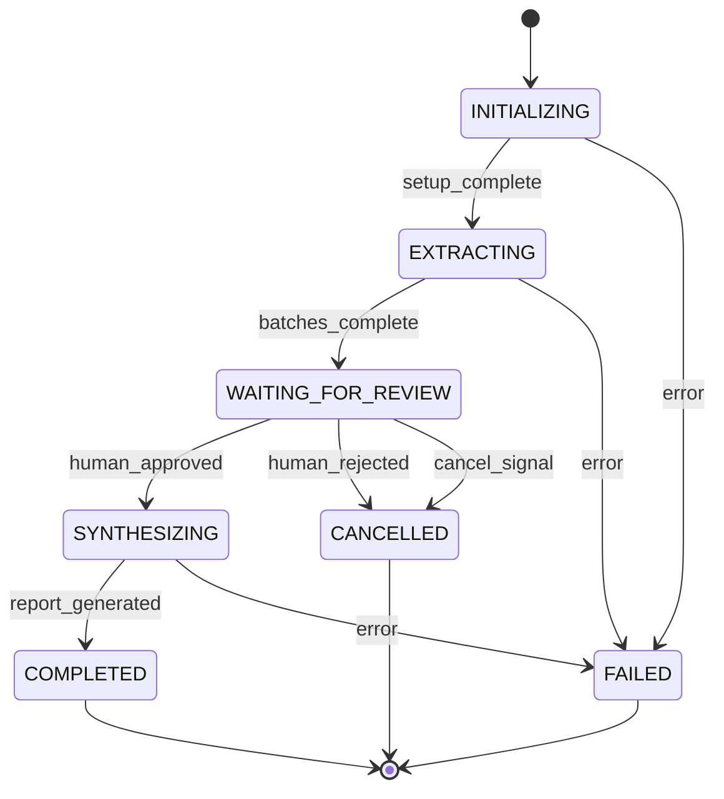

## Purpose

To demonstrate how to build a durable, long-running agent execution workflow that can survive unexpected failures, worker restarts, or human-in-the-loop pauses without duplicating side effects or losing progress.

## When to Use

Use this pattern when your workflow spans minutes to hours, involves external API calls that cannot be safely duplicated (e.g., modifying records, high-cost LLM generation), or requires human intervention (e.g., approval).

## When NOT to Use

Do not use this for short-lived, synchronous queries (e.g., typical chatbot interactions) where latency is more critical than state durability.

## Inputs

A large dataset of documents, search queries, and a research objective.

## Expected Output

A completed research report generated without duplicated work despite injected failures.

## Evaluation Rubric

- **No duplicated side effects**: LLM generation and external API calls must not trigger twice on retry.
- **State restored correctly**: Workflow variables must perfectly match the pre-restart state.
- **Bounded recovery time**: Resuming a task must not take linearly longer as the workflow progresses.
- **Cancellation respected**: If a cancellation signal is received during `WAITING_FOR_REVIEW`, the workflow must abort gracefully.

## Failure Modes & Risks

- **Worker OOM during EXTRACTING**: The new worker resumes from the last completed batch checkpoint.
- **API Timeout**: Retried with exponential backoff; idempotency key ensures no duplicate billing if the request actually succeeded.
- **Duplicate Delivery**: Handled gracefully using idempotency keys.
- **Corrupted Checkpoint**: Needs a fallback or manual intervention.
- **Stale Lease**: Handled by distributed locking/leases in the durable store.

## State Machine Diagram



## State Table

| State | Allowed Transitions | Guards | Side Effects | Terminal |
|---|---|---|---|---|
| INITIALIZING | EXTRACTING, FAILED | valid input | Create workspace | No |
| EXTRACTING | WAITING_FOR_REVIEW, FAILED | next batch exists | Call LLM | No |
| WAITING_FOR_REVIEW | SYNTHESIZING, CANCELLED | valid auth token | Send notification | No |
| SYNTHESIZING | COMPLETED, FAILED | report schema match | Write output | No |
| COMPLETED | None | None | None | Yes |
| FAILED | None | None | None | Yes |
| CANCELLED | None | None | None | Yes |

## Checkpoint Schema

```json
{
  "$schema": "http://json-schema.org/draft-07/schema#",
  "type": "object",
  "properties": {
    "version": { "type": "string" },
    "workflow_id": { "type": "string" },
    "state": { "type": "string" },
    "cursor": { "type": "integer" },
    "artifact_references": {
      "type": "array",
      "items": { "type": "string" }
    },
    "timestamps": {
      "type": "object",
      "properties": {
        "created_at": { "type": "string", "format": "date-time" },
        "updated_at": { "type": "string", "format": "date-time" }
      }
    },
    "retry_count": { "type": "integer" },
    "idempotency_key": { "type": "string" }
  },
  "required": ["version", "workflow_id", "state", "timestamps", "idempotency_key"]
}
```

## Realistic Checkpoint Document

```json
{
  "version": "1.0",
  "workflow_id": "wf-987654321",
  "state": "EXTRACTING",
  "cursor": 45,
  "artifact_references": ["s3://bucket/docs/batch-1.json", "s3://bucket/docs/batch-2.json"],
  "timestamps": {
    "created_at": "2026-10-08T10:00:00Z",
    "updated_at": "2026-10-08T10:15:30Z"
  },
  "retry_count": 0,
  "idempotency_key": "wf-987654321-EXTRACTING-45"
}
```

## Prompt / Procedure

### Resumable Workflow Pseudocode

```python
def run_workflow(workflow_id):
    state_doc = load_checkpoint(workflow_id)
    
    while state_doc.state not in ['COMPLETED', 'FAILED', 'CANCELLED']:
        try:
            if state_doc.state == 'INITIALIZING':
                idempotent_setup(workflow_id)
                state_doc = transition(workflow_id, 'EXTRACTING')
                
            elif state_doc.state == 'EXTRACTING':
                batch = get_batch(state_doc.cursor)
                if not batch:
                    state_doc = transition(workflow_id, 'WAITING_FOR_REVIEW')
                else:
                    process_batch_idempotent(batch, state_doc.idempotency_key)
                    state_doc.cursor += 1
                    save_checkpoint(state_doc)
                    
            elif state_doc.state == 'WAITING_FOR_REVIEW':
                status = check_human_approval(workflow_id)
                if status == 'APPROVED':
                    state_doc = transition(workflow_id, 'SYNTHESIZING')
                elif status in ['REJECTED', 'CANCELLED']:
                    state_doc = transition(workflow_id, 'CANCELLED')
                else:
                    sleep(60) # Wait for human
                    
            elif state_doc.state == 'SYNTHESIZING':
                idempotent_synthesize(workflow_id)
                state_doc = transition(workflow_id, 'COMPLETED')
                
        except Exception as e:
            handle_error(workflow_id, e)
            break
```

### Idempotency Record & Duplicate-Delivery

```json
{
  "idempotency_key": "wf-987654321-EXTRACTING-45",
  "status": "COMPLETED",
  "result_reference": "s3://bucket/results/45.json"
}
```
If a duplicate message arrives, the worker checks the key, finds `COMPLETED`, and safely acks the message without re-running the LLM.

### Successful Resume Trace

1. `worker-1` processes cursor `45`.
2. `worker-1` crashes (OOM).
3. Orchestrator detects heartbeat timeout.
4. `worker-2` acquires lease for `wf-987654321`.
5. `worker-2` loads checkpoint (state: `EXTRACTING`, cursor: `45`).
6. `worker-2` checks idempotency store for `wf-987654321-EXTRACTING-45`. Finds it completed.
7. `worker-2` advances cursor to `46` and continues.

### Cancellation Trace

1. Workflow is in `WAITING_FOR_REVIEW`.
2. User clicks "Cancel" in UI.
3. API updates state in DB to `CANCELLED`.
4. Next worker polling loop reads `CANCELLED` state and exits.

### Failure-Injection Matrix

| Injection | Observed Result | Target Threshold |
|---|---|---|
| Worker Crash | Resumed by new worker from last cursor | < 30s recovery |
| Stale Lease | Lease expires, new worker takes over | < 60s recovery |
| Duplicate Delivery | Ignored via idempotency key | 0 duplicate LLM calls |
| API Timeout | Retried with exponential backoff | Success after 3 retries |
| Corrupted Checkpoint | Fails workflow | Alert triggered |
| Human Rejection | Transitions to CANCELLED | Immediate |
| Cancellation | Transitions to CANCELLED | Immediate |

## Expected Output vs Observed Results

- **Expected**: Workflow finishes generating report, only 1 LLM call per batch.
- **Observed**: Exactly 100 batch completions recorded, even with 3 injected worker crashes.

## Security and Privacy

- Checkpoints containing document data must be encrypted at rest.
- Human review logs must record the identity of the approver.

## Latency and Cost

- State persistence adds 10-50ms per transition.
- Checkpointing prevents expensive re-generation of LLM calls, saving significant token costs on failure.

## Provenance

Author: Vu Hung. Conceptual review based on standard durable execution platforms (e.g., Temporal, AWS Step Functions). Verified conceptually.
