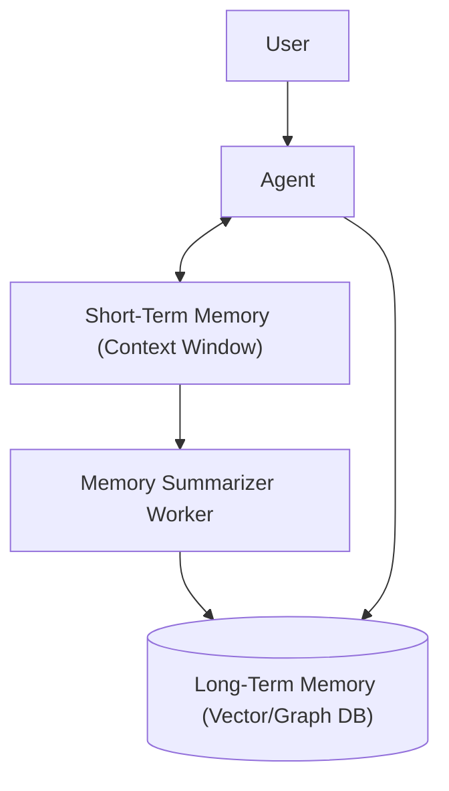

## 1. Concrete Production Problem & Non-goals

**Problem:** Agents operating over long sessions lose context due to strict token limits. Simply appending all interactions to the prompt leads to context window overflow, degraded attention, and high inference costs. We need a scalable memory architecture.

**Non-goals:** This is not a guide on training models with recurrent neural networks or managing global distributed databases. It focuses strictly on application-layer memory management for agents.

## 2. Prerequisites and Assumed System Scale

- **Prerequisites:** Understanding of context windows, semantic search, and basic state machines.
- **System Scale:** Supporting 10,000+ concurrent agent sessions, with individual sessions spanning days or weeks.

## 3. System Diagram



## 4. Viable Designs and Trade-offs

**Design A: Sliding Window Memory**
- *Pros:* Simple to implement; keeps only the most recent N messages.
- *Cons:* Complete loss of older but critical context.

**Design B: Tiered Memory (Recommended)**
- *Pros:* Retains immediate context perfectly while compressing older context via summarization and semantic retrieval.
- *Cons:* More complex; requires background summarization and secondary database calls.

## 5. Implementation Blueprint

```python
def get_agent_context(session_id: str, current_query: str):
    # 1. Fetch recent messages (Short-Term)
    recent_messages = db.get_recent_messages(session_id, limit=5)
    
    # 2. Retrieve relevant historical context (Long-Term)
    historical_context = vector_db.search(current_query, session_id=session_id)
    
    # 3. Fetch running summary
    summary = db.get_session_summary(session_id)
    
    return build_prompt(summary, historical_context, recent_messages, current_query)
```

## 6. Worked Example

User asks: "Can you update that marketing draft we discussed last Tuesday?"
1. The agent checks the recent messages (last 5 interactions), which do not contain the draft.
2. The agent queries the long-term memory for "marketing draft last Tuesday".
3. The vector DB returns the content of the draft and the context of the previous discussion.
4. The agent formulates a response using the retrieved historical context.

## 7. Failure Injection & Adversarial Cases

- **Adversarial Input:** A user injects conflicting facts over a long period to corrupt the session summary.
- **Mitigation:** Implement immutable event sourcing for memory so summaries can be rebuilt, and weight recent user explicit instructions over older summarized context.
- **Failure Injection:** Vector DB goes down. The agent must fall back to the sliding window and running summary.

## 8. Evaluation Criteria & Release Thresholds

- **Recall Accuracy:** &gt; 90% on targeted historical questions.
- **Release Threshold:** Context window utilization must remain below 75% of the model's limit during a simulated 100-turn conversation.

## 9. Security and Privacy Considerations

- **Data Privacy:** Long-term memory must be strongly partitioned by user ID to prevent cross-session data leakage.
- **Data Deletion:** Must support hard deletion of memory to comply with GDPR/CCPA requests.

## 10. Observability Requirements

- Track the size of the prompt in tokens over time to detect runaway context growth.
- Monitor the latency of the background summarizer worker.

## 11. Latency and Cost Considerations

- **Latency:** Tiered memory queries happen in parallel and add ~100ms.
- **Cost:** Background summarization requires periodic LLM calls. Batch these operations to use cheaper, smaller models.

## 12. Operational Artifact

**Memory Retention Runbook:** Guidelines on how long to retain different tiers of memory, how to trigger a manual summary rebuild, and how to purge a specific user's memory.

## 13. Authoritative Sources

- [Anthropic: Effective context engineering for AI agents](https://www.anthropic.com/engineering/effective-context-engineering-for-ai-agents) (Verified: 2026-10-07)

## 14. What would change this decision?

If models develop native, infinite, and zero-cost context caching with perfect retrieval over millions of tokens, application-tier memory management would become obsolete.

## 15. Hands-on Exercise

**Task:** Implement a tiered memory system that summarizes the oldest 10 messages in a chat once the chat reaches 15 messages.
**Evidence:** A log trace showing the context window shrinking after the summarization triggers, while still correctly answering a question about the first message.

## Competing designs and trade-offs

When evaluating alternatives, one might consider synchronous vs asynchronous execution, stateless vs stateful processes, and naive vs structured generation. Synchronous is easier to debug but scales poorly. Stateless is robust but limits context. The trade-offs heavily depend on the specific latency and cost budget allocated to the agent.

## Further reading

- [Anthropic Engineering Blog](https://www.anthropic.com/engineering)
- [Google Cloud Architecture Center](https://cloud.google.com/architecture)

