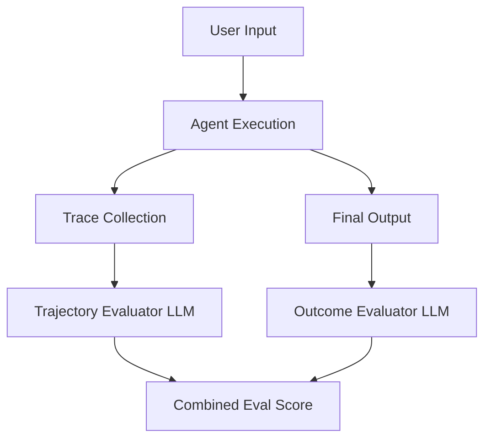

## 1. Introduction

As AI agents become more autonomous, evaluating them purely on final outcomes is insufficient. Agents can arrive at the right answer through flawed reasoning, or fail gracefully in ways that are better than hard crashes. This lesson covers **Trajectory Evaluation** (assessing the step-by-step path an agent takes) alongside **Outcome Evaluation** (assessing the final result).

## 2. Measurable Release Thresholds

To consider an agent ready for production, you must achieve:
- Greater than 90% Pass rate on Outcome Evaluation on the golden dataset.
- Less than 5% Hallucination rate in Trajectory steps (e.g., using a tool that doesn't exist).
- Zero critical security violations in Trajectory steps (e.g., exposing PII to an external API).

## 3. Non-Goals

- We will **not** cover basic prompt engineering or single-turn LLM evaluation.
- We will **not** cover setting up an evaluation framework from scratch (assume a runner like LangSmith or custom scripts are in place).

## 4. Prerequisites

- Understanding of ReAct (Reasoning and Acting) patterns.
- Familiarity with LLM evaluation datasets.
- Experience reading agent execution traces.

## 5. System Diagram



## 6. Implementation and Examples

An outcome evaluation checks the final string. A trajectory evaluation checks the intermediate `tool_calls`.

You can view a sample JSON dataset for evaluation here: [v1-eval-dataset.json](/datasets/v1-eval-dataset.json).
And a sample trace failure here: [example-trace-failure.json](/traces/example-trace-failure.json).

### Evaluating Trajectories

You can use an LLM-as-a-judge to evaluate the trajectory. Feed the trace to the judge and ask it to identify issues.

```javascript
// Pseudo-code for a Trajectory Evaluator
async function evaluateTrajectory(trace) {
  const prompt = `
    Analyze the following agent trace.
    Check for:
    1. Tool Hallucinations
    2. Ignored Tool Results
    3. Infinite Loops
    Trace: ${JSON.stringify(trace)}
  `;
  return await llmJudge.predict(prompt);
}
```

## 7. Failure Modes & Anti-Patterns

- **Outcome Bias**: Approving an agent because the final answer was correct, ignoring the fact that it hallucinated a tool call to get there.
- **Overly Strict Trajectory Evals**: Penalizing an agent for taking a slightly different but valid path to the solution.

## 8. Security & Privacy

Traces often contain PII or sensitive data from tool results (e.g., looking up a customer record). Ensure traces are sanitized before sending them to third-party LLM judges or storing them in plain text.

## 9. Performance & Cost

Evaluating every trace with an LLM judge is expensive and slow. Use LLM judges for a sample of traffic (e.g., 5%) or on your static evaluation datasets, not on every live production request.

## 10. Testing Strategy

1. **Golden Datasets**: Maintain a static set of input scenarios and expected trajectories.
2. **Regression Testing**: Run the agent against the dataset on every PR.
3. **Trace Inspection**: Manually review a sample of failed traces weekly.

## 11. Checklist

- [ ] Implement trace logging for all agent actions.
- [ ] Create an initial Outcome Evaluation dataset.
- [ ] Implement an LLM judge for checking Trajectory logic.
- [ ] Sanitize traces to remove PII.

## 12. Further Reading

- *Evaluating LLM Applications* (Industry Whitepaper)
- *The ReAct Pattern and Trace Analysis* (Academic Paper)

## 13. Glossary

- **Trajectory**: The sequence of thoughts, actions, and observations an agent takes.
- **Outcome**: The final response delivered to the user.
