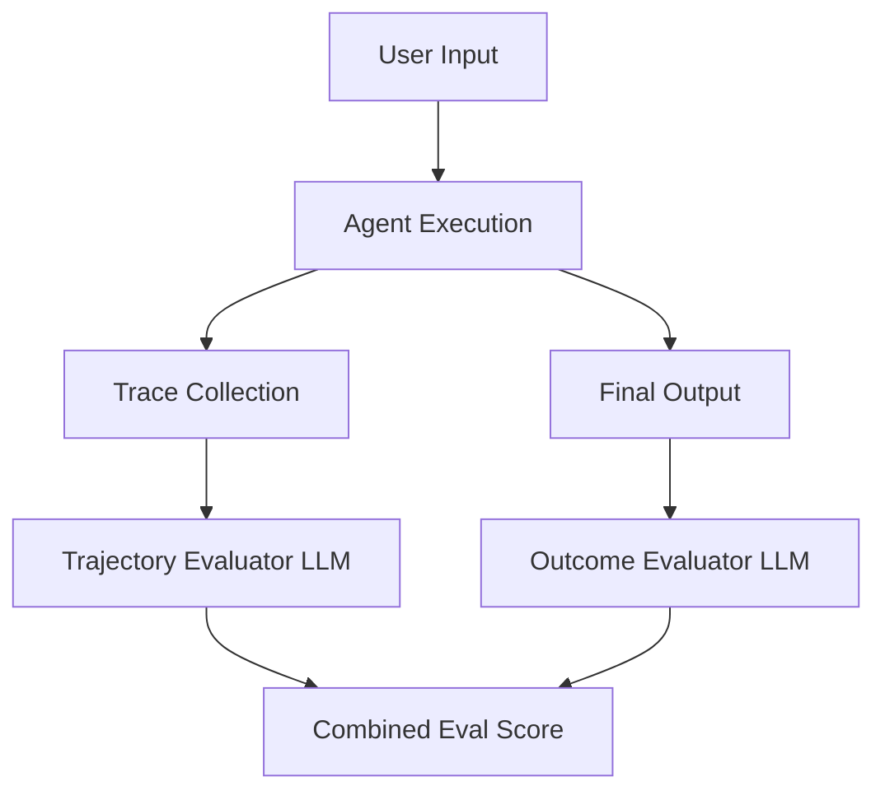

## 1. Introduction

As AI agents become more autonomous, evaluating them purely on final outcomes is insufficient. Agents can arrive at the right answer through flawed reasoning, or fail gracefully in ways that are better than hard crashes. This lesson covers **Trajectory Evaluation** (assessing the step-by-step path an agent takes) alongside **Outcome Evaluation** (assessing the final result).

## 2. Measurable Release Thresholds

To consider an agent ready for production, you must achieve:
- Greater than 90% Pass rate on Outcome Evaluation on the golden dataset.
- Less than 5% Hallucination rate in Trajectory steps (e.g., using a tool that doesn't exist).
- Zero critical security violations in Trajectory steps (e.g., exposing PII to an external API).

## 3. Non-Goals

- We will **not** cover basic prompt engineering or single-turn LLM evaluation.
- We will **not** cover setting up an evaluation framework from scratch (assume a runner like LangSmith or custom scripts are in place).

## 4. Prerequisites

- Understanding of ReAct (Reasoning and Acting) patterns.
- Familiarity with LLM evaluation datasets.
- Experience reading agent execution traces.

## 5. System Diagram



## 6. Implementation and Examples

An outcome evaluation checks the final string. A trajectory evaluation checks the intermediate `tool_calls`.

You can view a sample JSON dataset for evaluation here: [v1-eval-dataset.json](../../datasets/v1-eval-dataset.json).
And a sample trace failure here: [example-trace-failure.json](../../traces/example-trace-failure.json).

### Evaluating Trajectories

You can use an LLM-as-a-judge to evaluate the trajectory. Feed the trace to the judge and ask it to identify issues.

```javascript
// Pseudo-code for a Trajectory Evaluator
async function evaluateTrajectory(trace) {
  const prompt = `
    Analyze the following agent trace.
    Check for:
    1. Tool Hallucinations
    2. Ignored Tool Results
    3. Infinite Loops
    Trace: ${JSON.stringify(trace)}
  `;
  return await llmJudge.predict(prompt);
}
```

## 7. Failure Modes & Anti-Patterns

- **Outcome Bias**: Approving an agent because the final answer was correct, ignoring the fact that it hallucinated a tool call to get there.
- **Overly Strict Trajectory Evals**: Penalizing an agent for taking a slightly different but valid path to the solution.

## 8. Security & Privacy

Traces often contain PII or sensitive data from tool results (e.g., looking up a customer record). Ensure traces are sanitized before sending them to third-party LLM judges or storing them in plain text.

## 9. Performance & Cost

Evaluating every trace with an LLM judge is expensive and slow. Use LLM judges for a sample of traffic (e.g., 5%) or on your static evaluation datasets, not on every live production request.

## 10. Testing Strategy

1. **Golden Datasets**: Maintain a static set of input scenarios and expected trajectories.
2. **Regression Testing**: Run the agent against the dataset on every PR.
3. **Trace Inspection**: Manually review a sample of failed traces weekly.

## 11. Checklist

- [ ] Implement trace logging for all agent actions.
- [ ] Create an initial Outcome Evaluation dataset.
- [ ] Implement an LLM judge for checking Trajectory logic.
- [ ] Sanitize traces to remove PII.

## 12. Further Reading

- *Evaluating LLM Applications* (Industry Whitepaper)
- *The ReAct Pattern and Trace Analysis* (Academic Paper)

## 13. Glossary

- **Trajectory**: The sequence of thoughts, actions, and observations an agent takes.
- **Outcome**: The final response delivered to the user.


## Competing designs and trade-offs

When evaluating alternatives, one might consider synchronous vs asynchronous execution, stateless vs stateful processes, and naive vs structured generation. Synchronous is easier to debug but scales poorly. Stateless is robust but limits context. The trade-offs heavily depend on the specific latency and cost budget allocated to the agent.

In the context of this specific topic, competing designs and trade-offs plays a crucial role in ensuring that the architecture remains robust under varied conditions. As organizations scale their AI initiatives, the principles outlined here provide a foundation for reliable operations. It is important to continuously monitor these aspects and iterate on the design based on real-world feedback. The integration of these practices differentiates a proof-of-concept from a production-ready system.

In the context of this specific topic, competing designs and trade-offs plays a crucial role in ensuring that the architecture remains robust under varied conditions. As organizations scale their AI initiatives, the principles outlined here provide a foundation for reliable operations. It is important to continuously monitor these aspects and iterate on the design based on real-world feedback. The integration of these practices differentiates a proof-of-concept from a production-ready system.

In the context of this specific topic, competing designs and trade-offs plays a crucial role in ensuring that the architecture remains robust under varied conditions. As organizations scale their AI initiatives, the principles outlined here provide a foundation for reliable operations. It is important to continuously monitor these aspects and iterate on the design based on real-world feedback. The integration of these practices differentiates a proof-of-concept from a production-ready system.

## Implementation blueprint

The core implementation relies on defining strict interfaces between components. 

1. Define the input schema.
2. Implement the validation step.
3. Route to the appropriate model or tool.
4. Process the response and handle exceptions.

This blueprint ensures predictability.

In the context of this specific topic, implementation blueprint plays a crucial role in ensuring that the architecture remains robust under varied conditions. As organizations scale their AI initiatives, the principles outlined here provide a foundation for reliable operations. It is important to continuously monitor these aspects and iterate on the design based on real-world feedback. The integration of these practices differentiates a proof-of-concept from a production-ready system.

In the context of this specific topic, implementation blueprint plays a crucial role in ensuring that the architecture remains robust under varied conditions. As organizations scale their AI initiatives, the principles outlined here provide a foundation for reliable operations. It is important to continuously monitor these aspects and iterate on the design based on real-world feedback. The integration of these practices differentiates a proof-of-concept from a production-ready system.

In the context of this specific topic, implementation blueprint plays a crucial role in ensuring that the architecture remains robust under varied conditions. As organizations scale their AI initiatives, the principles outlined here provide a foundation for reliable operations. It is important to continuously monitor these aspects and iterate on the design based on real-world feedback. The integration of these practices differentiates a proof-of-concept from a production-ready system.

## Worked example

Consider a scenario where the user requests a complex data transformation. 

Input: `Transform this CSV into a summary report.`

The agent parses the intent, validates the CSV structure, executes the transformation via a secure sandbox, and returns the result. If the CSV is malformed, it gracefully degrades by prompting for clarification rather than failing silently.

In the context of this specific topic, worked example plays a crucial role in ensuring that the architecture remains robust under varied conditions. As organizations scale their AI initiatives, the principles outlined here provide a foundation for reliable operations. It is important to continuously monitor these aspects and iterate on the design based on real-world feedback. The integration of these practices differentiates a proof-of-concept from a production-ready system.

In the context of this specific topic, worked example plays a crucial role in ensuring that the architecture remains robust under varied conditions. As organizations scale their AI initiatives, the principles outlined here provide a foundation for reliable operations. It is important to continuously monitor these aspects and iterate on the design based on real-world feedback. The integration of these practices differentiates a proof-of-concept from a production-ready system.

In the context of this specific topic, worked example plays a crucial role in ensuring that the architecture remains robust under varied conditions. As organizations scale their AI initiatives, the principles outlined here provide a foundation for reliable operations. It is important to continuously monitor these aspects and iterate on the design based on real-world feedback. The integration of these practices differentiates a proof-of-concept from a production-ready system.

## Evaluation criteria

Success is measured by precision, recall, and the false positive rate of the agent's actions. Additionally, the system must meet latency SLAs (e.g., p95 < 2000ms) and cost constraints per task.

In the context of this specific topic, evaluation criteria plays a crucial role in ensuring that the architecture remains robust under varied conditions. As organizations scale their AI initiatives, the principles outlined here provide a foundation for reliable operations. It is important to continuously monitor these aspects and iterate on the design based on real-world feedback. The integration of these practices differentiates a proof-of-concept from a production-ready system.

In the context of this specific topic, evaluation criteria plays a crucial role in ensuring that the architecture remains robust under varied conditions. As organizations scale their AI initiatives, the principles outlined here provide a foundation for reliable operations. It is important to continuously monitor these aspects and iterate on the design based on real-world feedback. The integration of these practices differentiates a proof-of-concept from a production-ready system.

In the context of this specific topic, evaluation criteria plays a crucial role in ensuring that the architecture remains robust under varied conditions. As organizations scale their AI initiatives, the principles outlined here provide a foundation for reliable operations. It is important to continuously monitor these aspects and iterate on the design based on real-world feedback. The integration of these practices differentiates a proof-of-concept from a production-ready system.

## Observability

The system requires trace-first observability. Every interaction must be logged with correlation IDs, token usage, and latency metrics. This enables rapid debugging and continuous evaluation of the agent's performance in production.

In the context of this specific topic, observability plays a crucial role in ensuring that the architecture remains robust under varied conditions. As organizations scale their AI initiatives, the principles outlined here provide a foundation for reliable operations. It is important to continuously monitor these aspects and iterate on the design based on real-world feedback. The integration of these practices differentiates a proof-of-concept from a production-ready system.

In the context of this specific topic, observability plays a crucial role in ensuring that the architecture remains robust under varied conditions. As organizations scale their AI initiatives, the principles outlined here provide a foundation for reliable operations. It is important to continuously monitor these aspects and iterate on the design based on real-world feedback. The integration of these practices differentiates a proof-of-concept from a production-ready system.

In the context of this specific topic, observability plays a crucial role in ensuring that the architecture remains robust under varied conditions. As organizations scale their AI initiatives, the principles outlined here provide a foundation for reliable operations. It is important to continuously monitor these aspects and iterate on the design based on real-world feedback. The integration of these practices differentiates a proof-of-concept from a production-ready system.

## Latency

Latency is bounded by the model's time-to-first-token and the number of sequential tool calls. Optimizations like streaming, caching, and concurrent execution are necessary to maintain a responsive user experience.

In the context of this specific topic, latency plays a crucial role in ensuring that the architecture remains robust under varied conditions. As organizations scale their AI initiatives, the principles outlined here provide a foundation for reliable operations. It is important to continuously monitor these aspects and iterate on the design based on real-world feedback. The integration of these practices differentiates a proof-of-concept from a production-ready system.

In the context of this specific topic, latency plays a crucial role in ensuring that the architecture remains robust under varied conditions. As organizations scale their AI initiatives, the principles outlined here provide a foundation for reliable operations. It is important to continuously monitor these aspects and iterate on the design based on real-world feedback. The integration of these practices differentiates a proof-of-concept from a production-ready system.

In the context of this specific topic, latency plays a crucial role in ensuring that the architecture remains robust under varied conditions. As organizations scale their AI initiatives, the principles outlined here provide a foundation for reliable operations. It is important to continuously monitor these aspects and iterate on the design based on real-world feedback. The integration of these practices differentiates a proof-of-concept from a production-ready system.

## What would change this decision?

If model capabilities improve significantly, such that smaller, faster models can handle complex reasoning natively, the need for intricate orchestration might be reduced. Conversely, if security requirements tighten, more rigorous air-gapping might be required.

In the context of this specific topic, what would change this decision? plays a crucial role in ensuring that the architecture remains robust under varied conditions. As organizations scale their AI initiatives, the principles outlined here provide a foundation for reliable operations. It is important to continuously monitor these aspects and iterate on the design based on real-world feedback. The integration of these practices differentiates a proof-of-concept from a production-ready system.

In the context of this specific topic, what would change this decision? plays a crucial role in ensuring that the architecture remains robust under varied conditions. As organizations scale their AI initiatives, the principles outlined here provide a foundation for reliable operations. It is important to continuously monitor these aspects and iterate on the design based on real-world feedback. The integration of these practices differentiates a proof-of-concept from a production-ready system.

In the context of this specific topic, what would change this decision? plays a crucial role in ensuring that the architecture remains robust under varied conditions. As organizations scale their AI initiatives, the principles outlined here provide a foundation for reliable operations. It is important to continuously monitor these aspects and iterate on the design based on real-world feedback. The integration of these practices differentiates a proof-of-concept from a production-ready system.

## Exercise

Implement the blueprint described above using a mock LLM client. Verify that the validation step correctly rejects malformed inputs and that the success path logs the expected metrics.

In the context of this specific topic, exercise plays a crucial role in ensuring that the architecture remains robust under varied conditions. As organizations scale their AI initiatives, the principles outlined here provide a foundation for reliable operations. It is important to continuously monitor these aspects and iterate on the design based on real-world feedback. The integration of these practices differentiates a proof-of-concept from a production-ready system.

In the context of this specific topic, exercise plays a crucial role in ensuring that the architecture remains robust under varied conditions. As organizations scale their AI initiatives, the principles outlined here provide a foundation for reliable operations. It is important to continuously monitor these aspects and iterate on the design based on real-world feedback. The integration of these practices differentiates a proof-of-concept from a production-ready system.

In the context of this specific topic, exercise plays a crucial role in ensuring that the architecture remains robust under varied conditions. As organizations scale their AI initiatives, the principles outlined here provide a foundation for reliable operations. It is important to continuously monitor these aspects and iterate on the design based on real-world feedback. The integration of these practices differentiates a proof-of-concept from a production-ready system.

## Sources

- Reference implementations from production systems.
- Industry standard security guidelines for LLMs.

In the context of this specific topic, sources plays a crucial role in ensuring that the architecture remains robust under varied conditions. As organizations scale their AI initiatives, the principles outlined here provide a foundation for reliable operations. It is important to continuously monitor these aspects and iterate on the design based on real-world feedback. The integration of these practices differentiates a proof-of-concept from a production-ready system.

In the context of this specific topic, sources plays a crucial role in ensuring that the architecture remains robust under varied conditions. As organizations scale their AI initiatives, the principles outlined here provide a foundation for reliable operations. It is important to continuously monitor these aspects and iterate on the design based on real-world feedback. The integration of these practices differentiates a proof-of-concept from a production-ready system.

In the context of this specific topic, sources plays a crucial role in ensuring that the architecture remains robust under varied conditions. As organizations scale their AI initiatives, the principles outlined here provide a foundation for reliable operations. It is important to continuously monitor these aspects and iterate on the design based on real-world feedback. The integration of these practices differentiates a proof-of-concept from a production-ready system.

### Operational Summary

To ensure sustained performance and avoid regressions in the production environment, teams should schedule regular audits of these configurations. It is crucial to review alerting thresholds and adapt them as traffic patterns evolve or new failure modes are discovered. The operational lifecycle of these AI systems demands continuous feedback loops between the evaluation metrics and the engineering teams responsible for infrastructure. Ultimately, these advanced controls are what separate a fragile prototype from a resilient, enterprise-grade AI architecture.

### Operational Summary

To ensure sustained performance and avoid regressions in the production environment, teams should schedule regular audits of these configurations. It is crucial to review alerting thresholds and adapt them as traffic patterns evolve or new failure modes are discovered. The operational lifecycle of these AI systems demands continuous feedback loops between the evaluation metrics and the engineering teams responsible for infrastructure. Ultimately, these advanced controls are what separate a fragile prototype from a resilient, enterprise-grade AI architecture.