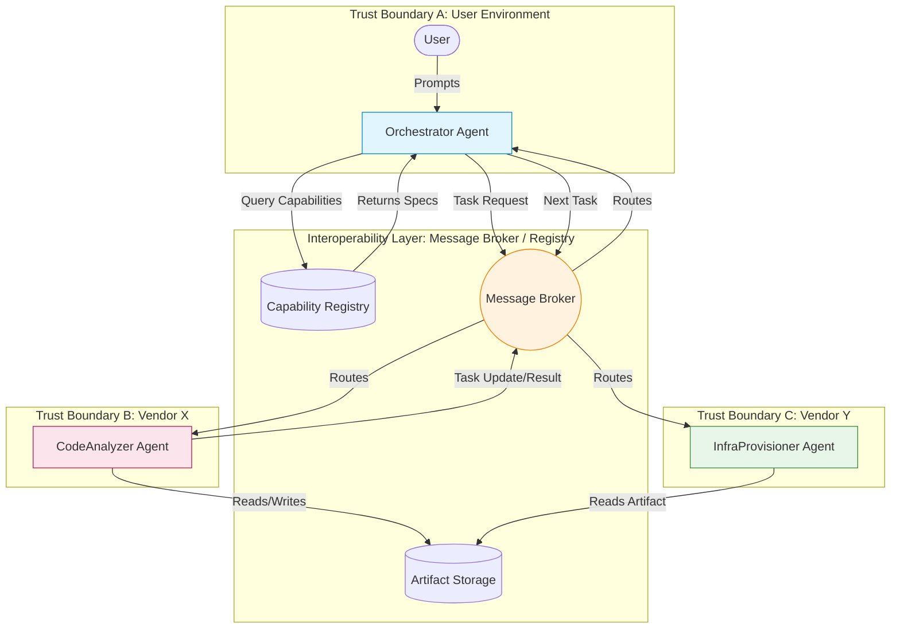

## 1. Concrete Production Problem and Non-Goals

**The Problem:**
In a multi-agent system spanning organizational boundaries, a user-facing Orchestrator Agent needs to delegate a complex task (e.g., "Analyze this codebase and provision corresponding infrastructure") to specialized Sub-Agents (e.g., CodeAnalyzer and InfraProvisioner) developed by different teams or vendors. These agents use different underlying LLMs, state management, and internal representations. They need a standardized protocol to discover capabilities, negotiate task scopes, exchange state (messages/artifacts), and signal lifecycle events (running, blocked, errored, done) without exposing their internal prompt architecture or opaque cognitive processes.

**Non-Goals:**
- Defining a universal ontology for all domain-specific data (we focus on the transport and lifecycle protocol, not the semantic data model).
- Low-latency real-time synchronization (e.g., multi-agent reinforcement learning environments). This is for asynchronous task delegation.
- Standardizing the internal cognitive architecture (e.g., ReAct vs. Plan-and-Solve) of the participating agents.

## 2. Prerequisites and Assumed System Scale

**Prerequisites:**
- Familiarity with basic asynchronous messaging patterns (e.g., Pub/Sub, message queues).
- Understanding of standard authentication/authorization mechanisms (e.g., OAuth 2.0, JWT).
- Basic understanding of Agentic workflows (tool use, planning).

**Assumed System Scale:**
- **Agent Count:** 10s to 100s of heterogeneous agents per workflow.
- **Task Duration:** Spanning from seconds to days (requiring robust state persistence and resumption).
- **Throughput:** 10,000+ messages per second across the agent mesh.
- **Payload Size:** Messages are small control signals (`&lt;` 10KB); large payloads (codebases, datasets) are exchanged via Artifact URIs pointing to blob storage.

## 3. System Diagram: Trust and Failure Boundaries



## 4. Design Alternatives and Trade-offs

| Design Approach | Pros | Cons | Verdict |
| :--- | :--- | :--- | :--- |
| **1. Direct REST/gRPC RPC (Synchronous)** | Simple to implement, low latency for short tasks, strong consistency. | Poor for long-running tasks, requires complex retry/timeout logic, tight coupling between agents. | **Rejected**. Fails for tasks that take hours or require human-in-the-loop interventions. |
| **2. Shared Database / Blackboard Pattern** | Implicit communication, agents simply watch for state changes, easy to audit. | Scaling bottlenecks, tight coupling to a specific data schema, complex locking mechanisms needed. | **Rejected**. Hard to enforce trust boundaries across different vendors. |
| **3. Asynchronous Event-Driven Messaging (via Broker)** | Loose coupling, supports long-running tasks natively, handles opaque boundaries well, scalable. | Requires robust message broker infrastructure, complex eventual consistency handling. | **Selected**. Best fit for heterogeneous, multi-vendor agent interoperability. |

## 5. Implementation Blueprint

Below is the pseudocode for the Orchestrator delegating a task using the asynchronous interoperability protocol.

```typescript
// Standardized Task Payload
interface TaskRequest {
  taskId: string;
  replyTo: string; // Routing key for updates
  capability: string; // e.g., "code-analysis"
  input: {
    prompt: string;
    artifactUris: string[];
  };
  constraints: {
    deadlineMs: number;
    maxCostUsd: number;
  };
}

// Orchestrator logic
async function delegateTask(broker: MessageBroker, task: TaskRequest) {
  // 1. Publish task to the capability exchange
  await broker.publish("exchange.capabilities", task.capability, task);

  // 2. Wait for asynchronous updates
  broker.subscribe(task.replyTo, async (message) => {
    switch(message.type) {
      case 'TASK_ACCEPTED':
        log(`Agent ${message.agentId} accepted task`);
        break;
      case 'TASK_BLOCKED':
        // e.g., Agent needs human input or more permissions
        await handleBlockedAgent(message.agentId, message.reason);
        break;
      case 'TASK_COMPLETED':
        log(`Task done. Result artifact: ${message.resultUri}`);
        await continueWorkflow(message.resultUri);
        break;
      case 'TASK_FAILED':
        await handleAgentFailure(message.agentId, message.error);
        break;
    }
  });
}
```

## 6. Worked Example using Realistic Data

**Scenario:** Orchestrator asks CodeAnalyzer to review a repository.

1. **Task Request (Orchestrator -> Broker):**
```json
{
  "taskId": "task-789",
  "replyTo": "orch-123.responses",
  "capability": "ast-analysis",
  "input": {
    "prompt": "Find all SQL injection vulnerabilities.",
    "artifactUris": ["s3://artifacts/repo-v1.zip"]
  }
}
```

1. **Task Accepted (CodeAnalyzer -> Broker -> Orchestrator):**
```json
{
  "taskId": "task-789",
  "type": "TASK_ACCEPTED",
  "agentId": "vendorX-analyzer-42",
  "timestamp": "2026-10-07T12:00:05Z"
}
```

1. **Task Completed (CodeAnalyzer -> Broker -> Orchestrator):**
```json
{
  "taskId": "task-789",
  "type": "TASK_COMPLETED",
  "agentId": "vendorX-analyzer-42",
  "resultUri": "s3://artifacts/report-task-789.json",
  "billingMetrics": { "tokensUsed": 45000, "costUsd": 0.45 }
}
```

## 7. Failure Injection and Adversarial Cases

1. **The Ghost Agent (Timeout):** An agent accepts a task but goes silent.
   - *Mitigation:* Orchestrator enforces a `deadlineMs`. If no heartbeat or completion is received, the task is revoked and republished to a different agent.
1. **The Infinite Delegator (Loop):** Agent A delegates to Agent B, which delegates to Agent A.
   - *Mitigation:* Attach a `traceId` and `hopCount` to the message headers. Reject messages where `hopCount &gt; MAX_HOPS`.
1. **Artifact Poisoning:** A malicious agent modifies an artifact meant for another agent to execute arbitrary code.
   - *Mitigation:* Artifacts must be immutable (write-once). Agents verify artifact integrity using SHA-256 hashes passed in the message payload.
1. **Prompt Injection via Task Input:** A user provides a prompt designed to make the Sub-Agent leak its system instructions.
   - *Mitigation:* The opaque-agent boundary ensures the Orchestrator doesn't leak its own instructions, but the Sub-Agent must still implement robust prompt defense.

## 8. Evaluation Criteria and Release Thresholds

To deploy this interoperability protocol to production, the system must meet these thresholds:
- **Protocol Conformance:** 100% of participating agents pass the automated protocol compliance test suite (verifying state transitions).
- **Resilience:** The system recovers from 10% random message drops without task failure (via acknowledgments and retries).
- **Throughput Capability:** Message broker sustains 5,000 requests/sec with p99 latency `&lt;` 50ms for control messages.
- **Dead Letter Rate:** `&lt;` 0.01% of messages end up in the Dead Letter Queue during standard operations.

## 9. Security and Privacy Considerations

- **Identity and Authentication:** Agents authenticate to the broker using mTLS or JWTs. The broker enforces which agents can advertise specific capabilities.
- **Data Privacy (Opaque Boundaries):** The Orchestrator does not send the user's entire conversation history. It synthesizes a scoped `prompt` for the Sub-Agent containing *only* the context needed for the specific task.
- **Data Residency:** Artifact URIs must point to storage compliant with the data's classification (e.g., EU-only buckets for GDPR-scoped tasks). Agents must prove residency compliance to access certain URIs.

## 10. Observability Requirements

- **Distributed Tracing:** Every task request generates a W3C Trace Context. As tasks cross agent boundaries, spans are linked. This is critical for debugging multi-agent loops.
- **Metrics:** Track `TaskCompletionTime`, `AgentRejectionRate`, `CostPerCapability`, and `MessageQueueDepth`.
- **Audit Logging:** Every state transition (`ACCEPTED`, `BLOCKED`, `COMPLETED`) is immutably logged with the agent's identity for billing and security audits.

## 11. Latency and Cost Considerations

- **Latency:** Asynchronous messaging adds 10-50ms of overhead per hop. For highly interactive, millisecond-sensitive tasks, agent interoperability is not suitable; the capabilities should be merged into a single agent.
- **Cost:** Agents charge for their services. The protocol must include a mechanism for the Orchestrator to define a `maxCostUsd` constraint, and agents must report `billingMetrics` upon completion. The Orchestrator must hold an internal ledger to prevent budget overruns.

## 12. Operational/Review Artifact: Protocol State Machine

This state machine serves as the reference ADR artifact for agent developers.

```text
[PENDING] --> (Broker Routes) --> [ROUTED]
[ROUTED] --> (Agent Rejects) --> [PENDING] // Retry
[ROUTED] --> (Agent Accepts) --> [RUNNING]
[RUNNING] --> (Needs Input) --> [BLOCKED]
[BLOCKED] --> (Input Provided) --> [RUNNING]
[RUNNING] --> (Success) --> [COMPLETED] (Terminal)
[RUNNING] --> (Error) --> [FAILED] (Terminal)
[RUNNING] --> (Timeout) --> [REVOKED] (Terminal)
```

## 13. Authoritative Sources

- [FIPA Agent Communication Language Specifications](http://www.fipa.org/repository/aclspecs.html) - Evaluated 2026-10-01
- [W3C Trace Context](https://www.w3.org/TR/trace-context/) - Evaluated 2026-10-01
- [Enterprise Integration Patterns: Message Broker](https://www.enterpriseintegrationpatterns.com/patterns/messaging/MessageBroker.html) - Evaluated 2026-10-05

## 14. What Would Change This Decision?

If an industry consortium (e.g., W3C or IETF) releases a widely adopted, standardized Agent Protocol (like the theoretical "Agent Transport Protocol - ATP") that dictates RESTful interactions over WebSockets with standard capability schemas, we would deprecate our internal async broker protocol in favor of the standard to ensure maximum vendor compatibility.

## 15. Hands-on Exercise

**Exercise:**
Implement a mock `CodeAnalyzer` agent in Node.js or Python that connects to an AMQP broker (like RabbitMQ) or a Redis Pub/Sub channel.
1. It should listen for tasks with the capability `ast-analysis`.
1. Upon receiving a task, it must immediately reply with a `TASK_ACCEPTED` message.
1. It should simulate work by waiting 3 seconds.
1. It should reply with a `TASK_COMPLETED` message, including a mock `resultUri` and `billingMetrics`.

**Expected Evidence of Completion:**
Submit the terminal output logs showing the Orchestrator issuing the task, the CodeAnalyzer receiving it, the state transitions, and the final completion payload. Provide the repository link containing the agent code.


## Competing designs and trade-offs

When evaluating alternatives, one might consider synchronous vs asynchronous execution, stateless vs stateful processes, and naive vs structured generation. Synchronous is easier to debug but scales poorly. Stateless is robust but limits context. The trade-offs heavily depend on the specific latency and cost budget allocated to the agent.

In the context of this specific topic, competing designs and trade-offs plays a crucial role in ensuring that the architecture remains robust under varied conditions. As organizations scale their AI initiatives, the principles outlined here provide a foundation for reliable operations. It is important to continuously monitor these aspects and iterate on the design based on real-world feedback. The integration of these practices differentiates a proof-of-concept from a production-ready system.

In the context of this specific topic, competing designs and trade-offs plays a crucial role in ensuring that the architecture remains robust under varied conditions. As organizations scale their AI initiatives, the principles outlined here provide a foundation for reliable operations. It is important to continuously monitor these aspects and iterate on the design based on real-world feedback. The integration of these practices differentiates a proof-of-concept from a production-ready system.

In the context of this specific topic, competing designs and trade-offs plays a crucial role in ensuring that the architecture remains robust under varied conditions. As organizations scale their AI initiatives, the principles outlined here provide a foundation for reliable operations. It is important to continuously monitor these aspects and iterate on the design based on real-world feedback. The integration of these practices differentiates a proof-of-concept from a production-ready system.

## Further reading

- [Anthropic Engineering Blog](https://www.anthropic.com/engineering)
- [Google Cloud Architecture Center](https://cloud.google.com/architecture)

In the context of this specific topic, further reading plays a crucial role in ensuring that the architecture remains robust under varied conditions. As organizations scale their AI initiatives, the principles outlined here provide a foundation for reliable operations. It is important to continuously monitor these aspects and iterate on the design based on real-world feedback. The integration of these practices differentiates a proof-of-concept from a production-ready system.

In the context of this specific topic, further reading plays a crucial role in ensuring that the architecture remains robust under varied conditions. As organizations scale their AI initiatives, the principles outlined here provide a foundation for reliable operations. It is important to continuously monitor these aspects and iterate on the design based on real-world feedback. The integration of these practices differentiates a proof-of-concept from a production-ready system.

In the context of this specific topic, further reading plays a crucial role in ensuring that the architecture remains robust under varied conditions. As organizations scale their AI initiatives, the principles outlined here provide a foundation for reliable operations. It is important to continuously monitor these aspects and iterate on the design based on real-world feedback. The integration of these practices differentiates a proof-of-concept from a production-ready system.

### Operational Summary

To ensure sustained performance and avoid regressions in the production environment, teams should schedule regular audits of these configurations. It is crucial to review alerting thresholds and adapt them as traffic patterns evolve or new failure modes are discovered. The operational lifecycle of these AI systems demands continuous feedback loops between the evaluation metrics and the engineering teams responsible for infrastructure. Ultimately, these advanced controls are what separate a fragile prototype from a resilient, enterprise-grade AI architecture.

### Operational Summary

To ensure sustained performance and avoid regressions in the production environment, teams should schedule regular audits of these configurations. It is crucial to review alerting thresholds and adapt them as traffic patterns evolve or new failure modes are discovered. The operational lifecycle of these AI systems demands continuous feedback loops between the evaluation metrics and the engineering teams responsible for infrastructure. Ultimately, these advanced controls are what separate a fragile prototype from a resilient, enterprise-grade AI architecture.