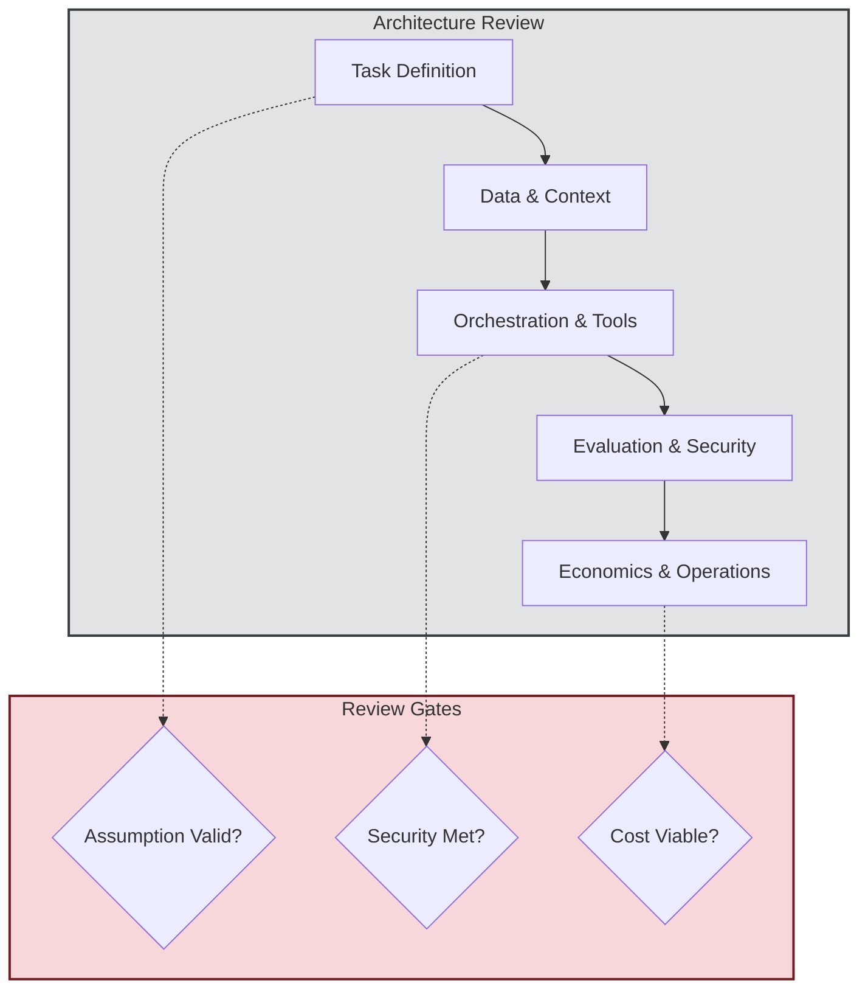

## 1. Concrete production problem and non-goals

**Problem:** AI systems are often built organically, layering on tools and context until the system becomes unmanageable, expensive, and insecure. Traditional architecture reviews fail to capture GenAI-specific risks like prompt injection, non-deterministic evaluation, and token economics. We need a standardized way to review AI architectures before they scale.

**Non-goals:** This lesson does not cover the organizational process of setting up an architecture review board. It focuses purely on the technical content of the review.

## 2. Prerequisites and assumed system scale

- **Prerequisites:** Experience with the full AI stack: retrieval, generation, evaluation, and operations.
- **Scale:** Enterprise scale where a single architectural flaw could lead to data exfiltration or massive token cost overruns.

## 3. System diagram with trust and failure boundaries

## 4. Viable designs and trade-offs

**Design 1: Decentralized, Ad-hoc Reviews**
- *Pros:* Low friction, fast iteration for early-stage startups.
- *Cons:* Inconsistent security posture, repeated mistakes across teams, lack of cross-cutting cost control.

**Design 2: Standardized AI Architecture Review Template**
- *Pros:* Forces engineers to answer hard questions about evaluation, security, and economics upfront. Identifies risky assumptions before scaling.
- *Cons:* Adds friction to the development process; requires senior AI engineers to conduct the review.

**Trade-off Summary:** For any system processing sensitive data or operating autonomously, the standardized review template is mandatory. The cost of a security breach or runaway token usage far outweighs the friction of a review.

## 5. Implementation blueprint

**The AI Architecture Review Template:**

1. **System Overview:** Objective, non-goals, and key assumptions to test before scale.
2. **Architecture & Data Flow:** Diagram with trust boundaries. Data sources and context management strategy.
3. **Model & Orchestration:** Model selection, fallback routing, and workflow vs. agent decision.
4. **Tooling & Sandboxing:** Tool scopes, capability security, and sandboxing for code execution.
5. **Evaluation:** Golden datasets, LLM-as-a-judge rubric, and release thresholds.
6. **Security & Privacy:** Mitigations for prompt injection, confused deputy, and data leakage.
7. **Economics & Operations:** Cost per transaction, latency SLAs, and observability/tracing strategy.

## 6. Worked example using realistic data

**Scenario:** Reviewing a "Customer Support Refund Agent."
- *Discovery:* The design proposed using a monolithic agent with access to the `issue_refund` tool and the raw customer email.
- *Review Outcome:* The review identified a critical "confused deputy" vulnerability. A malicious email could trick the agent into issuing a refund.
- *Remediation:* The architecture was changed to a dual-agent setup where the reading agent cannot call the refund tool, and the refund action requires human approval for amounts over $50.

## 7. Failure injection or adversarial cases

- **Test Case:** A proposed architecture assumes an open-source 7B model can reliably route complex tasks.
- *Reviewer Action:* Demand a baseline evaluation report demonstrating the 7B model's routing accuracy against a golden dataset before approving the architecture. (Injecting reality into assumptions).

## 8. Evaluation criteria and measurable release thresholds

- **Review Approval Thresholds:**
  - 100% of state-changing tools have documented authorization boundaries.
  - An evaluation dataset exists with at least 50 representative cases.
  - Cost estimates fall within the business unit's budget.

## 9. Security and privacy considerations

- The review itself is a security control. It ensures that data minimization, retention policies, and LLM-specific threats (like indirect prompt injection) are mitigated before code is written.

## 10. Observability requirements

- The architecture must specify how multi-step traces are captured and how token usage is attributed to specific features or users.

## 11. Latency and cost considerations

- The review must calculate the "Cost Per Successful Task," accounting for average iteration counts in agentic loops, not just a single API call.

## 12. Operational or review artifact

The completed Architecture Review Template (as outlined in section 5) serves as the primary artifact and Architecture Decision Record (ADR).

## 13. Authoritative sources

- [Anthropic: Building effective agents](https://www.anthropic.com/engineering/building-effective-agents) (Verified: 2026-10-07)
- [NIST AI Risk Management Framework](https://www.nist.gov/itl/ai-risk-management-framework) (Verified: 2026-10-07)

## 14. What would change this decision?

- If an organization develops a robust, automated "AI CI/CD" pipeline that can formally verify security and cost constraints through static analysis and simulation, the need for manual, document-based architecture reviews might decrease.

## 15. Hands-on exercise

**Exercise:** Take a recent AI project you've worked on (or a theoretical multi-agent research system). Fill out the 7-section AI Architecture Review Template detailed in Section 5. Identify at least one risky assumption you made.
**Expected Evidence:** A completed architecture review document highlighting the trust boundaries, evaluation strategy, and identified risks.

## Competing designs and trade-offs

When evaluating alternatives, one might consider synchronous vs asynchronous execution, stateless vs stateful processes, and naive vs structured generation. Synchronous is easier to debug but scales poorly. Stateless is robust but limits context. The trade-offs heavily depend on the specific latency and cost budget allocated to the agent.

In the context of this specific topic, competing designs and trade-offs plays a crucial role in ensuring that the architecture remains robust under varied conditions. As organizations scale their AI initiatives, the principles outlined here provide a foundation for reliable operations. It is important to continuously monitor these aspects and iterate on the design based on real-world feedback. The integration of these practices differentiates a proof-of-concept from a production-ready system.

In the context of this specific topic, competing designs and trade-offs plays a crucial role in ensuring that the architecture remains robust under varied conditions. As organizations scale their AI initiatives, the principles outlined here provide a foundation for reliable operations. It is important to continuously monitor these aspects and iterate on the design based on real-world feedback. The integration of these practices differentiates a proof-of-concept from a production-ready system.

In the context of this specific topic, competing designs and trade-offs plays a crucial role in ensuring that the architecture remains robust under varied conditions. As organizations scale their AI initiatives, the principles outlined here provide a foundation for reliable operations. It is important to continuously monitor these aspects and iterate on the design based on real-world feedback. The integration of these practices differentiates a proof-of-concept from a production-ready system.

## Further reading

- [Anthropic Engineering Blog](https://www.anthropic.com/engineering)
- [Google Cloud Architecture Center](https://cloud.google.com/architecture)

In the context of this specific topic, further reading plays a crucial role in ensuring that the architecture remains robust under varied conditions. As organizations scale their AI initiatives, the principles outlined here provide a foundation for reliable operations. It is important to continuously monitor these aspects and iterate on the design based on real-world feedback. The integration of these practices differentiates a proof-of-concept from a production-ready system.

In the context of this specific topic, further reading plays a crucial role in ensuring that the architecture remains robust under varied conditions. As organizations scale their AI initiatives, the principles outlined here provide a foundation for reliable operations. It is important to continuously monitor these aspects and iterate on the design based on real-world feedback. The integration of these practices differentiates a proof-of-concept from a production-ready system.

In the context of this specific topic, further reading plays a crucial role in ensuring that the architecture remains robust under varied conditions. As organizations scale their AI initiatives, the principles outlined here provide a foundation for reliable operations. It is important to continuously monitor these aspects and iterate on the design based on real-world feedback. The integration of these practices differentiates a proof-of-concept from a production-ready system.

### Operational Summary

To ensure sustained performance and avoid regressions in the production environment, teams should schedule regular audits of these configurations. It is crucial to review alerting thresholds and adapt them as traffic patterns evolve or new failure modes are discovered. The operational lifecycle of these AI systems demands continuous feedback loops between the evaluation metrics and the engineering teams responsible for infrastructure. Ultimately, these advanced controls are what separate a fragile prototype from a resilient, enterprise-grade AI architecture.

### Operational Summary

To ensure sustained performance and avoid regressions in the production environment, teams should schedule regular audits of these configurations. It is crucial to review alerting thresholds and adapt them as traffic patterns evolve or new failure modes are discovered. The operational lifecycle of these AI systems demands continuous feedback loops between the evaluation metrics and the engineering teams responsible for infrastructure. Ultimately, these advanced controls are what separate a fragile prototype from a resilient, enterprise-grade AI architecture.