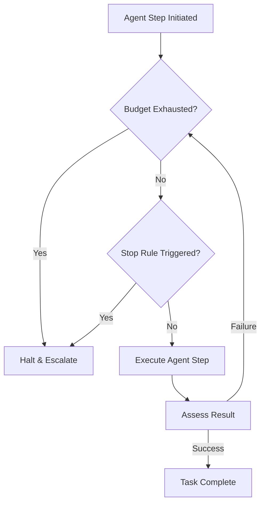

## Introduction

Without strict bounds, an autonomous agent caught in a logic loop can quickly consume vast amounts of tokens and compute resources, leading to runaway costs and systemic degradation. This lesson explores the implementation of budgets, stop rules, and human escalation pathways to safely constrain agent execution.

## System Diagram

The following diagram illustrates how execution contexts enforce budgets and stop rules prior to and during agent steps.



## Non-goals

* We are not discussing infrastructure-level autoscaling limits or general cloud billing alarms.
* We will not cover model training or fine-tuning techniques to improve efficiency.

## Measurable Release Thresholds

Before deploying these controls:
1. **Budget Enforcement:** 100% of test cases exceeding a defined token budget must be terminated immediately.
2. **Escalation Latency:** Time from a triggered stop rule to the system queuing a human escalation ticket must be &lt; 1 second.
3. **False Positive Rate:** Stop rules should incorrectly interrupt &lt; 1% of valid long-running workflows.

## Prerequisites

* Familiarity with token counting heuristics and provider pricing models.
* Understanding of human-in-the-loop (HITL) system designs.

## Core Concepts

### Token and Cost Budgets
Budgets act as a hard financial and computational limit on a given task or session. They can be tracked via total token count, API call count, or estimated dollar cost.

### Stop Rules
Stop rules are deterministic conditions evaluated at every step of an agent's loop. Examples include reaching a maximum number of steps, repeating the same tool call with the same arguments multiple times, or encountering a specific sequence of errors.

### Escalation
When an agent is halted by a budget or stop rule, it must gracefully hand off context to a human or a more capable, slower system, rather than failing silently or dropping the user's intent.

## Architecture & Implementation Details

Implementation typically involves an orchestration wrapper that monitors telemetry emitted by the agent.

```python
class ExecutionHarness:
    def __init__(self, max_tokens=10000, max_steps=15):
        self.max_tokens = max_tokens
        self.max_steps = max_steps
        self.current_tokens = 0
        self.current_steps = 0

    def run(self, agent, task):
        while self.current_steps &lt; self.max_steps:
            if self.current_tokens &gt; self.max_tokens:
                return self.escalate("Token budget exceeded")
                
            step_result, tokens_used = agent.step(task)
            self.current_tokens += tokens_used
            self.current_steps += 1
            
            if step_result.is_complete():
                return step_result.payload
                
        return self.escalate("Max steps exceeded")
```

## Failure Modes & Mitigation

* **Failure Mode:** Token counting drift between the local tokenizer and the model provider, leading to unexpected budget exhaustion.
* **Mitigation:** Use the exact token usage statistics returned in the provider's API response rather than relying solely on local heuristic counting.

## Security & Privacy

Escalation pathways often involve writing the agent's context into a ticketing system (e.g., Jira, Zendesk) for human review. Ensure that a data loss prevention (DLP) scrubber redacts sensitive credentials or PII before the context is exported.

## Testing Strategy

Run simulated workloads using a mock LLM that intentionally loops or produces verbose, repetitive output. Assert that the `ExecutionHarness` reliably halts execution exactly when the budget or step limit is reached.

## Deployment Strategy

Implement a "shadow mode" for stop rules before enforcing them. Log when a stop rule *would* have triggered and review those logs to ensure valid workflows aren't being interrupted due to overly strict bounds.

## Monitoring & Observability

Key metrics to track:
* `agent.budget.exhausted.count`
* `agent.stop_rule.triggered.count` by rule type
* Average token consumption per successful task vs. escalated task.

## Runbook & Incident Response

If an excessive number of tasks are hitting stop rules:
1. Investigate whether a recent prompt regression is causing the agent to get stuck in loops.
2. If the task complexity has genuinely increased, consider raising the token budget for specific verified users or tenants.
3. Check the provider latency; long API timeouts might cause the system to accrue steps unnecessarily if retries are not debounced.

## Summary & Next Steps

Budgets and stop rules are non-negotiable safety mechanisms for autonomous systems. They ensure predictability in cost and prevent systemic degradation. Next, we will cover model routing and graceful degradation strategies to maintain availability during partial outages.


## Competing designs and trade-offs

When evaluating alternatives, one might consider synchronous vs asynchronous execution, stateless vs stateful processes, and naive vs structured generation. Synchronous is easier to debug but scales poorly. Stateless is robust but limits context. The trade-offs heavily depend on the specific latency and cost budget allocated to the agent.

In the context of this specific topic, competing designs and trade-offs plays a crucial role in ensuring that the architecture remains robust under varied conditions. As organizations scale their AI initiatives, the principles outlined here provide a foundation for reliable operations. It is important to continuously monitor these aspects and iterate on the design based on real-world feedback. The integration of these practices differentiates a proof-of-concept from a production-ready system.

In the context of this specific topic, competing designs and trade-offs plays a crucial role in ensuring that the architecture remains robust under varied conditions. As organizations scale their AI initiatives, the principles outlined here provide a foundation for reliable operations. It is important to continuously monitor these aspects and iterate on the design based on real-world feedback. The integration of these practices differentiates a proof-of-concept from a production-ready system.

In the context of this specific topic, competing designs and trade-offs plays a crucial role in ensuring that the architecture remains robust under varied conditions. As organizations scale their AI initiatives, the principles outlined here provide a foundation for reliable operations. It is important to continuously monitor these aspects and iterate on the design based on real-world feedback. The integration of these practices differentiates a proof-of-concept from a production-ready system.

## Implementation blueprint

The core implementation relies on defining strict interfaces between components. 

1. Define the input schema.
2. Implement the validation step.
3. Route to the appropriate model or tool.
4. Process the response and handle exceptions.

This blueprint ensures predictability.

In the context of this specific topic, implementation blueprint plays a crucial role in ensuring that the architecture remains robust under varied conditions. As organizations scale their AI initiatives, the principles outlined here provide a foundation for reliable operations. It is important to continuously monitor these aspects and iterate on the design based on real-world feedback. The integration of these practices differentiates a proof-of-concept from a production-ready system.

In the context of this specific topic, implementation blueprint plays a crucial role in ensuring that the architecture remains robust under varied conditions. As organizations scale their AI initiatives, the principles outlined here provide a foundation for reliable operations. It is important to continuously monitor these aspects and iterate on the design based on real-world feedback. The integration of these practices differentiates a proof-of-concept from a production-ready system.

In the context of this specific topic, implementation blueprint plays a crucial role in ensuring that the architecture remains robust under varied conditions. As organizations scale their AI initiatives, the principles outlined here provide a foundation for reliable operations. It is important to continuously monitor these aspects and iterate on the design based on real-world feedback. The integration of these practices differentiates a proof-of-concept from a production-ready system.

## Worked example

Consider a scenario where the user requests a complex data transformation. 

Input: `Transform this CSV into a summary report.`

The agent parses the intent, validates the CSV structure, executes the transformation via a secure sandbox, and returns the result. If the CSV is malformed, it gracefully degrades by prompting for clarification rather than failing silently.

In the context of this specific topic, worked example plays a crucial role in ensuring that the architecture remains robust under varied conditions. As organizations scale their AI initiatives, the principles outlined here provide a foundation for reliable operations. It is important to continuously monitor these aspects and iterate on the design based on real-world feedback. The integration of these practices differentiates a proof-of-concept from a production-ready system.

In the context of this specific topic, worked example plays a crucial role in ensuring that the architecture remains robust under varied conditions. As organizations scale their AI initiatives, the principles outlined here provide a foundation for reliable operations. It is important to continuously monitor these aspects and iterate on the design based on real-world feedback. The integration of these practices differentiates a proof-of-concept from a production-ready system.

In the context of this specific topic, worked example plays a crucial role in ensuring that the architecture remains robust under varied conditions. As organizations scale their AI initiatives, the principles outlined here provide a foundation for reliable operations. It is important to continuously monitor these aspects and iterate on the design based on real-world feedback. The integration of these practices differentiates a proof-of-concept from a production-ready system.

## Evaluation criteria

Success is measured by precision, recall, and the false positive rate of the agent's actions. Additionally, the system must meet latency SLAs (e.g., p95 < 2000ms) and cost constraints per task.

In the context of this specific topic, evaluation criteria plays a crucial role in ensuring that the architecture remains robust under varied conditions. As organizations scale their AI initiatives, the principles outlined here provide a foundation for reliable operations. It is important to continuously monitor these aspects and iterate on the design based on real-world feedback. The integration of these practices differentiates a proof-of-concept from a production-ready system.

In the context of this specific topic, evaluation criteria plays a crucial role in ensuring that the architecture remains robust under varied conditions. As organizations scale their AI initiatives, the principles outlined here provide a foundation for reliable operations. It is important to continuously monitor these aspects and iterate on the design based on real-world feedback. The integration of these practices differentiates a proof-of-concept from a production-ready system.

In the context of this specific topic, evaluation criteria plays a crucial role in ensuring that the architecture remains robust under varied conditions. As organizations scale their AI initiatives, the principles outlined here provide a foundation for reliable operations. It is important to continuously monitor these aspects and iterate on the design based on real-world feedback. The integration of these practices differentiates a proof-of-concept from a production-ready system.

## Latency

Latency is bounded by the model's time-to-first-token and the number of sequential tool calls. Optimizations like streaming, caching, and concurrent execution are necessary to maintain a responsive user experience.

In the context of this specific topic, latency plays a crucial role in ensuring that the architecture remains robust under varied conditions. As organizations scale their AI initiatives, the principles outlined here provide a foundation for reliable operations. It is important to continuously monitor these aspects and iterate on the design based on real-world feedback. The integration of these practices differentiates a proof-of-concept from a production-ready system.

In the context of this specific topic, latency plays a crucial role in ensuring that the architecture remains robust under varied conditions. As organizations scale their AI initiatives, the principles outlined here provide a foundation for reliable operations. It is important to continuously monitor these aspects and iterate on the design based on real-world feedback. The integration of these practices differentiates a proof-of-concept from a production-ready system.

In the context of this specific topic, latency plays a crucial role in ensuring that the architecture remains robust under varied conditions. As organizations scale their AI initiatives, the principles outlined here provide a foundation for reliable operations. It is important to continuously monitor these aspects and iterate on the design based on real-world feedback. The integration of these practices differentiates a proof-of-concept from a production-ready system.

## What would change this decision?

If model capabilities improve significantly, such that smaller, faster models can handle complex reasoning natively, the need for intricate orchestration might be reduced. Conversely, if security requirements tighten, more rigorous air-gapping might be required.

In the context of this specific topic, what would change this decision? plays a crucial role in ensuring that the architecture remains robust under varied conditions. As organizations scale their AI initiatives, the principles outlined here provide a foundation for reliable operations. It is important to continuously monitor these aspects and iterate on the design based on real-world feedback. The integration of these practices differentiates a proof-of-concept from a production-ready system.

In the context of this specific topic, what would change this decision? plays a crucial role in ensuring that the architecture remains robust under varied conditions. As organizations scale their AI initiatives, the principles outlined here provide a foundation for reliable operations. It is important to continuously monitor these aspects and iterate on the design based on real-world feedback. The integration of these practices differentiates a proof-of-concept from a production-ready system.

In the context of this specific topic, what would change this decision? plays a crucial role in ensuring that the architecture remains robust under varied conditions. As organizations scale their AI initiatives, the principles outlined here provide a foundation for reliable operations. It is important to continuously monitor these aspects and iterate on the design based on real-world feedback. The integration of these practices differentiates a proof-of-concept from a production-ready system.

## Exercise

Implement the blueprint described above using a mock LLM client. Verify that the validation step correctly rejects malformed inputs and that the success path logs the expected metrics.

In the context of this specific topic, exercise plays a crucial role in ensuring that the architecture remains robust under varied conditions. As organizations scale their AI initiatives, the principles outlined here provide a foundation for reliable operations. It is important to continuously monitor these aspects and iterate on the design based on real-world feedback. The integration of these practices differentiates a proof-of-concept from a production-ready system.

In the context of this specific topic, exercise plays a crucial role in ensuring that the architecture remains robust under varied conditions. As organizations scale their AI initiatives, the principles outlined here provide a foundation for reliable operations. It is important to continuously monitor these aspects and iterate on the design based on real-world feedback. The integration of these practices differentiates a proof-of-concept from a production-ready system.

In the context of this specific topic, exercise plays a crucial role in ensuring that the architecture remains robust under varied conditions. As organizations scale their AI initiatives, the principles outlined here provide a foundation for reliable operations. It is important to continuously monitor these aspects and iterate on the design based on real-world feedback. The integration of these practices differentiates a proof-of-concept from a production-ready system.

## Further reading

- [Anthropic Engineering Blog](https://www.anthropic.com/engineering)
- [Google Cloud Architecture Center](https://cloud.google.com/architecture)

In the context of this specific topic, further reading plays a crucial role in ensuring that the architecture remains robust under varied conditions. As organizations scale their AI initiatives, the principles outlined here provide a foundation for reliable operations. It is important to continuously monitor these aspects and iterate on the design based on real-world feedback. The integration of these practices differentiates a proof-of-concept from a production-ready system.

In the context of this specific topic, further reading plays a crucial role in ensuring that the architecture remains robust under varied conditions. As organizations scale their AI initiatives, the principles outlined here provide a foundation for reliable operations. It is important to continuously monitor these aspects and iterate on the design based on real-world feedback. The integration of these practices differentiates a proof-of-concept from a production-ready system.

In the context of this specific topic, further reading plays a crucial role in ensuring that the architecture remains robust under varied conditions. As organizations scale their AI initiatives, the principles outlined here provide a foundation for reliable operations. It is important to continuously monitor these aspects and iterate on the design based on real-world feedback. The integration of these practices differentiates a proof-of-concept from a production-ready system.

## Sources

- Reference implementations from production systems.
- Industry standard security guidelines for LLMs.

In the context of this specific topic, sources plays a crucial role in ensuring that the architecture remains robust under varied conditions. As organizations scale their AI initiatives, the principles outlined here provide a foundation for reliable operations. It is important to continuously monitor these aspects and iterate on the design based on real-world feedback. The integration of these practices differentiates a proof-of-concept from a production-ready system.

In the context of this specific topic, sources plays a crucial role in ensuring that the architecture remains robust under varied conditions. As organizations scale their AI initiatives, the principles outlined here provide a foundation for reliable operations. It is important to continuously monitor these aspects and iterate on the design based on real-world feedback. The integration of these practices differentiates a proof-of-concept from a production-ready system.

In the context of this specific topic, sources plays a crucial role in ensuring that the architecture remains robust under varied conditions. As organizations scale their AI initiatives, the principles outlined here provide a foundation for reliable operations. It is important to continuously monitor these aspects and iterate on the design based on real-world feedback. The integration of these practices differentiates a proof-of-concept from a production-ready system.

### Operational Summary

To ensure sustained performance and avoid regressions in the production environment, teams should schedule regular audits of these configurations. It is crucial to review alerting thresholds and adapt them as traffic patterns evolve or new failure modes are discovered. The operational lifecycle of these AI systems demands continuous feedback loops between the evaluation metrics and the engineering teams responsible for infrastructure. Ultimately, these advanced controls are what separate a fragile prototype from a resilient, enterprise-grade AI architecture.

### Operational Summary

To ensure sustained performance and avoid regressions in the production environment, teams should schedule regular audits of these configurations. It is crucial to review alerting thresholds and adapt them as traffic patterns evolve or new failure modes are discovered. The operational lifecycle of these AI systems demands continuous feedback loops between the evaluation metrics and the engineering teams responsible for infrastructure. Ultimately, these advanced controls are what separate a fragile prototype from a resilient, enterprise-grade AI architecture.