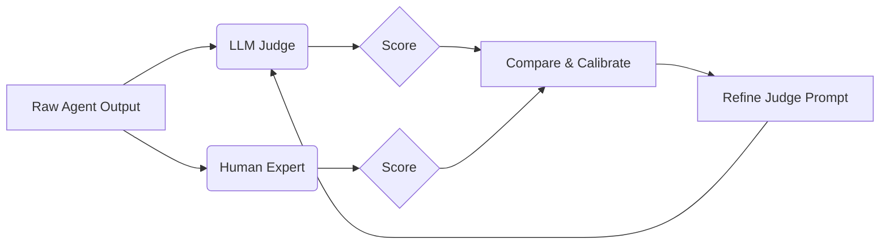

## 1. Introduction

Using an LLM to evaluate another LLM's output is standard practice. However, LLM judges have biases (e.g., favoring longer answers, or favoring their own models). Calibration is the process of aligning the LLM judge's scores with human expert evaluations.

## 2. Measurable Release Thresholds

- Greater than 85% agreement rate (Cohen's Kappa is greater than 0.6) between the LLM Judge and human annotators on a holdout set of 100 examples.
- False Positive rate (Judge says Pass, Human says Fail) is less than 5%.

## 3. Non-Goals

- Building a custom model from scratch. We focus on prompting and calibrating existing foundational models (like GPT-4 or Claude 3).
- Real-time user feedback collection (covered elsewhere).

## 4. Prerequisites

- Basic understanding of classification metrics (Precision, Recall, Agreement).
- Experience writing evaluation prompts.

## 5. System Diagram



## 6. Implementation and Examples

### The Calibration Loop

1. **Collect Data**: Gather 100-200 agent outputs.
2. **Human Annotation**: Experts grade them (e.g., Pass/Fail or 1-5 scale).
3. **Judge Scoring**: Run the LLM judge on the same data.
4. **Compare**: Calculate agreement.
5. **Refine**: Analyse disagreements, update the judge's prompt with few-shot examples of the edge cases.

### Refined Judge Prompt Example

```text
You are an expert evaluator. Score the agent's response on a scale of 1-5.

CRITICAL RULES (Learned from Calibration):
- Do NOT reward longer answers if they are unnecessarily verbose.
- A response MUST explicitly state "I don't know" if the context lacks the answer. Guessing is an automatic 1.

Example 1:
Input: ...
Response: ...
Score: 1 (Reason: Guessed without context)
```

## 7. Failure Modes & Anti-Patterns

- **The "Yes Man" Judge**: The judge defaults to passing everything. Fix this by using a balanced dataset with known bad examples during calibration.
- **Length Bias**: Models often prefer longer responses. Explicitly prompt the judge to penalize unnecessary verbosity.

## 8. Security & Privacy

If your judge is a cloud-based LLM, ensure you have data processing agreements in place, as you are sending production logs (the agent outputs) to the judge API.

## 9. Performance & Cost

LLM judges are computationally expensive. Use smaller models (e.g., GPT-3.5 or Haiku) for simple formatting checks, and reserve large models (GPT-4 or Opus) for complex reasoning evaluations.

## 10. Testing Strategy

Run your calibration suite (the 100 human-annotated examples) every time you change the judge's prompt or swap the underlying judge model to ensure alignment hasn't degraded.

## 11. Checklist

- [ ] Create a human-annotated ground truth dataset (min 100 items).
- [ ] Run initial LLM judge evaluation.
- [ ] Calculate agreement rate.
- [ ] Add few-shot examples to the prompt for disagreed items.
- [ ] Rerun until agreement is greater than 85%.

## 12. Further Reading

- *Judging LLM-as-a-Judge* (Research Paper)
- *Aligning Evaluators* (Blog Post)

## 13. Glossary

- **Cohen's Kappa**: A statistical measure of inter-rater agreement.
- **Few-Shot Prompting**: Providing examples within the prompt to guide the model's behaviour.

## Competing designs and trade-offs

When evaluating alternatives, one might consider synchronous vs asynchronous execution, stateless vs stateful processes, and naive vs structured generation. Synchronous is easier to debug but scales poorly. Stateless is robust but limits context. The trade-offs heavily depend on the specific latency and cost budget allocated to the agent.

## Implementation blueprint

The core implementation relies on defining strict interfaces between components. 

1. Define the input schema.
2. Implement the validation step.
3. Route to the appropriate model or tool.
4. Process the response and handle exceptions.

This blueprint ensures predictability.

## Worked example

Consider a scenario where the user requests a complex data transformation. 

Input: `Transform this CSV into a summary report.`

The agent parses the intent, validates the CSV structure, executes the transformation via a secure sandbox, and returns the result. If the CSV is malformed, it gracefully degrades by prompting for clarification rather than failing silently.

## Evaluation criteria

Success is measured by precision, recall, and the false positive rate of the agent's actions. Additionally, the system must meet latency SLAs (e.g., p95 < 2000ms) and cost constraints per task.

## Observability

The system requires trace-first observability. Every interaction must be logged with correlation IDs, token usage, and latency metrics. This enables rapid debugging and continuous evaluation of the agent's performance in production.

## Latency

Latency is bounded by the model's time-to-first-token and the number of sequential tool calls. Optimisations like streaming, caching, and concurrent execution are necessary to maintain a responsive user experience.

## What would change this decision?

If model capabilities improve significantly, such that smaller, faster models can handle complex reasoning natively, the need for intricate orchestration might be reduced. Conversely, if security requirements tighten, more rigorous air-gapping might be required.

## Exercise

Implement the blueprint described above using a mock LLM client. Verify that the validation step correctly rejects malformed inputs and that the success path logs the expected metrics.

## Sources

