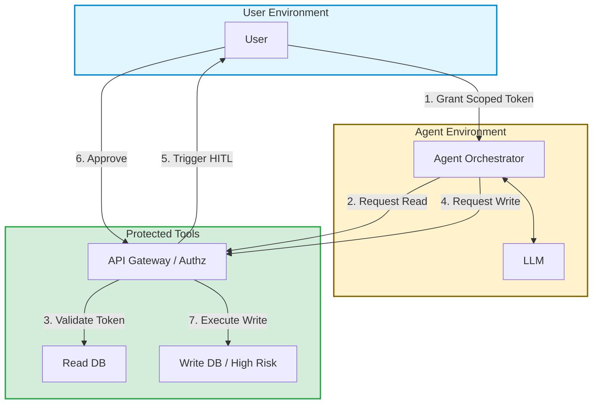

## 1. Concrete production problem and non-goals

**Problem:** Agents operating with long-lived, high-privilege credentials can cause immense damage if compromised via prompt injection or if they hallucinate. Traditional Role-Based Access Control (RBAC) is often too coarse for autonomous systems that need narrowly scoped permissions per task.

**Non-goals:** This lesson does not cover the specifics of configuring IAM roles in AWS or GCP. It focuses on the architectural pattern of delegating scoped capabilities to agents and intercepting high-risk actions for human review.

## 2. Prerequisites and assumed system scale

- **Prerequisites:** Understanding of OAuth 2.0, scopes, and synchronous/asynchronous execution models.
- **Scale:** High-scale enterprise systems where agents perform financial transactions, modify infrastructure, or access PII.

## 3. System diagram with trust and failure boundaries



## 4. Viable designs and trade-offs

### Design 1: Static API Keys with RBAC

- *Pros:* Simple to implement, standard industry practice for microservices.
- *Cons:* Extremely dangerous for agents. If the agent's context is hijacked, the attacker gains full access to all permissions associated with the static key.

### Design 2: Capability-based Security with Dynamic Scopes and HITL

- *Pros:* Agents only hold tokens valid for the specific task at hand. High-risk actions require real-time cryptographic approval from the human user. 
- *Cons:* Significantly more complex UX. Asynchronous workflows must handle pending states while waiting for human approval.

**Trade-off Summary:** For any system operating above trivial risk levels, capability-based security with HITL is mandatory. The UX complexity is a necessary cost for system integrity.

## 5. Implementation blueprint

```python
def invoke_tool(tool_name, arguments, agent_token):
    # 1. Validate the agent's token cryptographically
    claims = verify_jwt(agent_token)
    
    # 2. Check if the tool is within the token's granted scopes
    if tool_name not in claims['allowed_tools']:
        raise UnauthorizedError(f"Tool {tool_name} not in granted scopes.")
        
    # 3. Check if the tool requires Human-in-the-Loop approval
    if is_high_risk_tool(tool_name):
        # Suspend execution and send an approval request to the user
        approval_id = create_pending_approval(claims['user_id'], tool_name, arguments)
        return {"status": "pending_human_approval", "approval_id": approval_id}
        
    # 4. Execute the tool safely
    return execute_backend_action(tool_name, arguments)
```

## 6. Worked example using realistic data

**Scenario:** An IT support agent is asked to reset a user's password.

- *Input:* "Reset the password for employee John Doe."
- *Execution:* The agent has the scope `users:read` and `users:reset_password`. It calls the `reset_password` tool.
- *Mitigation:* The API Gateway detects `reset_password` is a high-risk action. It pauses the agent and sends a push notification to the IT Admin: "Agent requested to reset password for John Doe. Approve or Deny?" Once approved, the gateway completes the action and returns the new temporary password to the agent.

## 7. Failure injection or adversarial cases

- **Adversarial Input:** An attacker uses prompt injection to force the agent to request an OAuth token with administrative scopes.
- *Expected System Response:* The token issuance endpoint enforces strict maximum scopes based on the human user's session. The request for elevated scopes is rejected immediately.

## 8. Evaluation criteria and measurable release thresholds

- **Release Threshold:**
  - 100% of destructive operations require out-of-band human approval.
  - Agent tokens expire in under 15 minutes.
  - Zero hardcoded credentials exist within the agent's execution environment.

## 9. Security and privacy considerations

- Token leakage is a primary concern. Ensure agent tokens are stored in secure memory enclaves and never logged.
- The HITL approval prompt must clearly state *exactly* what the agent is about to do, preventing UI redressing attacks where the user approves a malicious action unknowingly.

## 10. Observability requirements

- Log every token issuance, token validation, and HITL approval decision. 
- Alert on a high frequency of denied HITL requests, which indicates a compromised or malfunctioning agent.

## 11. Latency and cost considerations

- HITL introduces indeterminate latency. The agent orchestrator must be designed to pause, serialize its state, and resume upon receiving an asynchronous webhook, rather than blocking a thread indefinitely.

## 12. Operational or review artifact

A matrix mapping every available tool to its required OAuth scopes and its HITL requirement status (e.g., "None", "MFA Required", "Manager Approval").

## 13. Authoritative sources

- [OAuth 2.0 Security Best Current Practice](https://datatracker.ietf.org/doc/html/draft-ietf-oauth-security-topics) (Verified: 2026-10-07)

## 14. What would change this decision?

- If cryptographic proof of LLM execution path (e.g., using zero-knowledge ML) becomes viable, we might trust the agent's intent enough to reduce HITL for medium-risk actions, relying entirely on the capability scope.

## 15. Hands-on exercise

**Exercise:** Design a sequence diagram showing the token flow and HITL approval process for an agent executing a `delete_database_table` command.
**Expected Evidence:** A completed Mermaid sequence diagram showing the interactions between the User, Agent, Auth Gateway, and Database.

## Provenance and further reading

- **Source**: Internal Engineering Guidelines
- **Author/Organization**: Security Architecture Team
- **Publication Date**: 2026-10-07
- **Access Date**: 2026-10-07
- **Next Steps**: Review the lesson `supply-chain-security`.

## Competing designs and trade-offs

When evaluating alternatives, one might consider synchronous vs asynchronous execution, stateless vs stateful processes, and naive vs structured generation. Synchronous is easier to debug but scales poorly. Stateless is robust but limits context. The trade-offs heavily depend on the specific latency and cost budget allocated to the agent.

