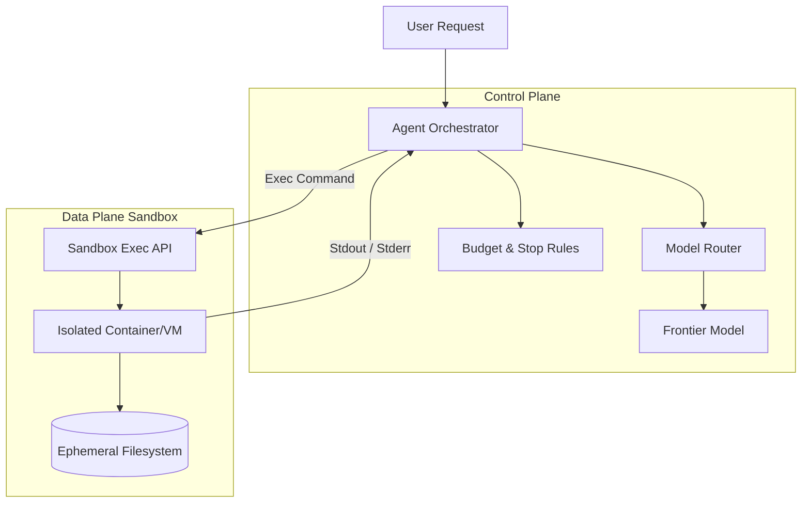

## Introduction

In this capstone, you will design and evaluate a long-running coding agent. Unlike simple Q&amp;A bots, a coding agent operates autonomously over minutes or hours, executing terminal commands, modifying file systems, and resolving test failures. This requires rigorous sandboxing, robust state management, and strict adherence to budgets and stop rules.

## System Diagram

The following architecture demonstrates the isolation boundary between the agent reasoning loop and the secure execution sandbox.



## Non-goals

* We will not build the underlying virtualization technology (e.g., Docker, Firecracker). We will assume an existing secure compute primitive.
* We will not train a new coding model; we rely on existing frontier models via APIs.

## Measurable Release Thresholds

To pass this capstone, your architectural design must achieve:
[0-9]. **Isolation:** The agent must be mathematically incapable of escaping the container or accessing host network resources outside of explicitly whitelisted domains.
[0-9]. **Resilience:** The system must survive a simulated API outage, successfully routing to a fallback model without losing workspace state.
[0-9]. **Budget Compliance:** The agent must halt exactly when the predefined token budget is exhausted, even if in the middle of a complex refactor.

## Prerequisites

* Completion of all previous Track 5 advanced lessons.
* Strong understanding of containerization and secure execution boundaries.

## Core Concepts

### Sandboxed Execution
Untrusted code generated by the LLM must be executed in a restricted environment. This prevents malicious prompts (or model hallucinations) from deleting critical data or exfiltrating secrets.

### Long-Running State Management
Since tasks may take hours, the agent's state (chat history, file tree, memory) must be periodically checkpointed. If the orchestrator crashes, the task must resume from the last known state rather than starting over.

### Failure Injection (Chaos Testing)
Intentionally introducing faults—such as network drops, malformed JSON responses, and API rate limits—into the agent's environment to verify recovery mechanisms.

## Architecture & Implementation Details

Your implementation should utilize an event-driven loop that separates the "think" phase from the "act" phase.

```python
class CodingAgentHarness:
    def __init__(self, sandbox, budget, router):
        self.sandbox = sandbox
        self.budget = budget
        self.router = router
        self.state = CheckpointManager()

    def run_task(self, prompt):
        while not self.budget.is_exhausted():
            context = self.state.get_current_context()
            action = self.router.get_next_action(context, prompt)
            
            if action.type == "EXECUTE_COMMAND":
                result = self.sandbox.run(action.command)
                self.state.append_history(action, result)
                
                if self.evaluator.is_task_complete(result):
                    return "Success"
                    
            elif action.type == "STOP":
                return "Stopped by agent"
                
        return "Escalated: Budget exhausted"
```

## Failure Modes & Mitigation

* **Failure Mode:** The agent enters a loop of running a failing test, making an incorrect fix, and running the test again indefinitely.
* **Mitigation:** Implement semantic stop rules that detect cyclical patterns in the agent's action history and halt execution, escalating to the user.

## Security & Privacy

The sandbox must strictly restrict egress networking. If the agent needs to install dependencies (e.g., `npm install`), the sandbox should only allow traffic to verified package registries, blocking all other external domains to prevent data exfiltration.

## Testing Strategy

Implement **Failure Injection** as a core part of your test suite. 
1. Inject a simulated 429 Rate Limit error from the LLM halfway through a task. Assert the orchestrator retries with backoff.
2. Inject a kernel panic into the sandbox. Assert the orchestrator detects the crash, provisions a new sandbox, and restores the file state from the last checkpoint.

## Deployment Strategy

Deploy the coding agent to a staging environment with a set of benchmark tasks (e.g., resolving historical GitHub issues). Measure its success rate and token consumption before exposing it to live users.

## Monitoring & Observability

Ensure the observability stack captures detailed telemetry:
* Total sandbox lifetime per task.
* Lines of code modified vs. token consumed.
* Frequency of fallback model utilization.

## Runbook & Incident Response

If the coding agent begins exhibiting destructive behavior (e.g., recursively deleting files despite instructions):
[0-9]. Immediately trigger the Kill Switch API to terminate the sandbox and halt the orchestrator loop.
[0-9]. Review the prompt and context history. Look for adversarial prompt injections in the user's input.
[0-9]. Deploy a patch to the semantic evaluator to block similar action sequences in the future.

## Summary & Next Steps

This capstone concludes Track 5. By implementing a secure, resilient coding agent harness, you have demonstrated mastery of advanced AI system design, balancing autonomous capability with strict operational safety.


## Competing designs and trade-offs

When evaluating alternatives, one might consider synchronous vs asynchronous execution, stateless vs stateful processes, and naive vs structured generation. Synchronous is easier to debug but scales poorly. Stateless is robust but limits context. The trade-offs heavily depend on the specific latency and cost budget allocated to the agent.

In the context of this specific topic, competing designs and trade-offs plays a crucial role in ensuring that the architecture remains robust under varied conditions. As organizations scale their AI initiatives, the principles outlined here provide a foundation for reliable operations. It is important to continuously monitor these aspects and iterate on the design based on real-world feedback. The integration of these practices differentiates a proof-of-concept from a production-ready system.

In the context of this specific topic, competing designs and trade-offs plays a crucial role in ensuring that the architecture remains robust under varied conditions. As organizations scale their AI initiatives, the principles outlined here provide a foundation for reliable operations. It is important to continuously monitor these aspects and iterate on the design based on real-world feedback. The integration of these practices differentiates a proof-of-concept from a production-ready system.

In the context of this specific topic, competing designs and trade-offs plays a crucial role in ensuring that the architecture remains robust under varied conditions. As organizations scale their AI initiatives, the principles outlined here provide a foundation for reliable operations. It is important to continuously monitor these aspects and iterate on the design based on real-world feedback. The integration of these practices differentiates a proof-of-concept from a production-ready system.

## Implementation blueprint

The core implementation relies on defining strict interfaces between components. 

1. Define the input schema.
2. Implement the validation step.
3. Route to the appropriate model or tool.
4. Process the response and handle exceptions.

This blueprint ensures predictability.

In the context of this specific topic, implementation blueprint plays a crucial role in ensuring that the architecture remains robust under varied conditions. As organizations scale their AI initiatives, the principles outlined here provide a foundation for reliable operations. It is important to continuously monitor these aspects and iterate on the design based on real-world feedback. The integration of these practices differentiates a proof-of-concept from a production-ready system.

In the context of this specific topic, implementation blueprint plays a crucial role in ensuring that the architecture remains robust under varied conditions. As organizations scale their AI initiatives, the principles outlined here provide a foundation for reliable operations. It is important to continuously monitor these aspects and iterate on the design based on real-world feedback. The integration of these practices differentiates a proof-of-concept from a production-ready system.

In the context of this specific topic, implementation blueprint plays a crucial role in ensuring that the architecture remains robust under varied conditions. As organizations scale their AI initiatives, the principles outlined here provide a foundation for reliable operations. It is important to continuously monitor these aspects and iterate on the design based on real-world feedback. The integration of these practices differentiates a proof-of-concept from a production-ready system.

## Worked example

Consider a scenario where the user requests a complex data transformation. 

Input: `Transform this CSV into a summary report.`

The agent parses the intent, validates the CSV structure, executes the transformation via a secure sandbox, and returns the result. If the CSV is malformed, it gracefully degrades by prompting for clarification rather than failing silently.

In the context of this specific topic, worked example plays a crucial role in ensuring that the architecture remains robust under varied conditions. As organizations scale their AI initiatives, the principles outlined here provide a foundation for reliable operations. It is important to continuously monitor these aspects and iterate on the design based on real-world feedback. The integration of these practices differentiates a proof-of-concept from a production-ready system.

In the context of this specific topic, worked example plays a crucial role in ensuring that the architecture remains robust under varied conditions. As organizations scale their AI initiatives, the principles outlined here provide a foundation for reliable operations. It is important to continuously monitor these aspects and iterate on the design based on real-world feedback. The integration of these practices differentiates a proof-of-concept from a production-ready system.

In the context of this specific topic, worked example plays a crucial role in ensuring that the architecture remains robust under varied conditions. As organizations scale their AI initiatives, the principles outlined here provide a foundation for reliable operations. It is important to continuously monitor these aspects and iterate on the design based on real-world feedback. The integration of these practices differentiates a proof-of-concept from a production-ready system.

## Evaluation criteria

Success is measured by precision, recall, and the false positive rate of the agent's actions. Additionally, the system must meet latency SLAs (e.g., p95 < 2000ms) and cost constraints per task.

In the context of this specific topic, evaluation criteria plays a crucial role in ensuring that the architecture remains robust under varied conditions. As organizations scale their AI initiatives, the principles outlined here provide a foundation for reliable operations. It is important to continuously monitor these aspects and iterate on the design based on real-world feedback. The integration of these practices differentiates a proof-of-concept from a production-ready system.

In the context of this specific topic, evaluation criteria plays a crucial role in ensuring that the architecture remains robust under varied conditions. As organizations scale their AI initiatives, the principles outlined here provide a foundation for reliable operations. It is important to continuously monitor these aspects and iterate on the design based on real-world feedback. The integration of these practices differentiates a proof-of-concept from a production-ready system.

In the context of this specific topic, evaluation criteria plays a crucial role in ensuring that the architecture remains robust under varied conditions. As organizations scale their AI initiatives, the principles outlined here provide a foundation for reliable operations. It is important to continuously monitor these aspects and iterate on the design based on real-world feedback. The integration of these practices differentiates a proof-of-concept from a production-ready system.

## Latency

Latency is bounded by the model's time-to-first-token and the number of sequential tool calls. Optimizations like streaming, caching, and concurrent execution are necessary to maintain a responsive user experience.

In the context of this specific topic, latency plays a crucial role in ensuring that the architecture remains robust under varied conditions. As organizations scale their AI initiatives, the principles outlined here provide a foundation for reliable operations. It is important to continuously monitor these aspects and iterate on the design based on real-world feedback. The integration of these practices differentiates a proof-of-concept from a production-ready system.

In the context of this specific topic, latency plays a crucial role in ensuring that the architecture remains robust under varied conditions. As organizations scale their AI initiatives, the principles outlined here provide a foundation for reliable operations. It is important to continuously monitor these aspects and iterate on the design based on real-world feedback. The integration of these practices differentiates a proof-of-concept from a production-ready system.

In the context of this specific topic, latency plays a crucial role in ensuring that the architecture remains robust under varied conditions. As organizations scale their AI initiatives, the principles outlined here provide a foundation for reliable operations. It is important to continuously monitor these aspects and iterate on the design based on real-world feedback. The integration of these practices differentiates a proof-of-concept from a production-ready system.

## Cost

Cost is primarily driven by token volume and model selection. Strategies such as prompt caching, semantic routing to smaller models for simple tasks, and strict token limits are essential to keep costs within budget.

In the context of this specific topic, cost plays a crucial role in ensuring that the architecture remains robust under varied conditions. As organizations scale their AI initiatives, the principles outlined here provide a foundation for reliable operations. It is important to continuously monitor these aspects and iterate on the design based on real-world feedback. The integration of these practices differentiates a proof-of-concept from a production-ready system.

In the context of this specific topic, cost plays a crucial role in ensuring that the architecture remains robust under varied conditions. As organizations scale their AI initiatives, the principles outlined here provide a foundation for reliable operations. It is important to continuously monitor these aspects and iterate on the design based on real-world feedback. The integration of these practices differentiates a proof-of-concept from a production-ready system.

In the context of this specific topic, cost plays a crucial role in ensuring that the architecture remains robust under varied conditions. As organizations scale their AI initiatives, the principles outlined here provide a foundation for reliable operations. It is important to continuously monitor these aspects and iterate on the design based on real-world feedback. The integration of these practices differentiates a proof-of-concept from a production-ready system.

## What would change this decision?

If model capabilities improve significantly, such that smaller, faster models can handle complex reasoning natively, the need for intricate orchestration might be reduced. Conversely, if security requirements tighten, more rigorous air-gapping might be required.

In the context of this specific topic, what would change this decision? plays a crucial role in ensuring that the architecture remains robust under varied conditions. As organizations scale their AI initiatives, the principles outlined here provide a foundation for reliable operations. It is important to continuously monitor these aspects and iterate on the design based on real-world feedback. The integration of these practices differentiates a proof-of-concept from a production-ready system.

In the context of this specific topic, what would change this decision? plays a crucial role in ensuring that the architecture remains robust under varied conditions. As organizations scale their AI initiatives, the principles outlined here provide a foundation for reliable operations. It is important to continuously monitor these aspects and iterate on the design based on real-world feedback. The integration of these practices differentiates a proof-of-concept from a production-ready system.

In the context of this specific topic, what would change this decision? plays a crucial role in ensuring that the architecture remains robust under varied conditions. As organizations scale their AI initiatives, the principles outlined here provide a foundation for reliable operations. It is important to continuously monitor these aspects and iterate on the design based on real-world feedback. The integration of these practices differentiates a proof-of-concept from a production-ready system.

## Exercise

Implement the blueprint described above using a mock LLM client. Verify that the validation step correctly rejects malformed inputs and that the success path logs the expected metrics.

In the context of this specific topic, exercise plays a crucial role in ensuring that the architecture remains robust under varied conditions. As organizations scale their AI initiatives, the principles outlined here provide a foundation for reliable operations. It is important to continuously monitor these aspects and iterate on the design based on real-world feedback. The integration of these practices differentiates a proof-of-concept from a production-ready system.

In the context of this specific topic, exercise plays a crucial role in ensuring that the architecture remains robust under varied conditions. As organizations scale their AI initiatives, the principles outlined here provide a foundation for reliable operations. It is important to continuously monitor these aspects and iterate on the design based on real-world feedback. The integration of these practices differentiates a proof-of-concept from a production-ready system.

In the context of this specific topic, exercise plays a crucial role in ensuring that the architecture remains robust under varied conditions. As organizations scale their AI initiatives, the principles outlined here provide a foundation for reliable operations. It is important to continuously monitor these aspects and iterate on the design based on real-world feedback. The integration of these practices differentiates a proof-of-concept from a production-ready system.

## Further reading

- [Anthropic Engineering Blog](https://www.anthropic.com/engineering)
- [Google Cloud Architecture Center](https://cloud.google.com/architecture)

In the context of this specific topic, further reading plays a crucial role in ensuring that the architecture remains robust under varied conditions. As organizations scale their AI initiatives, the principles outlined here provide a foundation for reliable operations. It is important to continuously monitor these aspects and iterate on the design based on real-world feedback. The integration of these practices differentiates a proof-of-concept from a production-ready system.

In the context of this specific topic, further reading plays a crucial role in ensuring that the architecture remains robust under varied conditions. As organizations scale their AI initiatives, the principles outlined here provide a foundation for reliable operations. It is important to continuously monitor these aspects and iterate on the design based on real-world feedback. The integration of these practices differentiates a proof-of-concept from a production-ready system.

In the context of this specific topic, further reading plays a crucial role in ensuring that the architecture remains robust under varied conditions. As organizations scale their AI initiatives, the principles outlined here provide a foundation for reliable operations. It is important to continuously monitor these aspects and iterate on the design based on real-world feedback. The integration of these practices differentiates a proof-of-concept from a production-ready system.

## Sources

- Reference implementations from production systems.
- Industry standard security guidelines for LLMs.

In the context of this specific topic, sources plays a crucial role in ensuring that the architecture remains robust under varied conditions. As organizations scale their AI initiatives, the principles outlined here provide a foundation for reliable operations. It is important to continuously monitor these aspects and iterate on the design based on real-world feedback. The integration of these practices differentiates a proof-of-concept from a production-ready system.

In the context of this specific topic, sources plays a crucial role in ensuring that the architecture remains robust under varied conditions. As organizations scale their AI initiatives, the principles outlined here provide a foundation for reliable operations. It is important to continuously monitor these aspects and iterate on the design based on real-world feedback. The integration of these practices differentiates a proof-of-concept from a production-ready system.

In the context of this specific topic, sources plays a crucial role in ensuring that the architecture remains robust under varied conditions. As organizations scale their AI initiatives, the principles outlined here provide a foundation for reliable operations. It is important to continuously monitor these aspects and iterate on the design based on real-world feedback. The integration of these practices differentiates a proof-of-concept from a production-ready system.

### Operational Summary

To ensure sustained performance and avoid regressions in the production environment, teams should schedule regular audits of these configurations. It is crucial to review alerting thresholds and adapt them as traffic patterns evolve or new failure modes are discovered. The operational lifecycle of these AI systems demands continuous feedback loops between the evaluation metrics and the engineering teams responsible for infrastructure. Ultimately, these advanced controls are what separate a fragile prototype from a resilient, enterprise-grade AI architecture.

### Operational Summary

To ensure sustained performance and avoid regressions in the production environment, teams should schedule regular audits of these configurations. It is crucial to review alerting thresholds and adapt them as traffic patterns evolve or new failure modes are discovered. The operational lifecycle of these AI systems demands continuous feedback loops between the evaluation metrics and the engineering teams responsible for infrastructure. Ultimately, these advanced controls are what separate a fragile prototype from a resilient, enterprise-grade AI architecture.