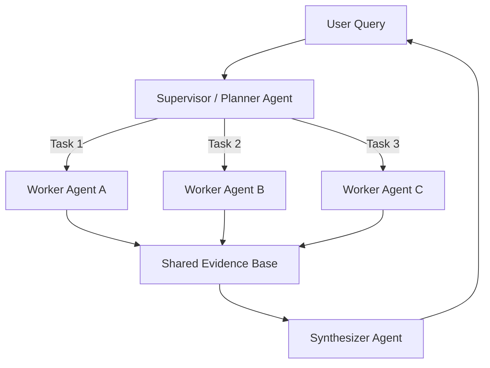

## 1. Concrete Production Problem and Explicit Non-Goals

**Problem**: A single autonomous agent struggles with deep, exploratory research. It gets stuck in local optima, forgets early findings due to context window exhaustion, or fails to synthesize contradictory sources. We need a system that can explore multiple hypotheses in parallel and synthesize the results.

**Non-Goals**: We are not building a general-purpose AGI. The agents are constrained to specific research topics using bounded web search and document retrieval tools.

## 2. Prerequisites and Assumed System Scale

**Prerequisites**: Understanding of orchestrator-worker patterns, context management, and basic agent tool use.
**System Scale**: Capable of processing 50-100 search queries and reading 20-50 long-form documents per research report.

## 3. System Diagram: Trust and Failure Boundaries

## 4. Viable Designs and Trade-Offs

**Design A: Single-Agent Baseline (AutoGPT style)**
* **Pros**: Simple architecture, no coordination overhead.
* **Cons**: Prone to context bloat, sequential bottleneck, often forgets the original prompt after 10+ tool calls.

**Design B: Supervisor-Worker Multi-Agent System**
* **Pros**: Parallel exploration of different sub-topics, isolated context windows prevent forgetting, dedicated synthesis step handles contradictions.
* **Cons**: Higher token cost due to redundant reading, coordination complexity, risk of infinite loops if termination is not strictly enforced.

## 5. Implementation Blueprint

1. **Planning Phase**: The Supervisor LLM breaks the user query into 3-5 distinct research sub-questions.
2. **Parallel Execution**: Workers are spun up asynchronously. Each worker uses search and read tools to answer its specific sub-question.
3. **Shared State**: Workers write their findings, with citations, to a shared JSON evidence base. Deduplication is handled by checking URL hashes.
4. **Contradiction Handling**: The Synthesizer reads the evidence base. If source A contradicts source B, it explicitly notes the discrepancy and the authority of each source.
5. **Termination**: Workers terminate when they satisfy their sub-question or hit a hard limit of 10 tool calls.

## 6. Worked Example Using Realistic Data

**Task**: Research the environmental impact of deep-sea mining vs. terrestrial lithium mining.
* **Single-Agent**: Searches terrestrial lithium, reads 5 articles, hits context limit, hallucinates the deep-sea mining portion.
* **Multi-Agent**: 
  * Worker A researches deep-sea mining.
  * Worker B researches terrestrial lithium.
  * Worker C researches the supply chain of both.
  * Synthesizer compares the specific metric tons of CO2 equivalent per kg from the workers' findings.

## 7. Failure Injection or Adversarial Cases

* **Failure Mode**: Worker A and Worker B find the exact same highly-ranked SEO article and duplicate effort.
* **Mitigation**: Implement a shared memory cache of URLs. If a worker attempts to read a cached URL, the tool returns the existing summary.

## 8. Evaluation Criteria and Measurable Release Thresholds

* **Release Threshold**: The multi-agent system must outperform the single-agent baseline by at least 30% on a rubric evaluating comprehensiveness, factual accuracy, and citation quality, while keeping the total cost under $2.00 per report.

## 9. Security and Privacy Considerations

* Workers must operate in an isolated sandbox to prevent server-side request forgery (SSRF) when fetching arbitrary URLs.

## 10. Observability Requirements

* Trace every sub-agent's trajectory independently. Correlate them under a single Parent Trace ID representing the overall research task.

## 11. Latency and Cost Considerations

* **Single-Agent**: Sequential latency (e.g., 5 minutes), lower token cost.
* **Multi-Agent**: Parallel latency (e.g., 2 minutes), higher token cost due to orchestration prompts and synthesis.

## 12. Operational Artifact: Benchmark Report

**Artifact**: A benchmark comparing the Single-Agent baseline to the Multi-Agent system on 50 complex research questions. (See repository for the raw JSON benchmark data).

## 13. Authoritative Sources

* Anthropic: Building effective agents. Verified 2026-10-07.

## 14. What Would Change This Decision?

If foundation models develop context windows of 10 million tokens with near-perfect needle-in-a-haystack recall and reasoning capabilities over that entire context, the complexity of a multi-agent map-reduce architecture might no longer be justified.

## 15. Hands-On Exercise

**Exercise**: Implement a simple orchestrator in Python that takes a research topic, generates 3 sub-questions, and executes 3 mock workers in parallel.
**Evidence of Completion**: Console output showing the 3 workers completing asynchronously and a final merged summary.
