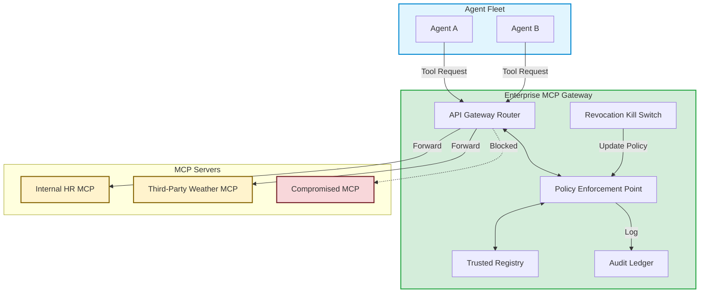

## 1. Concrete production problem and non-goals

**Problem:** In a large enterprise, hundreds of internal teams and third-party vendors provide MCP servers. If agents connect to these servers directly, the security team cannot enforce data loss prevention (DLP), audit tool usage, or rapidly revoke access when a server is compromised. A centralized Enterprise MCP Gateway is required to broker all agent-to-tool communications.

**Non-goals:** This case study does not cover the deployment of Kubernetes clusters to host the gateway. It focuses on the architectural design, policy enforcement mechanisms, and incident response workflows of the gateway itself.

## 2. Prerequisites and assumed system scale

- **Prerequisites:** Completion of Phase D lessons (Threat Modelling, Capability Security, Supply Chain Security, Operational Governance).
- **Scale:** Enterprise scale handling 10,000+ requests per second across 500+ distinct MCP servers and thousands of autonomous agents.

## 3. System diagram with trust and failure boundaries



## 4. Viable designs and trade-offs

### Design 1: Decentralized Direct Connections

- *Pros:* Low latency, no single point of failure.
- *Cons:* Impossible to audit centrally. Cannot enforce global DLP rules. If a tool is compromised, every agent must be updated individually to remove it.

### Design 2: Centralized Enterprise MCP Gateway

- *Pros:* Single choke point for audit logging, DLP, and access control. Rapid revocation via a global kill switch. Enforces registry verification.
- *Cons:* Becomes a single point of failure and a potential latency bottleneck. Requires highly available infrastructure.

**Trade-off Summary:** Enterprise security requires centralization for AI tools. The Gateway model is non-negotiable for compliance, making the engineering challenge about minimizing the latency overhead of the Policy Enforcement Point (PEP).

## 5. Implementation blueprint

```python
def route_mcp_request(agent_token, requested_server_id, payload):
    # 1. Identity & Revocation Check
    if is_revoked(requested_server_id):
        raise SecurityError("MCP Server has been globally revoked.")
        
    # 2. Registry Verification
    server_metadata = registry.get(requested_server_id)
    if not server_metadata:
        raise SecurityError("Unregistered MCP Server.")
        
    # 3. Capability / Authz Check
    agent_claims = verify_jwt(agent_token)
    if requested_server_id not in agent_claims['allowed_servers']:
        raise UnauthorizedError("Agent lacks scopes for this server.")
        
    # 4. Data Loss Prevention (DLP) on Request
    sanitized_payload = dlp_scanner.scrub(payload)
    
    # 5. Forward to actual MCP server
    response = execute_http_forward(server_metadata.url, sanitized_payload)
    
    # 6. DLP on Response & Audit Logging
    sanitized_response = dlp_scanner.scrub(response)
    audit_ledger.log(agent_claims['agent_id'], requested_server_id, sanitized_payload)
    
    return sanitized_response
```

## 6. Worked example using realistic data

**Scenario:** The "Compromised Server" Incident.

- *T0:* Threat intel reports that a popular Third-Party Financial MCP server has been compromised and is returning prompt injection payloads designed to exfiltrate data.
- *T+1 min:* The SOC team activates the Gateway Kill Switch for `mcp-server-finance-ext`.
- *T+2 min:* An internal agent, unaware of the compromise, attempts to query the financial server.
- *Execution:* The `route_mcp_request` function hits step 1. The `is_revoked` check returns True.
- *Mitigation:* The connection is blocked. The agent receives a 403 Forbidden and gracefully degrades its task. The prompt injection never reaches the agent's LLM context window.

## 7. Failure injection or adversarial cases

- **Adversarial Input:** A malicious internal developer tries to bypass the registry by having their agent send a hardcoded HTTP request directly to a compromised external IP, ignoring the MCP gateway.
- *Expected System Response:* The Agent Environment has strict egress network policies (VPC configuration). Outbound traffic is only allowed to the Enterprise MCP Gateway IP. The direct request is dropped at the network layer.

## 8. Evaluation criteria and measurable release thresholds

- **Release Threshold:**
  - 100% of agent-to-tool traffic routes through the Gateway.
  - Global revocation of an MCP server takes less than 5 seconds to propagate.
  - Gateway adds less than 50ms of p99 latency to MCP requests (excluding DLP scanning time).

## 9. Security and privacy considerations

- The Gateway decrypts TLS traffic to perform DLP scanning. This means the Gateway itself holds highly sensitive plaintext data in memory. It must operate in a secure enclave with strict access controls.

## 10. Observability requirements

- The Gateway must emit metrics on routing latency, DLP rejection rates, and revocation events.
- A sudden spike in 403 Forbidden errors for a specific agent type indicates either a misconfigured policy or a compromised agent attempting lateral movement.

## 11. Latency and cost considerations

- Deep Packet Inspection and DLP scanning are computationally expensive. Use caching for static responses and optimize regex engines for PII detection to minimize the latency impact on the agent's critical path.

## 12. Operational or review artifact

An Incident Post-Mortem document detailing the timeline of a simulated compromised MCP server event, proving that the Gateway successfully blocked the traffic and logged the blocked attempts.

## 13. Authoritative sources

- [Model Context Protocol Specification](https://modelcontextprotocol.io/) (Verified: 2026-10-07)

## 14. What would change this decision?

- If agents ran locally on user devices (edge AI) rather than in a corporate cloud, a centralized gateway would be impossible. In that case, policy enforcement would need to occur locally via a lightweight daemon on the endpoint.

## 15. Hands-on exercise

**Exercise:** Write a post-mortem report for the scenario described in Section 6. Include the timeline of events, the root cause analysis (why the third-party was compromised is less important than how your system responded), and action items for improving the Gateway's alerting logic.
**Expected Evidence:** A completed Incident Post-Mortem document.

## Provenance and further reading

- **Source**: Enterprise Architecture Blueprint
- **Author/Organization**: Gateway Infrastructure Team
- **Publication Date**: 2026-10-07
- **Access Date**: 2026-10-07
- **Next Steps**: Proceed to Phase E.

## Competing designs and trade-offs

When evaluating alternatives, one might consider synchronous vs asynchronous execution, stateless vs stateful processes, and naive vs structured generation. Synchronous is easier to debug but scales poorly. Stateless is robust but limits context. The trade-offs heavily depend on the specific latency and cost budget allocated to the agent.

