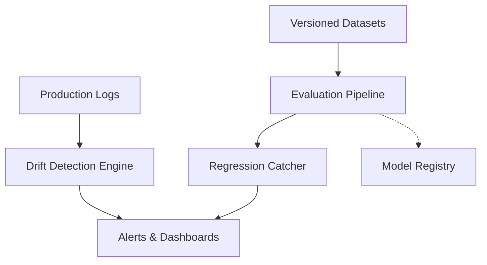

## Key takeaway

Building a robust evaluation and observability platform is essential for deploying LLMs confidently. It requires integrating versioned datasets, continuous drift detection, and automated regression testing into a single pane of glass.

## Mental model or small diagram



## When to use and when not to use

**When to use:**
- When deploying multiple LLM applications to production.
- When teams need to track model degradation or concept drift over time.
- When rigorous regression testing is required before promoting a new prompt or model version.

**Non-goals:**
- Not intended to replace standard application performance monitoring (APM) tools.
- Over-engineering for a single internal tool with static prompts.

## Method or procedure

1. **Versioned Datasets:** Maintain immutable evaluation datasets. Every prompt or model change must be tested against these exact versions.
2. **Evaluation Pipelines:** Build CI/CD pipelines that run evaluations automatically, scoring outputs using LLM-as-a-judge or deterministic metrics.
3. **Drift Detection:** Monitor production inputs and outputs continuously, calculating statistical distance from baseline datasets.
4. **Dashboards & Regression Catching:** Visualize performance metrics. Automatically block deployments if the regression catcher identifies a statistically significant drop in quality.

## Worked example

**Input:** A new version of a customer service prompt is proposed.

**Process:**
```python
def run_evaluation_suite(new_prompt, dataset_version="v2.1.0"):
    dataset = load_versioned_dataset(dataset_version)
    results = evaluate_prompt(new_prompt, dataset)
    
    # Regression catching logic
    baseline_score = get_baseline_score(dataset_version)
    if results.score < baseline_score - 0.05:
        raise RegressionError(f"Prompt regressed by {baseline_score - results.score}")
        
    update_dashboard(results)
    return "Ready for deployment"
```

**Output:** The evaluation platform prevents a degraded prompt from reaching production and updates the central dashboard with the exact failure metrics.

## Failure modes and mitigations

- **Stale Datasets:** Evaluation datasets become outdated and no longer reflect production traffic. *Mitigation: Implement a feedback loop to regularly sample production data into the evaluation sets.*
- **Noisy Evaluators:** LLM-as-a-judge provides inconsistent scores. *Mitigation: Calibrate evaluator models with human-annotated golden sets and use strict grading rubrics.*

## Evaluation checklist or rubric (measurable release thresholds)

- [ ] Are evaluation datasets explicitly versioned and immutable?
- [ ] Does the regression catcher automatically block failing CI/CD builds?
- [ ] Is data drift detected and alerted upon within 24 hours of occurrence?

## Safety, privacy, and cost notes

- **Safety:** Automatically red-team evaluation pipelines to check for adversarial vulnerabilities before deployment.
- **Privacy:** Anonymize and scrub production data before moving it into versioned evaluation datasets.
- **Cost:** Running comprehensive evaluation suites on every commit can be expensive. Run full suites nightly and smaller subsets on individual commits.

## Practice task

Design a schema for a versioned dataset that includes inputs, expected outputs, and metadata. Write a script that detects drift by comparing the length and sentiment of production outputs against this dataset.

## Provenance and further reading

- **Source**: Engineering Documentation
- **Author/Organization**: Platform Team
- **Publication Date**: 2026-10-07
