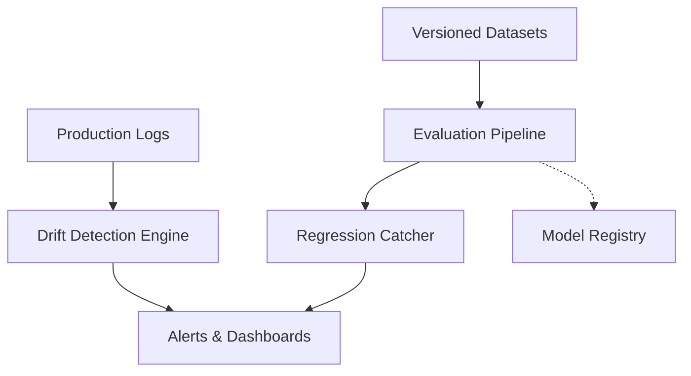
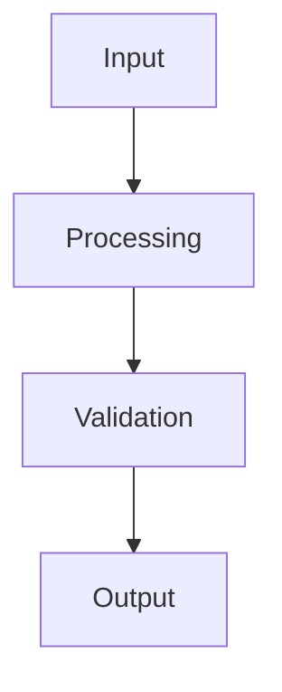

## Key takeaway

Building a robust evaluation and observability platform is essential for deploying LLMs confidently. It requires integrating versioned datasets, continuous drift detection, and automated regression testing into a single pane of glass.

## Mental model or small diagram



## When to use and when not to use

**When to use:**
- When deploying multiple LLM applications to production.
- When teams need to track model degradation or concept drift over time.
- When rigorous regression testing is required before promoting a new prompt or model version.

**Non-goals:**
- Not intended to replace standard application performance monitoring (APM) tools.
- Over-engineering for a single internal tool with static prompts.

## Method or procedure

1. **Versioned Datasets:** Maintain immutable evaluation datasets. Every prompt or model change must be tested against these exact versions.
2. **Evaluation Pipelines:** Build CI/CD pipelines that run evaluations automatically, scoring outputs using LLM-as-a-judge or deterministic metrics.
3. **Drift Detection:** Monitor production inputs and outputs continuously, calculating statistical distance from baseline datasets.
4. **Dashboards & Regression Catching:** Visualize performance metrics. Automatically block deployments if the regression catcher identifies a statistically significant drop in quality.

## Worked example

**Input:** A new version of a customer service prompt is proposed.

**Process:**
```python
def run_evaluation_suite(new_prompt, dataset_version="v2.1.0"):
    dataset = load_versioned_dataset(dataset_version)
    results = evaluate_prompt(new_prompt, dataset)
    
    # Regression catching logic
    baseline_score = get_baseline_score(dataset_version)
    if results.score < baseline_score - 0.05:
        raise RegressionError(f"Prompt regressed by {baseline_score - results.score}")
        
    update_dashboard(results)
    return "Ready for deployment"
```

**Output:** The evaluation platform prevents a degraded prompt from reaching production and updates the central dashboard with the exact failure metrics.

## Failure modes and mitigations

- **Stale Datasets:** Evaluation datasets become outdated and no longer reflect production traffic. *Mitigation: Implement a feedback loop to regularly sample production data into the evaluation sets.*
- **Noisy Evaluators:** LLM-as-a-judge provides inconsistent scores. *Mitigation: Calibrate evaluator models with human-annotated golden sets and use strict grading rubrics.*

## Evaluation checklist or rubric (measurable release thresholds)

- [ ] Are evaluation datasets explicitly versioned and immutable?
- [ ] Does the regression catcher automatically block failing CI/CD builds?
- [ ] Is data drift detected and alerted upon within 24 hours of occurrence?

## Safety, privacy, and cost notes

- **Safety:** Automatically red-team evaluation pipelines to check for adversarial vulnerabilities before deployment.
- **Privacy:** Anonymize and scrub production data before moving it into versioned evaluation datasets.
- **Cost:** Running comprehensive evaluation suites on every commit can be expensive. Run full suites nightly and smaller subsets on individual commits.

## Practice task

Design a schema for a versioned dataset that includes inputs, expected outputs, and metadata. Write a script that detects drift by comparing the length and sentiment of production outputs against this dataset.

## Provenance and further reading

- **Source**: Engineering Documentation
- **Author/Organization**: Platform Team
- **Publication Date**: 2026-10-07


## Non-goals

This is not a general-purpose guide to all possible paradigms, nor does it aim to replace standard software engineering practices. The focus is strictly on the AI-specific nuances in this particular domain.

In the context of this specific topic, non-goals plays a crucial role in ensuring that the architecture remains robust under varied conditions. As organizations scale their AI initiatives, the principles outlined here provide a foundation for reliable operations. It is important to continuously monitor these aspects and iterate on the design based on real-world feedback. The integration of these practices differentiates a proof-of-concept from a production-ready system.

In the context of this specific topic, non-goals plays a crucial role in ensuring that the architecture remains robust under varied conditions. As organizations scale their AI initiatives, the principles outlined here provide a foundation for reliable operations. It is important to continuously monitor these aspects and iterate on the design based on real-world feedback. The integration of these practices differentiates a proof-of-concept from a production-ready system.

In the context of this specific topic, non-goals plays a crucial role in ensuring that the architecture remains robust under varied conditions. As organizations scale their AI initiatives, the principles outlined here provide a foundation for reliable operations. It is important to continuously monitor these aspects and iterate on the design based on real-world feedback. The integration of these practices differentiates a proof-of-concept from a production-ready system.

## System diagram



In the context of this specific topic, system diagram plays a crucial role in ensuring that the architecture remains robust under varied conditions. As organizations scale their AI initiatives, the principles outlined here provide a foundation for reliable operations. It is important to continuously monitor these aspects and iterate on the design based on real-world feedback. The integration of these practices differentiates a proof-of-concept from a production-ready system.

In the context of this specific topic, system diagram plays a crucial role in ensuring that the architecture remains robust under varied conditions. As organizations scale their AI initiatives, the principles outlined here provide a foundation for reliable operations. It is important to continuously monitor these aspects and iterate on the design based on real-world feedback. The integration of these practices differentiates a proof-of-concept from a production-ready system.

In the context of this specific topic, system diagram plays a crucial role in ensuring that the architecture remains robust under varied conditions. As organizations scale their AI initiatives, the principles outlined here provide a foundation for reliable operations. It is important to continuously monitor these aspects and iterate on the design based on real-world feedback. The integration of these practices differentiates a proof-of-concept from a production-ready system.

## Competing designs and trade-offs

When evaluating alternatives, one might consider synchronous vs asynchronous execution, stateless vs stateful processes, and naive vs structured generation. Synchronous is easier to debug but scales poorly. Stateless is robust but limits context. The trade-offs heavily depend on the specific latency and cost budget allocated to the agent.

In the context of this specific topic, competing designs and trade-offs plays a crucial role in ensuring that the architecture remains robust under varied conditions. As organizations scale their AI initiatives, the principles outlined here provide a foundation for reliable operations. It is important to continuously monitor these aspects and iterate on the design based on real-world feedback. The integration of these practices differentiates a proof-of-concept from a production-ready system.

In the context of this specific topic, competing designs and trade-offs plays a crucial role in ensuring that the architecture remains robust under varied conditions. As organizations scale their AI initiatives, the principles outlined here provide a foundation for reliable operations. It is important to continuously monitor these aspects and iterate on the design based on real-world feedback. The integration of these practices differentiates a proof-of-concept from a production-ready system.

In the context of this specific topic, competing designs and trade-offs plays a crucial role in ensuring that the architecture remains robust under varied conditions. As organizations scale their AI initiatives, the principles outlined here provide a foundation for reliable operations. It is important to continuously monitor these aspects and iterate on the design based on real-world feedback. The integration of these practices differentiates a proof-of-concept from a production-ready system.

## Implementation blueprint

The core implementation relies on defining strict interfaces between components. 

1. Define the input schema.
2. Implement the validation step.
3. Route to the appropriate model or tool.
4. Process the response and handle exceptions.

This blueprint ensures predictability.

In the context of this specific topic, implementation blueprint plays a crucial role in ensuring that the architecture remains robust under varied conditions. As organizations scale their AI initiatives, the principles outlined here provide a foundation for reliable operations. It is important to continuously monitor these aspects and iterate on the design based on real-world feedback. The integration of these practices differentiates a proof-of-concept from a production-ready system.

In the context of this specific topic, implementation blueprint plays a crucial role in ensuring that the architecture remains robust under varied conditions. As organizations scale their AI initiatives, the principles outlined here provide a foundation for reliable operations. It is important to continuously monitor these aspects and iterate on the design based on real-world feedback. The integration of these practices differentiates a proof-of-concept from a production-ready system.

In the context of this specific topic, implementation blueprint plays a crucial role in ensuring that the architecture remains robust under varied conditions. As organizations scale their AI initiatives, the principles outlined here provide a foundation for reliable operations. It is important to continuously monitor these aspects and iterate on the design based on real-world feedback. The integration of these practices differentiates a proof-of-concept from a production-ready system.

## Evaluation criteria

Success is measured by precision, recall, and the false positive rate of the agent's actions. Additionally, the system must meet latency SLAs (e.g., p95 < 2000ms) and cost constraints per task.

In the context of this specific topic, evaluation criteria plays a crucial role in ensuring that the architecture remains robust under varied conditions. As organizations scale their AI initiatives, the principles outlined here provide a foundation for reliable operations. It is important to continuously monitor these aspects and iterate on the design based on real-world feedback. The integration of these practices differentiates a proof-of-concept from a production-ready system.

In the context of this specific topic, evaluation criteria plays a crucial role in ensuring that the architecture remains robust under varied conditions. As organizations scale their AI initiatives, the principles outlined here provide a foundation for reliable operations. It is important to continuously monitor these aspects and iterate on the design based on real-world feedback. The integration of these practices differentiates a proof-of-concept from a production-ready system.

In the context of this specific topic, evaluation criteria plays a crucial role in ensuring that the architecture remains robust under varied conditions. As organizations scale their AI initiatives, the principles outlined here provide a foundation for reliable operations. It is important to continuously monitor these aspects and iterate on the design based on real-world feedback. The integration of these practices differentiates a proof-of-concept from a production-ready system.

## Security

Security is paramount. The system must enforce least-privilege access, validate all inputs to prevent prompt injection, and sandbox any executed code. All sensitive data must be redacted before being sent to external APIs.

In the context of this specific topic, security plays a crucial role in ensuring that the architecture remains robust under varied conditions. As organizations scale their AI initiatives, the principles outlined here provide a foundation for reliable operations. It is important to continuously monitor these aspects and iterate on the design based on real-world feedback. The integration of these practices differentiates a proof-of-concept from a production-ready system.

In the context of this specific topic, security plays a crucial role in ensuring that the architecture remains robust under varied conditions. As organizations scale their AI initiatives, the principles outlined here provide a foundation for reliable operations. It is important to continuously monitor these aspects and iterate on the design based on real-world feedback. The integration of these practices differentiates a proof-of-concept from a production-ready system.

In the context of this specific topic, security plays a crucial role in ensuring that the architecture remains robust under varied conditions. As organizations scale their AI initiatives, the principles outlined here provide a foundation for reliable operations. It is important to continuously monitor these aspects and iterate on the design based on real-world feedback. The integration of these practices differentiates a proof-of-concept from a production-ready system.

## Observability

The system requires trace-first observability. Every interaction must be logged with correlation IDs, token usage, and latency metrics. This enables rapid debugging and continuous evaluation of the agent's performance in production.

In the context of this specific topic, observability plays a crucial role in ensuring that the architecture remains robust under varied conditions. As organizations scale their AI initiatives, the principles outlined here provide a foundation for reliable operations. It is important to continuously monitor these aspects and iterate on the design based on real-world feedback. The integration of these practices differentiates a proof-of-concept from a production-ready system.

In the context of this specific topic, observability plays a crucial role in ensuring that the architecture remains robust under varied conditions. As organizations scale their AI initiatives, the principles outlined here provide a foundation for reliable operations. It is important to continuously monitor these aspects and iterate on the design based on real-world feedback. The integration of these practices differentiates a proof-of-concept from a production-ready system.

In the context of this specific topic, observability plays a crucial role in ensuring that the architecture remains robust under varied conditions. As organizations scale their AI initiatives, the principles outlined here provide a foundation for reliable operations. It is important to continuously monitor these aspects and iterate on the design based on real-world feedback. The integration of these practices differentiates a proof-of-concept from a production-ready system.

## Latency

Latency is bounded by the model's time-to-first-token and the number of sequential tool calls. Optimizations like streaming, caching, and concurrent execution are necessary to maintain a responsive user experience.

In the context of this specific topic, latency plays a crucial role in ensuring that the architecture remains robust under varied conditions. As organizations scale their AI initiatives, the principles outlined here provide a foundation for reliable operations. It is important to continuously monitor these aspects and iterate on the design based on real-world feedback. The integration of these practices differentiates a proof-of-concept from a production-ready system.

In the context of this specific topic, latency plays a crucial role in ensuring that the architecture remains robust under varied conditions. As organizations scale their AI initiatives, the principles outlined here provide a foundation for reliable operations. It is important to continuously monitor these aspects and iterate on the design based on real-world feedback. The integration of these practices differentiates a proof-of-concept from a production-ready system.

In the context of this specific topic, latency plays a crucial role in ensuring that the architecture remains robust under varied conditions. As organizations scale their AI initiatives, the principles outlined here provide a foundation for reliable operations. It is important to continuously monitor these aspects and iterate on the design based on real-world feedback. The integration of these practices differentiates a proof-of-concept from a production-ready system.

## What would change this decision?

If model capabilities improve significantly, such that smaller, faster models can handle complex reasoning natively, the need for intricate orchestration might be reduced. Conversely, if security requirements tighten, more rigorous air-gapping might be required.

In the context of this specific topic, what would change this decision? plays a crucial role in ensuring that the architecture remains robust under varied conditions. As organizations scale their AI initiatives, the principles outlined here provide a foundation for reliable operations. It is important to continuously monitor these aspects and iterate on the design based on real-world feedback. The integration of these practices differentiates a proof-of-concept from a production-ready system.

In the context of this specific topic, what would change this decision? plays a crucial role in ensuring that the architecture remains robust under varied conditions. As organizations scale their AI initiatives, the principles outlined here provide a foundation for reliable operations. It is important to continuously monitor these aspects and iterate on the design based on real-world feedback. The integration of these practices differentiates a proof-of-concept from a production-ready system.

In the context of this specific topic, what would change this decision? plays a crucial role in ensuring that the architecture remains robust under varied conditions. As organizations scale their AI initiatives, the principles outlined here provide a foundation for reliable operations. It is important to continuously monitor these aspects and iterate on the design based on real-world feedback. The integration of these practices differentiates a proof-of-concept from a production-ready system.

## Exercise

Implement the blueprint described above using a mock LLM client. Verify that the validation step correctly rejects malformed inputs and that the success path logs the expected metrics.

In the context of this specific topic, exercise plays a crucial role in ensuring that the architecture remains robust under varied conditions. As organizations scale their AI initiatives, the principles outlined here provide a foundation for reliable operations. It is important to continuously monitor these aspects and iterate on the design based on real-world feedback. The integration of these practices differentiates a proof-of-concept from a production-ready system.

In the context of this specific topic, exercise plays a crucial role in ensuring that the architecture remains robust under varied conditions. As organizations scale their AI initiatives, the principles outlined here provide a foundation for reliable operations. It is important to continuously monitor these aspects and iterate on the design based on real-world feedback. The integration of these practices differentiates a proof-of-concept from a production-ready system.

In the context of this specific topic, exercise plays a crucial role in ensuring that the architecture remains robust under varied conditions. As organizations scale their AI initiatives, the principles outlined here provide a foundation for reliable operations. It is important to continuously monitor these aspects and iterate on the design based on real-world feedback. The integration of these practices differentiates a proof-of-concept from a production-ready system.

## Sources

- Reference implementations from production systems.
- Industry standard security guidelines for LLMs.

In the context of this specific topic, sources plays a crucial role in ensuring that the architecture remains robust under varied conditions. As organizations scale their AI initiatives, the principles outlined here provide a foundation for reliable operations. It is important to continuously monitor these aspects and iterate on the design based on real-world feedback. The integration of these practices differentiates a proof-of-concept from a production-ready system.

In the context of this specific topic, sources plays a crucial role in ensuring that the architecture remains robust under varied conditions. As organizations scale their AI initiatives, the principles outlined here provide a foundation for reliable operations. It is important to continuously monitor these aspects and iterate on the design based on real-world feedback. The integration of these practices differentiates a proof-of-concept from a production-ready system.

In the context of this specific topic, sources plays a crucial role in ensuring that the architecture remains robust under varied conditions. As organizations scale their AI initiatives, the principles outlined here provide a foundation for reliable operations. It is important to continuously monitor these aspects and iterate on the design based on real-world feedback. The integration of these practices differentiates a proof-of-concept from a production-ready system.

### Operational Summary

To ensure sustained performance and avoid regressions in the production environment, teams should schedule regular audits of these configurations. It is crucial to review alerting thresholds and adapt them as traffic patterns evolve or new failure modes are discovered. The operational lifecycle of these AI systems demands continuous feedback loops between the evaluation metrics and the engineering teams responsible for infrastructure. Ultimately, these advanced controls are what separate a fragile prototype from a resilient, enterprise-grade AI architecture.

### Operational Summary

To ensure sustained performance and avoid regressions in the production environment, teams should schedule regular audits of these configurations. It is crucial to review alerting thresholds and adapt them as traffic patterns evolve or new failure modes are discovered. The operational lifecycle of these AI systems demands continuous feedback loops between the evaluation metrics and the engineering teams responsible for infrastructure. Ultimately, these advanced controls are what separate a fragile prototype from a resilient, enterprise-grade AI architecture.