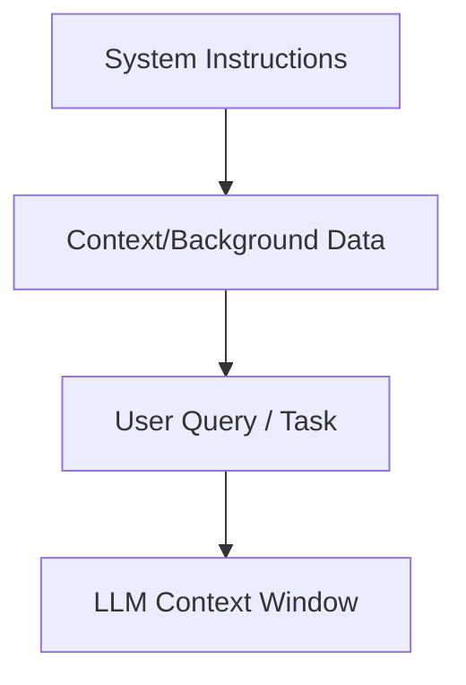

## Key takeaway

The context window is the memory space an LLM has for a given interaction. Optimizing how you format and structure text inside this window prevents the model from forgetting information or hallucinating.

## Mental model or small diagram



## When to use and when not to use

**When to use:**

- Always, when passing external documents, code snippets, or database records to an LLM.
- When orchestrating multi-turn conversations where past interactions need to be remembered.

**When not to use:**

- When performing simple, zero-shot tasks that rely entirely on the LLM's internal knowledge.
- When cost and latency constraints are so extreme that only minimal, hardcoded prompts are feasible.

## Method or procedure

1. **Structure with Clear Boundaries:** Use delimiters (like XML tags `<context>...</context>` or markdown headers) to clearly separate instructions from context data.
2. **Prioritize Order (The "U-Shape" Effect):** LLMs tend to pay more attention to information at the very beginning and the very end of the prompt. Place critical instructions and key constraints at the end, and foundational context at the beginning.
3. **Include Metadata:** When providing documents, include relevant metadata (e.g., title, date, source) to help the model ground its understanding.

## Worked example

**Input / Before:**

```text
Here are some notes: The project is called Apollo. It started in 2023. The deadline is Q4 2024. The budget is $5M. 
Also, John is the PM. 
Based on the notes, write a project summary.
```

**Process / After:**

```xml
<system_instructions>
You are an expert project manager. Your task is to write a concise project summary based ONLY on the provided context.
</system_instructions>

<context>
Project Name: Apollo
Start Date: 2023
Target Deadline: Q4 2024
Budget: $5M
Project Manager: John Doe
</context>

<task>
Write a 2-sentence project summary highlighting the timeline and budget. Do not include information outside of the <context> block.
</task>
```

## Failure modes and mitigations

- **Lost in the Middle:** Overloading the context window causes the model to ignore information in the middle. *Mitigation: Put the most important constraints at the very end.*
- **Context Window Exceeded:** Exceeding the maximum token limit results in truncation. *Mitigation: Track token usage and compress data if necessary.*

## Evaluation checklist or rubric

- [ ] **Formatting:** Are boundaries clearly defined with XML or markdown?
- [ ] **Placement:** Are the most important instructions at the bottom of the prompt?
- [ ] **Token limits:** Is the assembled prompt comfortably within the model's context window limit?

## Safety, privacy, and cost notes

- **Prompt Injection:** Be wary of untrusted data added to the context. Use clear delimiters to separate untrusted user data from system instructions.
- **Cost:** Large contexts incur high input token costs.

## Practice task

Take a 5-paragraph news article and format it as context using XML tags. Add a system prompt at the top and a specific query at the bottom to ask the LLM to extract the main entities mentioned in the article.

## Provenance and further reading

> **Note:** The principles taught in this lesson are model-independent. Any vendor-specific implementation notes (e.g., specific API features or context limits from Anthropic or OpenAI) are used for illustration and should be adapted to your chosen provider.

- **Source**: [Context Window Limits](https://docs.anthropic.com/en/docs/build-with-claude/context-windows)
- **Author/Organization**: Anthropic
- **Publication Date**: 2024-01-15
- **Access Date**: 2026-10-07
- **Next Steps**: Review the related example `content-format-transformer` or proceed to the lesson `context-engineering`.
