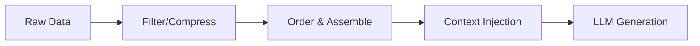

## Key takeaway

An AI model is only as smart as the context you provide. Structuring, filtering, and injecting the right information at the right time is often more impactful than tweaking the prompt instructions themselves.

## Mental model or small diagram



## When to use and when not to use

**When to use:**

- **Enterprise Applications:** When the model needs to answer questions based on proprietary, private, or real-time data.
- **Agentic Systems:** Injecting the current environment state, available tools, and previous tool outputs.

**When not to use:**

- **General Knowledge Tasks:** When standard, generalized knowledge is sufficient. Over-stuffing context here wastes tokens.

## Method or procedure

1. **Selection & Retrieval (RAG):** Search an external database for relevant documents based on the user's query.
2. **Compression & Filtering:** Summarize previous interactions or large documents. Condense the retrieved data so only the most relevant snippets remain.
3. **Ordering:** Place the most critical retrieved documents near the end, right before the task instruction.
4. **Context Lifecycle Management:** In multi-turn systems, actively truncate or summarize old context to make room for new data without exceeding limits.

## Worked example

**Input:** A user asks "Create a new React button component here."
**Process (Dynamic Context Injection):**
Instead of just sending the user prompt, assemble the environment state:

```xml
<system_state>
Current User: vuhung
Current Directory: /src/components/
Local Time: 2026-10-05T14:30:00Z
Existing Files: Button.css, index.js
</system_state>
<task>
User Request: "Create a new React button component here."
</task>
```

**Output:** The LLM generates the component knowing exactly where it goes and what CSS might already exist.

## Failure modes and mitigations

- **Context Bloat / Overflow:** Stuffing too much information into the prompt. *Mitigation: Aggressively filter retrieved documents and implement summarization.*
- **Distraction / Dilution:** Including irrelevant documents that confuse the model. *Mitigation: Improve your retrieval precision (e.g., better vector search algorithms).*

## Evaluation checklist or rubric

- [ ] **Groundedness:** Does the model stick strictly to the provided facts without hallucinating external information?
- [ ] **Retrieval Metrics:** Are you fetching the correct context? Measure Recall and Precision.
- [ ] **Instruction Adherence:** Can the model still follow core instructions despite a massive payload of context?

## Safety, privacy, and cost notes

- **Data Leakage:** Never retrieve and inject sensitive PII into the context window unless the user explicitly has permission to see it.
- **Cost Management:** Dynamic context can quickly balloon token usage. Set strict caps on the number of retrieved documents.

## Practice task

Write a script that takes a long chat history, summarizes the first 10 messages into a single paragraph, and appends the 3 most recent messages verbatim to create a compressed context payload for the next LLM call.

## Provenance and further reading

> **Note:** The principles taught in this lesson are model-independent. Any vendor-specific implementation notes (e.g., specific API features or context limits from Anthropic or OpenAI) are used for illustration and should be adapted to your chosen provider.

- **Source**: [Advanced RAG Techniques](https://docs.llamaindex.ai/en/stable/optimizing/advanced_retrieval/)
- **Author/Organization**: LlamaIndex
- **Publication Date**: 2024-02-20
- **Access Date**: 2026-10-07
- **Next Steps**: Review the related example `content-format-transformer` or proceed to the lesson `workflow-engineering`.
