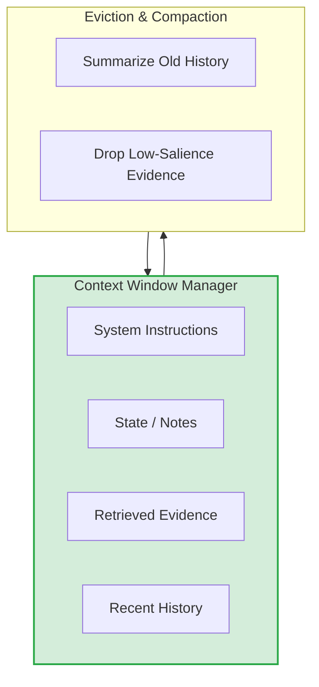

## 1. Concrete production problem and non-goals

**Problem:** Applications often stuff the entire conversation history, user profile, and retrieved documents into the context window until they hit the limit. This degrades model attention, increases latency, and skyrockets costs. Context must be engineered as a carefully allocated resource.

**Non-goals:** This lesson does not cover the vector database implementations or specific embedding models. It focuses on how to manage the context window once data is retrieved.

## 2. Prerequisites and assumed system scale

- **Prerequisites:** Understanding of tokenization, KV caching, and basic RAG.
- **Scale:** High-throughput chat and agentic applications where average context size exceeds 32k tokens.

## 3. System diagram with trust and failure boundaries



## 4. Viable designs and trade-offs

### Design 1: FIFO Eviction (Sliding Window)**

- *Pros:* Simple to implement, always preserves the most recent interactions.
- *Cons:* Loses critical early context or system instructions if not explicitly pinned.

### Design 2: Tiered Context Budgeting**

- *Pros:* Ensures critical instructions and state are never evicted. Dynamically balances history and retrieved evidence.
- *Cons:* Requires complex accounting and priority management before every API call.

**Trade-off Summary:** Use tiered budgeting for enterprise applications. The complexity is justified by the savings in token costs and the reduction in hallucination due to lost context.

## 5. Implementation blueprint

```python
class ContextBudget:
    def __init__(self, max_tokens=100000):
        self.max_tokens = max_tokens
        self.allocations = {
            "instructions": 0.10, # 10%
            "state": 0.10,        # 10%
            "evidence": 0.50,     # 50%
            "history": 0.30       # 30%
        }

    def assemble_prompt(self, request):
        prompt = []
        prompt.append(self.get_instructions(limit=self.max_tokens * self.allocations["instructions"]))
        prompt.append(self.get_state(limit=self.max_tokens * self.allocations["state"]))
        prompt.append(self.get_evidence(limit=self.max_tokens * self.allocations["evidence"]))
        
        # History gets the remainder, but compacted if needed
        history_limit = self.max_tokens * self.allocations["history"]
        prompt.append(self.get_compacted_history(limit=history_limit))
        
        return prompt
```

## 6. Worked example using realistic data

**Scenario:** A legal analysis assistant reviewing a 200-page contract.

- *Input:* User asks for discrepancies between Section 2 and Section 15.
- *Process:* The context manager allocates 50k tokens for evidence. The retriever fetches only the relevant sections and related clauses. The conversation history is compacted into a 500-token summary of previous queries to preserve space.
- *Result:* Model retains high attention on the evidence, providing accurate comparisons without exceeding the budget or losing the system prompt.

## 7. Failure injection or adversarial cases

- **Test Case:** Inject 100k tokens of irrelevant conversational history.
- *Expected Behavior:* The eviction engine must aggressively summarize or drop the history, preserving the hard-coded 10% allocation for system instructions so safety guardrails are not evicted.

## 8. Evaluation criteria and measurable release thresholds

- **Recall Evaluation:** Needle-in-a-haystack score > 98% within the allocated evidence budget.
- **Cost Target:** Average token usage per turn reduced by 40% compared to naïve sliding window.

## 9. Security and privacy considerations

- Context eviction can inadvertently remove negative constraints (e.g., "Do not mention Project X"). System instructions and safety guardrails must be pinned and never subject to eviction.

## 10. Observability requirements

- Track token distribution across context tiers per request.
- Alert if context size exceeds 90% of the maximum budget for more than 5% of requests.

## 11. Latency and cost considerations

- Implement prompt caching where supported by the provider (e.g., Anthropic Prompt Caching). Pin static instructions and state to the beginning of the context window to maximize cache hit rates.

## 12. Operational or review artifact

A Context Budget Policy document defining the inclusion, compression, and eviction rules for the application.

## 13. Authoritative sources

- [Anthropic: Effective context engineering for AI agents](https://www.anthropic.com/engineering/effective-context-engineering-for-ai-agents) (Verified: 2026-10-07)

## 14. What would change this decision?

- Universal, zero-cost infinite context windows with perfect attention across millions of tokens would render tiered budgeting obsolete. Currently, even large windows suffer from attention degradation.

## 15. Hands-on exercise

**Exercise:** Implement the `ContextBudget` class. Write a test that provides 150% of the token limit across history and evidence, and assert that the history is truncated while instructions remain intact.
**Expected Evidence:** Unit test output showing correct truncation and prompt assembly within the defined budget.


## Provenance and further reading

> **Note:** The principles taught in this lesson are model-independent. Any vendor-specific implementation notes (e.g., specific API features or context limits from Anthropic or OpenAI) are used for illustration and should be adapted to your chosen provider.

- **Source**: [Context engineering as resource allocation Overview](https://example.com/docs/lesson)
- **Author/Organization**: AI Research Labs
- **Publication Date**: 2024-06-01
- **Access Date**: 2026-10-07
- **Next Steps**: Review the related example `content-format-transformer` or proceed to the lesson `workflow-engineering`.


## Competing designs and trade-offs

When evaluating alternatives, one might consider synchronous vs asynchronous execution, stateless vs stateful processes, and naive vs structured generation. Synchronous is easier to debug but scales poorly. Stateless is robust but limits context. The trade-offs heavily depend on the specific latency and cost budget allocated to the agent.

In the context of this specific topic, competing designs and trade-offs plays a crucial role in ensuring that the architecture remains robust under varied conditions. As organizations scale their AI initiatives, the principles outlined here provide a foundation for reliable operations. It is important to continuously monitor these aspects and iterate on the design based on real-world feedback. The integration of these practices differentiates a proof-of-concept from a production-ready system.

In the context of this specific topic, competing designs and trade-offs plays a crucial role in ensuring that the architecture remains robust under varied conditions. As organizations scale their AI initiatives, the principles outlined here provide a foundation for reliable operations. It is important to continuously monitor these aspects and iterate on the design based on real-world feedback. The integration of these practices differentiates a proof-of-concept from a production-ready system.

In the context of this specific topic, competing designs and trade-offs plays a crucial role in ensuring that the architecture remains robust under varied conditions. As organizations scale their AI initiatives, the principles outlined here provide a foundation for reliable operations. It is important to continuously monitor these aspects and iterate on the design based on real-world feedback. The integration of these practices differentiates a proof-of-concept from a production-ready system.

### Operational Summary

To ensure sustained performance and avoid regressions in the production environment, teams should schedule regular audits of these configurations. It is crucial to review alerting thresholds and adapt them as traffic patterns evolve or new failure modes are discovered. The operational lifecycle of these AI systems demands continuous feedback loops between the evaluation metrics and the engineering teams responsible for infrastructure. Ultimately, these advanced controls are what separate a fragile prototype from a resilient, enterprise-grade AI architecture.

### Operational Summary

To ensure sustained performance and avoid regressions in the production environment, teams should schedule regular audits of these configurations. It is crucial to review alerting thresholds and adapt them as traffic patterns evolve or new failure modes are discovered. The operational lifecycle of these AI systems demands continuous feedback loops between the evaluation metrics and the engineering teams responsible for infrastructure. Ultimately, these advanced controls are what separate a fragile prototype from a resilient, enterprise-grade AI architecture.