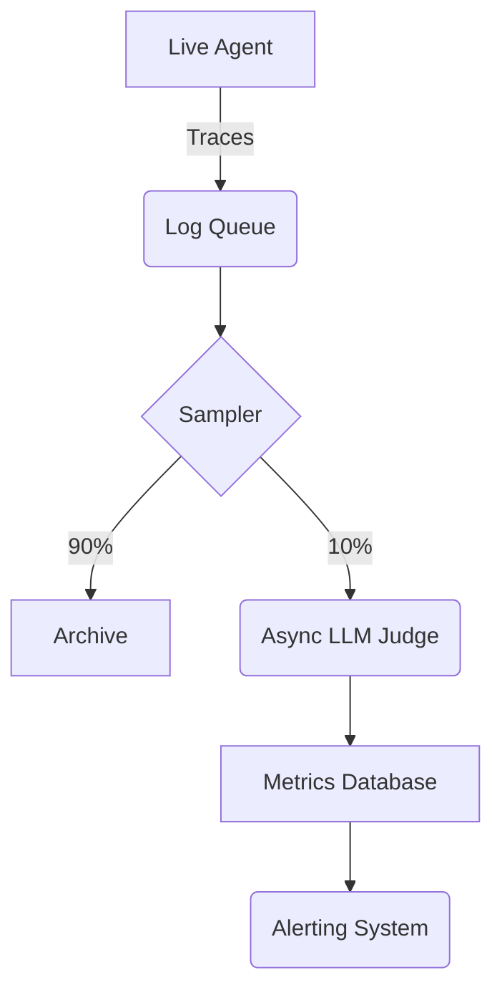

## 1. Introduction

Static evaluation is necessary but not sufficient. Production environments change: APIs drift, user behavior evolves, and data shifts. Continuous Evaluation (CE) runs evaluations on a sample of live production traffic to detect degradation over time.

## 2. Measurable Release Thresholds

- 10% of all production traffic is asynchronously evaluated.
- Alerts fire within 15 minutes if the rolling average success rate drops below 80%.

## 3. Non-Goals

- CI/CD pipeline setup for static tests.
- Infrastructure provisioning for log ingestion.

## 4. Prerequisites

- Understanding of Trajectory and Outcome Evaluation.
- Familiarity with monitoring tools (e.g., Datadog, Grafana) or LLM observability platforms.

## 5. System Diagram



## 6. Implementation and Examples

Set up an asynchronous worker to process traces. You can view an example of a failed trace format here: [example-trace-failure.json](/traces/example-trace-failure.json).

```javascript
// Async worker pseudo-code
import { getTraceFromQueue, evaluateTrace, sendMetric } from './eval-utils';

export async function processEvaluationQueue() {
  while (true) {
    const trace = await getTraceFromQueue();
    if (!trace) continue;
    
    // Run the calibrated judge
    const score = await evaluateTrace(trace);
    
    // Send metric to observability platform
    sendMetric('agent.production.quality_score', score);
    
    if (score < 3) {
      sendMetric('agent.production.failure', 1);
    }
  }
}
```

## 7. Failure Modes & Anti-Patterns

- **Synchronous Evaluation**: Running the judge in the critical path of the user request. Always evaluate asynchronously to avoid latency.
- **Alert Fatigue**: Alerting on single failures. Always alert on rolling averages or error budgets to prevent false positives.

## 8. Security & Privacy

Live traffic contains real user data. Continuous evaluation systems must have strict access controls. Do not log PII in the metrics database; only log the aggregate scores and anonymized trace IDs.

## 9. Performance & Cost

Evaluating 100% of live traffic with GPT-4 is prohibitively expensive. Use a sampling rate (e.g., 5-10%) or use a fast, cheap model for initial triage and only send low-confidence scores to the expensive model.

## 10. Testing Strategy

Inject simulated bad traces into the production queue and verify that the continuous evaluation system catches them and fires an alert.

## 11. Checklist

- [ ] Implement trace sampling mechanism.
- [ ] Deploy asynchronous evaluation worker.
- [ ] Connect scores to observability dashboard.
- [ ] Configure alerts for quality degradation.

## 12. Further Reading

- *Observability for Large Language Models*
- *Continuous Delivery for Machine Learning (CD4ML)*

## 13. Glossary

- **Sampling Rate**: The percentage of live traffic selected for evaluation.
- **Asynchronous Evaluation**: Running evaluations outside the main user request lifecycle.
