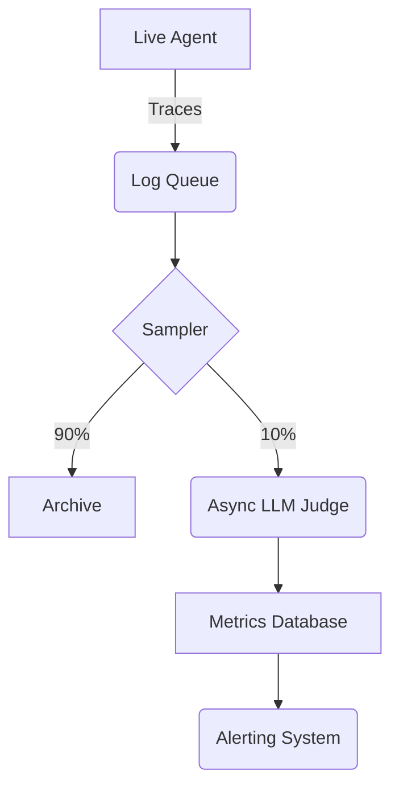

## 1. Introduction

Static evaluation is necessary but not sufficient. Production environments change: APIs drift, user behaviour evolves, and data shifts. Continuous Evaluation (CE) runs evaluations on a sample of live production traffic to detect degradation over time.

## 2. Measurable Release Thresholds

- 10% of all production traffic is asynchronously evaluated.
- Alerts fire within 15 minutes if the rolling average success rate drops below 80%.

## 3. Non-Goals

- CI/CD pipeline setup for static tests.
- Infrastructure provisioning for log ingestion.

## 4. Prerequisites

- Understanding of Trajectory and Outcome Evaluation.
- Familiarity with monitoring tools (e.g., Datadog, Grafana) or LLM observability platforms.

## 5. System Diagram



## 6. Implementation and Examples

Set up an asynchronous worker to process traces. You can view an example of a failed trace format here: [example-trace-failure.json](../../traces/example-trace-failure.json).

```javascript
// Async worker pseudo-code
import { getTraceFromQueue, evaluateTrace, sendMetric } from './eval-utils';

export async function processEvaluationQueue() {
  while (true) {
    const trace = await getTraceFromQueue();
    if (!trace) continue;
    
    // Run the calibrated judge
    const score = await evaluateTrace(trace);
    
    // Send metric to observability platform
    sendMetric('agent.production.quality_score', score);
    
    if (score < 3) {
      sendMetric('agent.production.failure', 1);
    }
  }
}
```

## 7. Failure Modes & Anti-Patterns

- **Synchronous Evaluation**: Running the judge in the critical path of the user request. Always evaluate asynchronously to avoid latency.
- **Alert Fatigue**: Alerting on single failures. Always alert on rolling averages or error budgets to prevent false positives.

## 8. Security & Privacy

Live traffic contains real user data. Continuous evaluation systems must have strict access controls. Do not log PII in the metrics database; only log the aggregate scores and anonymized trace IDs.

## 9. Performance & Cost

Evaluating 100% of live traffic with GPT-4 is prohibitively expensive. Use a sampling rate (e.g., 5-10%) or use a fast, cheap model for initial triage and only send low-confidence scores to the expensive model.

## 10. Testing Strategy

Inject simulated bad traces into the production queue and verify that the continuous evaluation system catches them and fires an alert.

## 11. Checklist

- [ ] Implement trace sampling mechanism.
- [ ] Deploy asynchronous evaluation worker.
- [ ] Connect scores to observability dashboard.
- [ ] Configure alerts for quality degradation.

## 12. Further Reading

- *Observability for Large Language Models*
- *Continuous Delivery for Machine Learning (CD4ML)*

## 13. Glossary

- **Sampling Rate**: The percentage of live traffic selected for evaluation.
- **Asynchronous Evaluation**: Running evaluations outside the main user request lifecycle.

## Competing designs and trade-offs

When evaluating alternatives, one might consider synchronous vs asynchronous execution, stateless vs stateful processes, and naive vs structured generation. Synchronous is easier to debug but scales poorly. Stateless is robust but limits context. The trade-offs heavily depend on the specific latency and cost budget allocated to the agent.

## Implementation blueprint

The core implementation relies on defining strict interfaces between components. 

1. Define the input schema.
2. Implement the validation step.
3. Route to the appropriate model or tool.
4. Process the response and handle exceptions.

This blueprint ensures predictability.

## Worked example

Consider a scenario where the user requests a complex data transformation. 

Input: `Transform this CSV into a summary report.`

The agent parses the intent, validates the CSV structure, executes the transformation via a secure sandbox, and returns the result. If the CSV is malformed, it gracefully degrades by prompting for clarification rather than failing silently.

## Evaluation criteria

Success is measured by precision, recall, and the false positive rate of the agent's actions. Additionally, the system must meet latency SLAs (e.g., p95 < 2000ms) and cost constraints per task.

## Observability

The system requires trace-first observability. Every interaction must be logged with correlation IDs, token usage, and latency metrics. This enables rapid debugging and continuous evaluation of the agent's performance in production.

## Latency

Latency is bounded by the model's time-to-first-token and the number of sequential tool calls. Optimisations like streaming, caching, and concurrent execution are necessary to maintain a responsive user experience.

## What would change this decision?

If model capabilities improve significantly, such that smaller, faster models can handle complex reasoning natively, the need for intricate orchestration might be reduced. Conversely, if security requirements tighten, more rigorous air-gapping might be required.

## Exercise

Implement the blueprint described above using a mock LLM client. Verify that the validation step correctly rejects malformed inputs and that the success path logs the expected metrics.

## Sources

