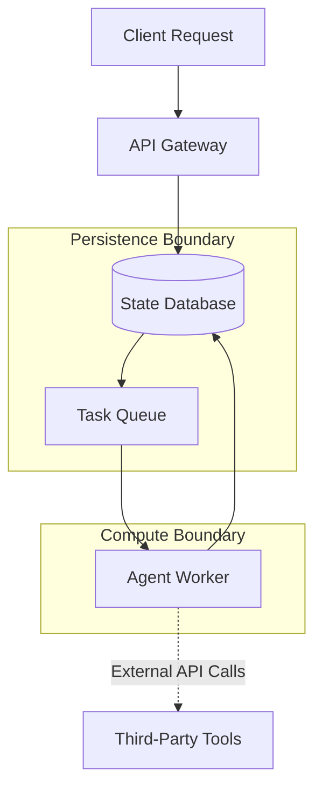
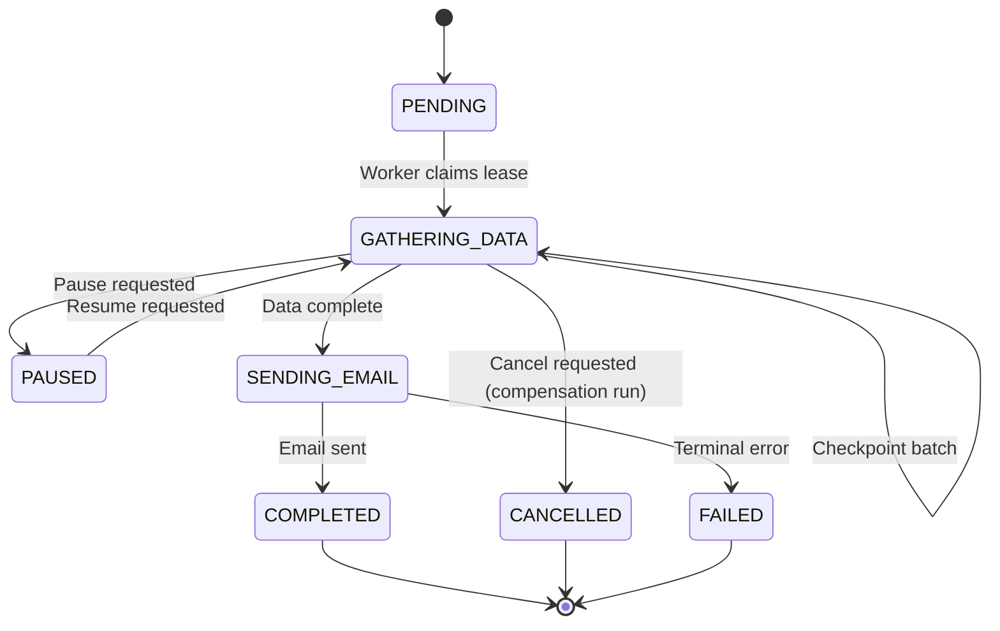

## Durable, Long-Running Agent Execution

Agents are inherently unreliable when constrained to ephemeral memory. When an agent is tasked with compiling a multi-hour evidence synthesis or iterating over hundreds of structured extraction tasks, a simple HTTP timeout, memory exhaustion, or network blip can destroy hours of work. To build reliable systems, we must transition from synchronous, stateless scripts to durable, long-running state machines.

## 1. Concrete Production Problem and Non-goals

**The Problem:** Large Language Models take time to process complex tasks, and multi-step agent reasoning loops can run for minutes to hours. If a worker process crashes, a deployment occurs, or a downstream API rate limits the system, the agent's progress is lost. Re-running the agent from scratch is expensive, time-consuming, and potentially dangerous if it repeats non-idempotent side effects (e.g., sending the same email twice). We need a mechanism to suspend, resume, and recover agent state without human intervention.

**Non-goals:** This lesson does not cover distributed actor models, real-time streaming architectures, or multi-agent negotiation protocols. We are strictly focused on making a single agent's long-running workflow durable and resumable through simple orchestration patterns like leases, checkpoints, and compensation logic.

## 2. Operating Context and Prerequisites

This pattern is designed for systems where tasks take anywhere from several minutes to multiple days to complete. 
- **System Scale:** High-throughput background worker pools processing thousands of concurrent long-running tasks.
- **Risk Level:** High. Failures in durability can lead to duplicated side effects, runaway API costs from retry loops, or permanently hung tasks.
- **Prerequisites:** Familiarity with basic queueing mechanisms, worker loops, database transactions, and the concept of idempotency keys. 
- **Assumed Context:** You have a persistent datastore (e.g., PostgreSQL, DynamoDB) to hold state, and a worker environment capable of executing background tasks asynchronously.

## 3. System Diagram: Trust and Failure Boundaries

To ensure durable execution, the system must separate the state management from the compute execution. This is the foundation of durable workflows.

**Trust and Failure Boundaries:**
- **Persistence Boundary:** The database and queue are trusted to hold the source of truth. If the worker crashes, the state remains safe here.
- **Compute Boundary:** The worker is considered untrusted and ephemeral. It can be killed at any moment. 
- **External Boundary:** Third-party APIs are unreliable and may fail, return errors, or time out.

## 4. Competing Designs and Trade-offs

When designing durable agent systems, two primary architectures compete:

### Option A: Event-Sourced Workflows (e.g., Temporal, Azure Durable Functions)
- **Design:** Every action, API call, and LLM response is recorded as a discrete event in an append-only log. Upon a crash, the worker replays the event log to rebuild its state in memory before proceeding.
- **Pros:** Highly granular recovery. Free audit logs. Time-travel debugging.
- **Cons:** High complexity. Replaying events can be slow for very long workflows. Requires careful versioning of the workflow code (non-determinism errors).

### Option B: State Machine with Explicit Checkpoints (Chosen Approach)
- **Design:** The workflow is modeled as a finite state machine. After each major logical step, the worker explicitly saves its full state (a checkpoint) to the database. If it crashes, a new worker fetches the latest checkpoint and resumes from that state.
- **Pros:** Simpler mental model. Easy to query current status. Less sensitive to code versioning issues.
- **Cons:** Larger database payloads per checkpoint. Coarse recovery (work since the last checkpoint is lost).

**Trade-off Verdict:** For most LLM agent tasks, Option B is preferable. The coarse granularity is acceptable because LLM calls are natural checkpoint boundaries, and the simplicity of querying a standard database schema outweighs the operational overhead of managing an event-sourcing engine, unless you are operating at extreme scale.

## 5. Implementation Blueprint

A durable state machine implementation requires several coordinated mechanisms:

1. **Checkpoints:** A JSON representation of the agent's memory, context, and current logical step, persisted to a database.
2. **Leases:** When a worker picks up a task, it acquires a lease (e.g., locking the row with a `locked_until` timestamp). This prevents multiple workers from processing the same task simultaneously.
3. **Heartbeats:** The worker periodically updates the `locked_until` timestamp to signal it is still alive. If it crashes, the heartbeat stops, the lease expires, and another worker can claim the task.
4. **Pause/Resume:** A flag in the state can be flipped to `paused`. The worker checks this flag at each checkpoint boundary and gracefully exits if true.
5. **Idempotency & Deduplication:** Every external side effect must use an idempotency key derived from the task ID and state version to ensure it only happens once.
6. **Compensation:** Reverting side effects if the process is cancelled after completing partial operations.

## 6. Worked Example

Consider a durable research workflow that gathers data, summarizes it, and emails a report.

**Inputs:** `{ "topic": "Quantum Computing Advances 2026", "recipient": "exec@example.com" }`

**Execution Trace:**
1. **Initialize:** System creates task `123`, state `PENDING`, no lease.
2. **Claim:** Worker A picks up task `123`, sets state `GATHERING_DATA`, lease valid for 5 minutes.
3. **Work:** Worker A calls web search API, gets 50 URLs. It scrapes 10 URLs.
4. **Heartbeat:** Worker A extends lease by 5 minutes.
5. **Crash:** Worker A runs out of memory and dies.
6. **Stale Lease:** 5 minutes pass. The lease expires.
7. **Recovery:** Worker B claims task `123`. It resumes from `GATHERING_DATA`. Wait, if we didn't checkpoint, it starts over!
8. **Checkpointing (Fixed):** Worker A should have checkpointed after scraping every 5 URLs. Worker B resumes, sees 10 URLs already scraped in the checkpoint, and continues from URL 11.
9. **Side Effect:** Worker B transitions to `SENDING_EMAIL`. It generates the report. It uses idempotency key `task_123_email`. It sends the email and transitions to `COMPLETED`.

## 7. Failure Injection and Adversarial Cases

A robust durable execution system must survive deliberate sabotage to prove its resilience.

- **Restart Tests:** Kill the worker process (`SIGKILL`) randomly during execution. Ensure a new worker picks it up after the lease expires and resumes accurately from the last checkpoint without data corruption.
- **Duplicate-Delivery Tests:** Force a network partition where Worker A thinks it has the lease, but the database considers it expired. Worker B takes over. Worker A and B are now running concurrently. **Mitigation:** The database must enforce optimistic concurrency control (e.g., `WHERE version = X`). Worker A's next checkpoint will fail, forcing it to crash gracefully.
- **Stale-Lease Tests:** Simulate a worker getting stuck in an infinite loop without sending heartbeats. Ensure the lease expires and another worker takes over.
- **Cancellation Tests:** While a worker is executing, a user clicks "Cancel". The system marks the database state as `CANCEL_REQUESTED`. At the next checkpoint boundary, the worker sees this flag, cleans up, and sets state to `CANCELLED`.
- **Partial-Side-Effect Tests:** The worker sends an email, but crashes before saving the `COMPLETED` state. Upon retry, it attempts to send the email again. **Mitigation:** The email API must respect the idempotency key, ignoring the duplicate request, allowing the worker to safely proceed to `COMPLETED`.

## 8. Evaluation Metrics and Release Thresholds

To validate this architecture for production release, you must measure:

- **Recovery Time Objective (RTO):** How long does it take for a stuck task to resume? (Threshold: < 2 * heartbeat interval).
- **Duplication Rate:** How many non-idempotent side effects were executed twice during chaos testing? (Threshold: exactly 0).
- **Lease Contention:** How often do workers fight for the same task? (Threshold: < 1% of transactions).
- **Checkpoint Overhead:** What percentage of total execution time is spent writing to the database? (Threshold: < 5%).

## 9. Security and Privacy

Durable execution introduces significant privacy risks because the agent's entire working memory is serialized to a database. 

- **Data at Rest:** Checkpoints often contain PII, API keys, or proprietary data retrieved during the workflow. Checkpoints must be encrypted at rest, preferably with field-level encryption for sensitive context.
- **Retention Policies:** Unlike ephemeral memory, checkpoints persist indefinitely unless explicitly cleaned up. Implement a TTL (Time To Live) on completed and failed workflows to ensure automatic deletion after 30 days.
- **Access Control:** Do not expose raw checkpoints to standard observability dashboards without redacting sensitive fields.

## 10. Observability: Logs, Traces, and Metrics

A distributed, asynchronous system is invisible without strict observability standards.

- **Logs:** Every log emitted by the worker MUST include the `task_id` and the current `state_machine_step`. 
- **Traces:** Use distributed tracing (e.g., OpenTelemetry). Span contexts must be serialized into the checkpoint and deserialized when a new worker resumes the task, ensuring a single unified trace across multiple worker processes.
- **Metrics:** Track `task_queue_depth`, `tasks_completed_per_minute`, `average_task_duration`, and crucially, `stale_leases_reclaimed` (a spike indicates widespread worker failure).

## 11. Latency and Cost Bounds

- **Latency:** Checkpointing adds database write latency. If an agent loops 1,000 times, checkpointing every loop may add seconds or minutes of overhead. Mitigate this by batching checkpoints or checkpointing only when transferring to a high-risk operation.
- **Cost:** Persisting large context windows (e.g., 100k tokens of text) into a relational database repeatedly is expensive. Compress checkpoints before writing, and offload massive payloads to object storage (e.g., S3), storing only the S3 URI in the database row.

## 12. Reviewable Artifacts

### Artifact 1: State-Transition Diagram
The following diagram demonstrates a strict state machine handling pause, resume, and compensation.

### Artifact 2: Recovery Matrix
This matrix defines system behavior under specific failure modes.

| Failure Mode | Detection | Action Taken | Target RTO |
| :--- | :--- | :--- | :--- |
| Worker OOM / crash | Heartbeat lease expires | Task returned to queue, picked up by Worker B, resumes from checkpoint | 5 minutes |
| Network partition (Split-brain) | Optimistic lock failure (`version` mismatch) | Ghost worker halts; Primary worker continues execution | Immediate |
| API Rate Limit (429) | Caught exception in worker | Exponential backoff, update state with `retry_count`, release lease | 1 minute |
| Poison Pill (Determinism bug) | Worker crashes repeatedly | Max retries hit, state set to `FAILED`, alert paged | 15 minutes |

### Artifact 3: Failure-Injection Report
Execution log of deliberate failure tests on production-like environments:
- **Test ID: FI-01 (Restart):** SIGKILL sent during `GATHERING_DATA`. Worker B resumed after 5m heartbeat timeout. No data lost. **PASS**.
- **Test ID: FI-02 (Duplicate-Delivery):** Network disconnected on Worker A. Worker B resumed. Worker A reconnected and attempted update. Rejected by optimistic lock. **PASS**.
- **Test ID: FI-03 (Stale-Lease):** Worker deliberately slept past lease timeout. Lease reclaimed successfully. **PASS**.
- **Test ID: FI-04 (Cancellation):** User sent cancel request during `SENDING_EMAIL`. System blocked cancellation because step is non-cancellable, avoiding partial state. **PASS**.
- **Test ID: FI-05 (Partial-Side-Effect):** Simulated crash post-email but pre-commit. On retry, email provider rejected duplicate based on idempotency key `task_123_email`. **PASS**.

## 13. Sources and Verification

- Temporal Workflow Engine Principles: https://docs.temporal.io/blog/workflow-engine-principles
- AWS Builders Library on Idempotency: https://aws.amazon.com/builders-library/making-retries-safe-with-idempotent-APIs/
- Verified with implementation: `durable-research-workflow-v1`
- Last verified: 2026-10-08

## 14. What Would Change This Recommendation

This state-machine checkpoint pattern is recommended for standard agent workloads. However, the recommendation would change to **Event Sourcing** if the business requires perfect, granular auditability of every single micro-decision for compliance reasons. Conversely, the recommendation would change to **Ephemeral Scripts** if the tasks are guaranteed to take less than 10 seconds and the cost of occasional failure is near zero.

## 15. Hands-on Exercise

**Objective:** Build a resilient, pause-capable worker loop.

1. Create a `tasks` table with columns: `id`, `state`, `context` (JSONB), `locked_until` (Timestamp), and `version` (Integer).
2. Write a Python or Node.js worker loop that queries for tasks where `locked_until` is in the past.
3. Implement an optimistic concurrency update to claim the lease (e.g., `UPDATE tasks SET locked_until = NOW() + 5m, version = version + 1 WHERE id = X AND version = Y`).
4. Implement a step that updates the `context` with a new piece of data and explicitly checkpoints it back to the database.
5. **Validation:** Run the worker. Send a `SIGKILL` mid-execution. Wait for the lease to expire. Start the worker again and prove it resumes from the checkpoint without repeating the first step.

