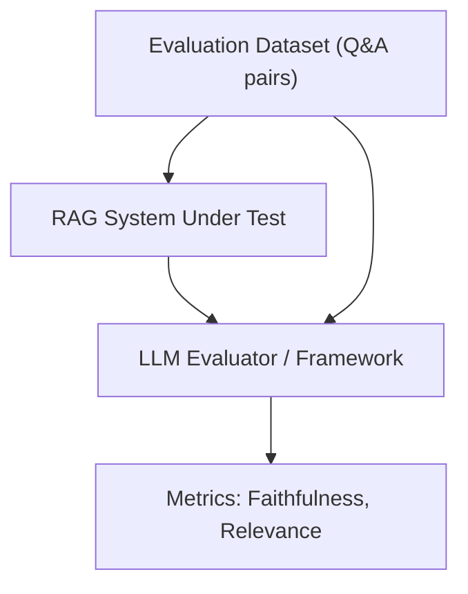

## 1. Concrete Production Problem & Non-goals

**Problem:** Deploying RAG without quantitative evaluation leads to undetected regressions in answer quality, hallucinations, and unhelpful responses. We need a systematic way to measure generation faithfulness, answer relevance, and retrieval precision.

**Non-goals:** This is not a guide on how to train custom evaluation models or a deep dive into human-in-the-loop UI design. The focus is on automated, scalable evaluation frameworks.

## 2. Prerequisites and Assumed System Scale

- **Prerequisites:** Understanding of RAG pipelines, LLM as a judge concepts, and basic statistics.
- **System Scale:** CI/CD pipeline evaluating hundreds of test cases per pull request for an enterprise RAG application.

## 3. System Diagram



## 4. Viable Designs and Trade-offs

**Design A: Human Evaluation Only**
- *Pros:* High ground-truth accuracy; nuances are caught.
- *Cons:* Extremely slow, expensive, and cannot block CI/CD pipelines automatically.

**Design B: Automated LLM-as-a-Judge (Recommended)**
- *Pros:* Scalable, fast, easily integrated into CI/CD.
- *Cons:* The judge model itself may have biases or make mistakes (requires calibration).

## 5. Implementation Blueprint

```python
from ragas import evaluate
from ragas.metrics import faithfulness, answer_relevancy, context_precision

def run_evaluation(dataset, rag_pipeline):
    results = []
    for row in dataset:
        response, context = rag_pipeline.query(row['question'])
        results.append({
            "question": row['question'],
            "answer": response,
            "contexts": context,
            "ground_truth": row['ground_truth']
        })
    
    score = evaluate(results, metrics=[faithfulness, answer_relevancy, context_precision])
    return score
```

## 6. Worked Example

Given a test dataset of 100 questions regarding company policies:
1. The pipeline generates answers and retrieves contexts.
2. The evaluator measures `faithfulness` (are all claims in the answer supported by the context?).
3. The evaluator measures `context_precision` (did we retrieve the relevant documents first?).
4. Output: Faithfulness = 0.92, Context Precision = 0.85.

## 7. Failure Injection & Adversarial Cases

- **Adversarial Input:** Questions designed to trigger the LLM's pre-trained knowledge instead of the retrieved context.
- **Mitigation:** Test the system against a dataset containing contradictory facts to ensure it relies solely on the provided context.
- **Failure Injection:** Provide completely irrelevant context and verify the system correctly abstains from answering.

## 8. Evaluation Criteria & Release Thresholds

- **Faithfulness:** Must be 0.95 or higher.
- **Answer Relevancy:** Must be 0.90 or higher.
- **Release Threshold:** Any PR that degrades these metrics by more than 0.02 on the golden dataset is automatically blocked.

## 9. Security and Privacy Considerations

- **Data Privacy:** Evaluation datasets must be sanitized. Do not include PII in the golden dataset.
- **Security:** Ensure the LLM judge is not vulnerable to prompt injection from the generated answers it is evaluating.

## 10. Observability Requirements

- Log all evaluation runs with their associated commit hashes.
- Store the trace of the LLM judge's reasoning for low-scoring answers to allow for manual review and debugging.

## 11. Latency and Cost Considerations

- **Latency:** Evaluation is done offline/asynchronously, so real-time latency is not a concern.
- **Cost:** Running LLM-as-a-judge on thousands of queries can be expensive. Use smaller, specialized models for evaluation where possible, or sample the dataset.

## 12. Operational Artifact

**Evaluation Dataset Specification:** A documented schema and process for maintaining the golden evaluation dataset, including guidelines for adding new test cases when production failures occur.

## 13. Authoritative Sources

- [RAGAS: Automated Evaluation of Retrieval-Augmented Generation](https://arxiv.org/abs/2309.15217) (Verified: 2026-10-07)
- [Anthropic: Demystifying evals for AI agents](https://www.anthropic.com/engineering/demystifying-evals-for-ai-agents) (Verified: 2026-10-07)

## 14. What would change this decision?

If specialized small models (e.g., reward models) become freely available and highly accurate for evaluating specific tasks, we would shift away from using large, general-purpose LLMs as judges to reduce costs.

## 15. Hands-on Exercise

**Task:** Create a golden dataset of 10 Q&A pairs. Run a baseline RAG system against it and calculate the faithfulness score using an automated evaluator.
**Evidence:** Provide the JSON output of the evaluation scores and one example of a failed faithfulness check with the judge's reasoning.
