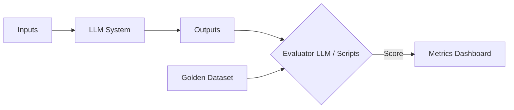

## Key takeaway
You cannot improve what you cannot measure. Because LLM outputs are non-deterministic, traditional unit tests must be replaced or augmented with heuristic checks, golden datasets, and LLM-as-a-judge evaluations.

## Mental model or small diagram


## When to use and when not to use
**When to use:**
- Always, for production systems.
- When optimizing costs or latency (e.g., swapping to a smaller model).
- During RAG development to isolate retrieval vs. generation failures.

**When not to use:**
- Casual experimentation or personal prototypes.
- Simple, deterministic tasks that can be perfectly validated with regex.

## Method or procedure
1. **Golden Datasets:** Curate a set of diverse, challenging inputs and expected outputs.
2. **Automated Metrics:** Use heuristics (schema compliance, exact matches).
3. **LLM-as-a-judge:** Use a highly capable model to score outputs based on a strict rubric.
4. **Regression Testing:** Run your evaluation suite automatically whenever prompts or models change.

## Worked example
**Process (LLM-as-a-judge):**
```python
def evaluate_response(user_query, bot_response, golden_context):
    eval_prompt = f"""
    Grade the bot's response on a scale of 1-5 based on Accuracy.
    User Query: {user_query}
    Bot Response: {bot_response}
    Context: {golden_context}
    Return JSON with 'accuracy_score' and 'reasoning'.
    """
    return call_evaluator_llm(eval_prompt)
```
**Output:** A structured, trackable score that can block a bad deployment if the average falls below a threshold.

## Failure modes and mitigations
- **Over-indexing on a single metric:** E.g., focusing only on helpfulness and ignoring tone. *Mitigation: Use multi-dimensional rubrics.*
- **Static golden datasets:** User behavior drifts over time. *Mitigation: Continuously sample production logs to add new edge cases to your evaluation set.*

## Evaluation checklist or rubric
- [ ] **Baseline:** Have you manually graded at least 50 inputs to set a baseline?
- [ ] **Alignment:** Do the LLM judge's scores match human intuition?
- [ ] **Isolation:** Are you evaluating retrieval separately from generation?

## Safety, privacy, and cost notes
- **Privacy:** Ensure golden datasets do not contain sensitive PII unless strictly necessary and secured.
- **Cost:** Running an LLM judge on every production log is expensive. Sample logs (e.g., 5%) for evaluation, or use smaller models for the judge.

## Practice task
Write an evaluation prompt for an LLM judge to determine if a summarization bot hallucinated any facts not present in the original source document.
