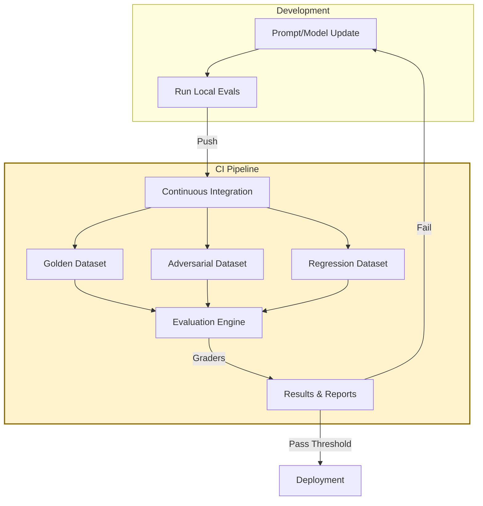

## 1. Concrete production problem and non-goals

**Problem:** Engineers often optimize prompts and switch models based on "vibe checks" or ad-hoc testing with a few inputs. This leads to regressions where fixing one edge case breaks three common cases. Optimization cannot happen without a systematic evaluation harness.

**Non-goals:** This lesson does not cover the specific metrics for evaluating RAG (e.g., faithfulness, answer relevance). It focuses on the systemic engineering of the evaluation pipeline itself.

## 2. Prerequisites and assumed system scale

- **Prerequisites:** Familiarity with CI/CD pipelines, basic unit testing, and structured outputs.
- **Scale:** Production systems requiring continuous deployment of prompt and model updates across multiple teams.

## 3. System diagram with trust and failure boundaries



## 4. Viable designs and trade-offs

### Design 1: Human-in-the-loop Evaluation**

- *Pros:* High fidelity, nuanced understanding of quality, identifies unknown failure modes.
- *Cons:* Slow, unscalable, expensive, delays CI/CD pipelines.

### Design 2: Automated LLM-as-a-Judge Evaluation**

- *Pros:* Highly scalable, fast feedback loop, integrates easily into CI/CD.
- *Cons:* Requires calibration, susceptible to biases (e.g., verbosity bias), requires its own evaluation.

**Trade-off Summary:** Use LLM-as-a-judge for continuous CI/CD evaluation to prevent regressions, but calibrate the judge regularly using a small, high-quality, human-labeled golden dataset.

## 5. Implementation blueprint

```python
def evaluate_update(system_prompt, dataset):
    results = []
    for test_case in dataset:
        # Generate output
        output = generate_response(system_prompt, test_case["input"])
        
        # Grade output using LLM as a judge
        score = grader_llm.grade(
            question=test_case["input"],
            expected=test_case["expected"],
            actual=output,
            rubric=test_case["rubric"]
        )
        results.append(score)
    
    pass_rate = sum(1 for r in results if r["passed"]) / len(results)
    if pass_rate < 0.95:
        raise DeploymentBlocked(f"Pass rate {pass_rate} below 0.95 threshold")
    return results
```

## 6. Worked example using realistic data

**Scenario:** Updating a data extraction agent.

- *Dataset:* 100 invoice PDFs (60 standard, 20 edge cases, 20 known past failures).
- *Update:* Added few-shot examples to the prompt to handle new European VAT formats.
- *Execution:* The evaluation pipeline runs. Standard cases score 100%. Edge cases score 90%. Past failures score 100%. Overall pass rate is 98%, exceeding the 95% threshold.

## 7. Failure injection or adversarial cases

- **Test Case:** An invoice deliberately formatted to look like a script injection attack.
- *Evaluation Requirement:* The system must cleanly fail to extract data or reject the file, rather than executing or logging the payload improperly. The grader must explicitly check for safe rejection.

## 8. Evaluation criteria and measurable release thresholds

- **Release Threshold:**
  - 100% pass rate on adversarial and regression datasets.
  - > 95% pass rate on the golden standard dataset.
  - No single regression allowed on P0 critical tasks.

## 9. Security and privacy considerations

- Evaluation datasets often contain real user data. This data must be anonymized, scrubbed of PII, and stored in a secure enclave. Do not use production PII in lower environments without obfuscation.

## 10. Observability requirements

- Store all evaluation runs with pointers to the exact prompt commit, model version, and dataset version.
- Visualize pass rate trends over time in the developer dashboard.

## 11. Latency and cost considerations

- Running comprehensive evals on every commit is expensive. Use a stratified approach: run a fast, small subset (10 cases) on PRs, and the full suite (1000+ cases) nightly or pre-deployment.

## 12. Operational or review artifact

An Evaluation Dataset Specification detailing the composition, stratification, and versioning strategy for the test cases.

## 13. Authoritative sources

- [Anthropic: Demystifying evals for AI agents](https://www.anthropic.com/engineering/demystifying-evals-for-ai-agents) (Verified: 2026-10-07)
- [OpenAI API: Working with evals](https://developers.openai.com/api/docs/guides/evals) (Verified: 2026-10-07)

## 14. What would change this decision?

- If automated code generation models become perfectly self-correcting, the need for extensive external grading might decrease, though validation against business logic would always remain necessary.

## 15. Hands-on exercise

**Exercise:** Build a stratified dataset of 50 examples for a task of your choice. Create a script that runs an LLM-as-a-judge over the dataset using a strict 0-1 pass/fail rubric.
**Expected Evidence:** A CSV output showing the input, expected output, actual output, and boolean pass/fail grade for all 50 cases.


## Provenance and further reading

> **Note:** The principles taught in this lesson are model-independent. Any vendor-specific implementation notes (e.g., specific API features or context limits from Anthropic or OpenAI) are used for illustration and should be adapted to your chosen provider.

- **Source**: [Build an evaluation system before optimizing Overview](https://example.com/docs/lesson)
- **Author/Organization**: AI Research Labs
- **Publication Date**: 2024-06-01
- **Access Date**: 2026-10-07
- **Next Steps**: Review the related example `content-format-transformer` or proceed to the lesson `workflow-engineering`.


## Competing designs and trade-offs

When evaluating alternatives, one might consider synchronous vs asynchronous execution, stateless vs stateful processes, and naive vs structured generation. Synchronous is easier to debug but scales poorly. Stateless is robust but limits context. The trade-offs heavily depend on the specific latency and cost budget allocated to the agent.

In the context of this specific topic, competing designs and trade-offs plays a crucial role in ensuring that the architecture remains robust under varied conditions. As organizations scale their AI initiatives, the principles outlined here provide a foundation for reliable operations. It is important to continuously monitor these aspects and iterate on the design based on real-world feedback. The integration of these practices differentiates a proof-of-concept from a production-ready system.

In the context of this specific topic, competing designs and trade-offs plays a crucial role in ensuring that the architecture remains robust under varied conditions. As organizations scale their AI initiatives, the principles outlined here provide a foundation for reliable operations. It is important to continuously monitor these aspects and iterate on the design based on real-world feedback. The integration of these practices differentiates a proof-of-concept from a production-ready system.

In the context of this specific topic, competing designs and trade-offs plays a crucial role in ensuring that the architecture remains robust under varied conditions. As organizations scale their AI initiatives, the principles outlined here provide a foundation for reliable operations. It is important to continuously monitor these aspects and iterate on the design based on real-world feedback. The integration of these practices differentiates a proof-of-concept from a production-ready system.

### Operational Summary

To ensure sustained performance and avoid regressions in the production environment, teams should schedule regular audits of these configurations. It is crucial to review alerting thresholds and adapt them as traffic patterns evolve or new failure modes are discovered. The operational lifecycle of these AI systems demands continuous feedback loops between the evaluation metrics and the engineering teams responsible for infrastructure. Ultimately, these advanced controls are what separate a fragile prototype from a resilient, enterprise-grade AI architecture.

### Operational Summary

To ensure sustained performance and avoid regressions in the production environment, teams should schedule regular audits of these configurations. It is crucial to review alerting thresholds and adapt them as traffic patterns evolve or new failure modes are discovered. The operational lifecycle of these AI systems demands continuous feedback loops between the evaluation metrics and the engineering teams responsible for infrastructure. Ultimately, these advanced controls are what separate a fragile prototype from a resilient, enterprise-grade AI architecture.