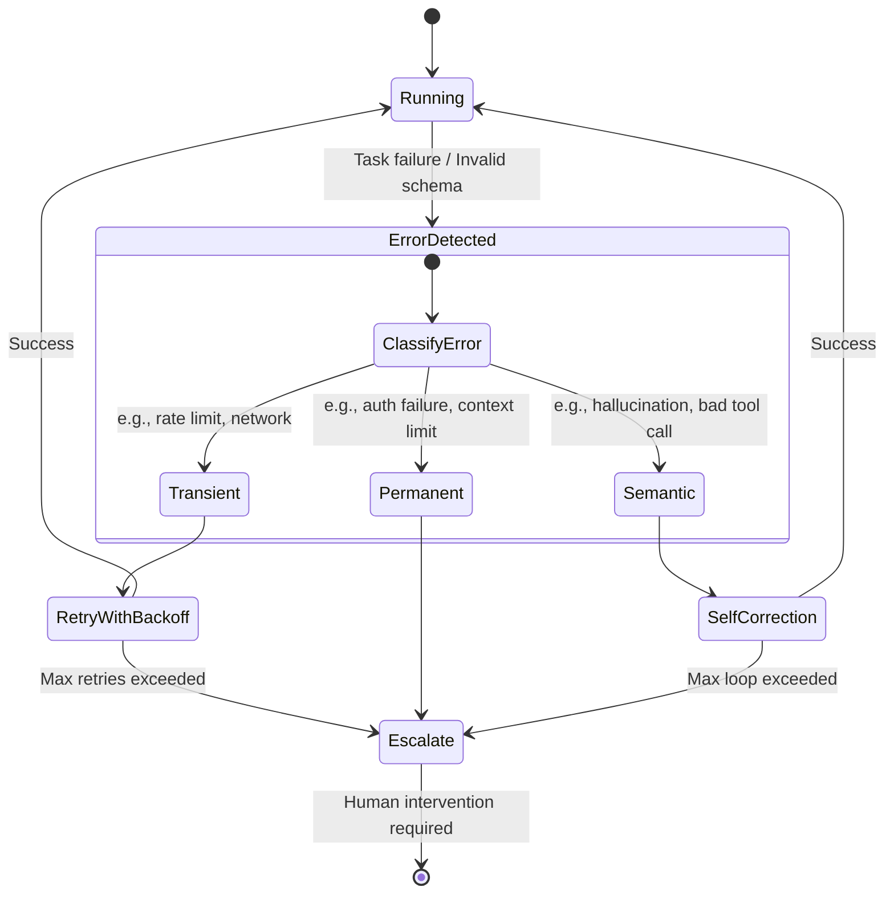

## Introduction

As agentic systems operate autonomously in production, failures are inevitable. A robust failure taxonomy and recovery strategy is required to build reliable systems. This lesson details how to classify, identify, and recover from various failure modes in LLM-driven agents.

## System Diagram

The following Mermaid diagram outlines a standardized recovery workflow when an agent encounters an unhandled exception or an invalid generation state.



## Non-goals

* We will not cover standard infrastructure failures (e.g., Kubernetes pod crashes) unless they specifically intersect with agent state.
* We will not discuss basic syntax errors in non-agent application code.

## Measurable Release Thresholds

Before deploying recovery loops to production, ensure the system meets the following thresholds:
1. **Recovery Rate:** &gt; 95% automated recovery from transient API errors.
2. **Correction Loop Limit:** Strict limit of 3 semantic retry attempts per task before escalating.
3. **MTTR (Mean Time To Recovery):** Less than 2 seconds for localized tool correction.

## Prerequisites

* Familiarity with state machine patterns in software engineering.
* Understanding of LLM tool calling schema validation.

## Core Concepts

A comprehensive failure taxonomy for agentic systems divides failures into three primary categories: Transient, Permanent, and Semantic.

### 1. Transient Failures
These are temporary issues, primarily caused by external dependencies. Examples include rate limits (HTTP 429), temporary network timeouts, or service degradation at the model provider.

### 2. Permanent Failures
These are structural issues that cannot be resolved through retries. Examples include hard authentication failures, exceeding maximum context window lengths, or requesting an impossible tool sequence.

### 3. Semantic Failures
These are unique to generative models. The model responds successfully from an HTTP perspective, but the payload is semantically invalid. Examples include hallucinating a tool name, generating malformed JSON, or violating a business logic constraint.

## Architecture & Implementation Details

To implement this taxonomy, your agent execution framework should wrap LLM calls in a robust execution harness.

```python
def execute_agent_step(agent, context):
    try:
        response = agent.generate(context)
        validate_schema(response)
        return execute_tool(response)
    except TransientError as e:
        return handle_transient(e)
    except SemanticError as e:
        return prompt_self_correction(agent, e)
    except PermanentError as e:
        return escalate_to_human(e)
```

## Failure Modes & Mitigation

* **Failure Mode:** Infinite self-correction loops.
* **Mitigation:** Always implement a strict deterministic counter for self-correction. Never allow an agent to retry infinitely.

## Security & Privacy

When logging semantic failures, ensure that PII (Personally Identifiable Information) generated during hallucinations is aggressively redacted before the failure context is sent to observability platforms.

## Testing Strategy

Employ **Failure Injection**. Write integration tests that deliberately mock the LLM provider to return 429 status codes, malformed JSON strings, and hallucinated tool names, asserting that the framework successfully categorizes and recovers from each.

## Deployment Strategy

Roll out recovery logic changes gradually. Use feature flags to test self-correction logic in a dark-launch phase, comparing its recovery rate against the baseline.

## Monitoring & Observability

All failures must be tagged with their taxonomy classification in your metrics provider (e.g., `agent.failure.count{type="semantic"}`). This allows tracking the underlying cause of agent degradation.

## Runbook & Incident Response

If semantic failures spike above 5% per minute:
1. Verify if the underlying model provider silently updated their model weights.
2. Check if a recent prompt change degraded tool-calling adherence.
3. Fallback to an older, pinned model version.

## Summary & Next Steps

Categorizing failures enables deterministic recovery strategies for non-deterministic AI systems. Next, review how to implement cost budgets and stop rules to constrain escalating failures.
