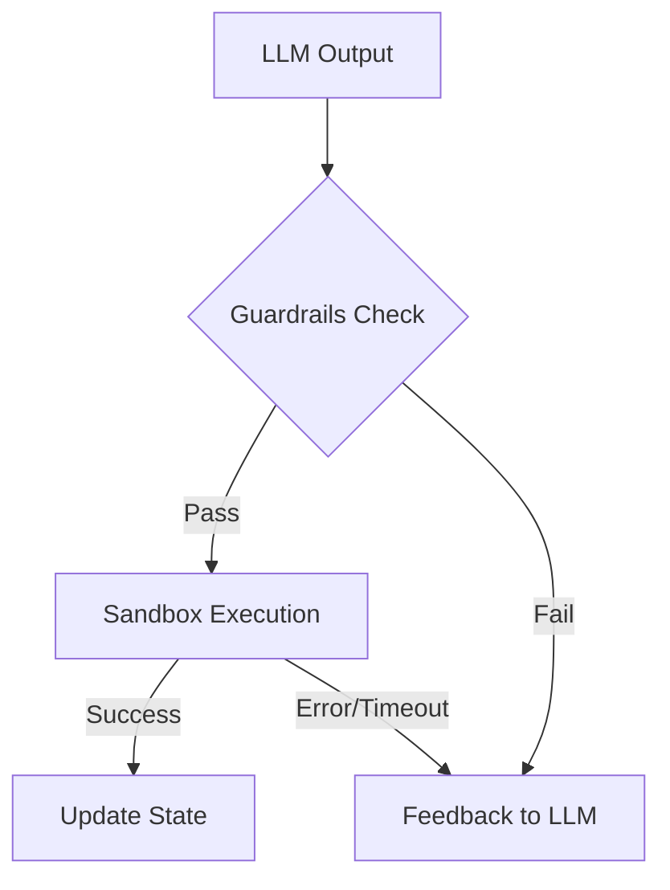
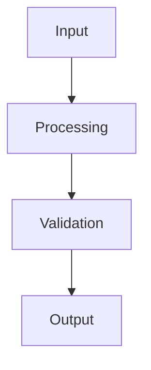

## Key takeaway

Agents are only as safe and effective as the environment they operate in. Harness engineering provides the scaffolding required to run autonomous AI agents reliably and securely.

## Mental model or small diagram



## When to use and when not to use

**When to use:**

- Autonomous Agents that execute code, query databases, or call external APIs.
- Multi-step Workflows where tasks might fail and need retry logic.
- Production Systems with strict security and reliability requirements.

**When not to use:**

- Text-only Conversational Tasks that only output text to the user.
- Simple Zero-shot Classification.

## Method or procedure

1. **Execution Environments:** Set up sandboxed areas (Docker containers, serverless functions) to run agent code securely.
2. **State & Memory Management:** Persist the agent's context and action history.
3. **Guardrails & Permissions:** Enforce access controls and human-in-the-loop approvals for sensitive actions.
4. **Resilience Mechanisms:** Implement built-in retries, timeouts, and error-parsing logic to recover from failures.

## Worked example

**Input:** Agent wants to execute `os.system("rm -rf /")`.
**Process:**

```python
def run_agent_action(tool_call):
    if not is_code_safe(tool_call.code):
        return "Error: Unsafe code detected. Please rewrite without system calls."
    try:
        result = run_in_sandbox(tool_call.code, timeout_seconds=10)
        return result
    except TimeoutException:
        return "Error: Code execution timed out."
```

**Output:** The harness blocks the destructive action and provides a safe error message back to the LLM to try a different approach.

## Failure modes and mitigations

- **Unrestricted Access:** Agent modifies production data. *Mitigation: Run strictly in read-only modes or isolated staging environments.*
- **Brittle Output Parsing:** The harness crashes if the LLM output isn't perfect JSON. *Mitigation: Use robust parsers that extract JSON from markdown or use native tool-calling APIs.*
- **Lack of Timeouts:** The agent initiates an infinite loop script. *Mitigation: Enforce hard execution time limits.*

## Evaluation checklist or rubric

- [ ] **Security Audits:** Can the agent bypass the sandbox?
- [ ] **Recovery Rate:** When a tool fails, does the agent successfully understand the error and correct its next action?
- [ ] **Execution Overhead:** Is the latency of the sandbox acceptable?

## Safety, privacy, and cost notes

- **Safety:** Treat all LLM-generated code as untrusted user input. Never run it on your host machine without a sandbox.
- **Cost:** Provisioning sandboxes dynamically can be expensive. Re-use containers when safe to do so.

## Practice task

Write a simple Python wrapper function that takes an LLM-generated JSON string, attempts to parse it, and if it fails, returns a cleanly formatted error message intended for the LLM to read and correct itself.

## Provenance and further reading

> **Note:** The principles taught in this lesson are model-independent. Any vendor-specific implementation notes (e.g., specific API features or context limits from Anthropic or OpenAI) are used for illustration and should be adapted to your chosen provider.

- **Source**: [Testing LLM Applications](https://python.langchain.com/docs/langsmith/)
- **Author/Organization**: LangChain
- **Publication Date**: 2024-03-05
- **Access Date**: 2026-10-07
- **Next Steps**: Review the related example `content-format-transformer` or proceed to the lesson `evaluation-reliability`.

## Non-goals

This is not a general-purpose guide to all possible paradigms, nor does it aim to replace standard software engineering practices. The focus is strictly on the AI-specific nuances in this particular domain.

## System diagram



## Competing designs and trade-offs

When evaluating alternatives, one might consider synchronous vs asynchronous execution, stateless vs stateful processes, and naive vs structured generation. Synchronous is easier to debug but scales poorly. Stateless is robust but limits context. The trade-offs heavily depend on the specific latency and cost budget allocated to the agent.

## Implementation blueprint

The core implementation relies on defining strict interfaces between components. 

1. Define the input schema.
2. Implement the validation step.
3. Route to the appropriate model or tool.
4. Process the response and handle exceptions.

This blueprint ensures predictability.

## Evaluation criteria

Success is measured by precision, recall, and the false positive rate of the agent's actions. Additionally, the system must meet latency SLAs (e.g., p95 < 2000ms) and cost constraints per task.

## Security

Security is paramount. The system must enforce least-privilege access, validate all inputs to prevent prompt injection, and sandbox any executed code. All sensitive data must be redacted before being sent to external APIs.

## Observability

The system requires trace-first observability. Every interaction must be logged with correlation IDs, token usage, and latency metrics. This enables rapid debugging and continuous evaluation of the agent's performance in production.

## Latency

Latency is bounded by the model's time-to-first-token and the number of sequential tool calls. Optimizations like streaming, caching, and concurrent execution are necessary to maintain a responsive user experience.

## What would change this decision?

If model capabilities improve significantly, such that smaller, faster models can handle complex reasoning natively, the need for intricate orchestration might be reduced. Conversely, if security requirements tighten, more rigorous air-gapping might be required.

## Exercise

Implement the blueprint described above using a mock LLM client. Verify that the validation step correctly rejects malformed inputs and that the success path logs the expected metrics.

## Sources

