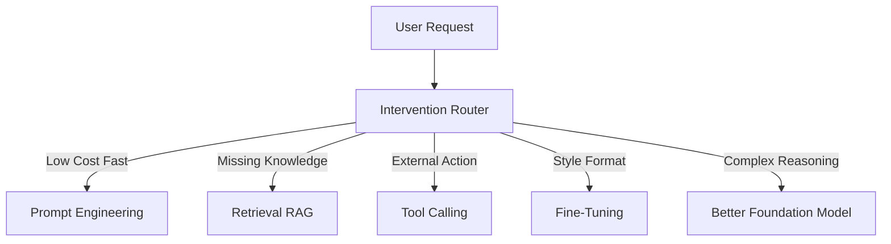

## 1. Concrete Production Problem and Explicit Non-Goals

**Problem**: Your generative AI application is underperforming (e.g., hallucinating, failing to follow formatting instructions, or executing too slowly). You must decide whether to adjust the prompt, add retrieval (RAG), provide new tools, fine-tune the model, or switch to a more capable foundation model.

**Non-Goals**: We are not building a new foundation model from scratch, nor are we covering the low-level hyperparameters of LoRA or full fine-tuning.

## 2. Prerequisites and Assumed System Scale

**Prerequisites**: Understanding of basic RAG, tool calling, and prompt engineering.
**System Scale**: Production system handling 100+ requests per minute where latency and cost per successful task matter.

## 3. System Diagram: Trust and Failure Boundaries

## 4. Viable Designs and Trade-Offs

**Design A: Retrieval Augmented Generation (RAG)**
* **Pros**: Grounded in current data, easy to update knowledge, mitigates hallucination.
* **Cons**: Adds latency, requires external infrastructure (vector DB), does not improve base reasoning.

**Design B: Fine-Tuning**
* **Pros**: Reduces prompt size (saving token costs and latency), excellent for teaching specific output formats or styles.
* **Cons**: Expensive to train, requires high-quality curated data, cannot easily learn new dynamic facts.

## 5. Implementation Blueprint

1. **Diagnose**: Run evaluation suite to categorize errors (e.g., format error, factual error, reasoning error).
2. **Evaluate Prompts First**: Can a few-shot prompt fix it? If yes, and context window permits, stop.
3. **Evaluate Knowledge Base**: If factual errors persist, implement RAG or Tool Calling.
4. **Evaluate Fine-Tuning**: If the model struggles with a strict JSON schema or brand voice, fine-tune a smaller, cheaper model.
5. **Evaluate Model Upgrade**: If it fails at complex multi-step logic, upgrade the foundation model.

## 6. Worked Example Using Realistic Data

A customer support bot repeatedly misformats refund API payloads.
* **Attempt 1**: Add 5 examples to the prompt. Result: Token cost increases by 30%, format improves but still fails 5% of the time.
* **Attempt 2**: Fine-tune a smaller model on 1,000 successful refund API calls. Result: 99.9% format reliability, 40% reduction in latency and cost per call.

## 7. Failure Injection or Adversarial Cases

* **Adversarial Case**: Injecting conflicting instructions into retrieved documents (Prompt Injection).
* **Failure Mode**: A fine-tuned model overfits to the training format and crashes when a new API parameter is introduced.

## 8. Evaluation Criteria and Measurable Release Thresholds

* **Threshold**: The chosen intervention must improve the target metric (e.g., format reliability) by at least 15% without regressing latency by more than 200ms or cost by more than 10%.

## 9. Security and Privacy Considerations

* **RAG**: Ensure document-level access control so users only retrieve what they are authorized to see.
* **Fine-Tuning**: Beware of training on PII. Fine-tuned models can memorize and regurgitate private training data.

## 10. Observability Requirements

* Track intervention cost vs. baseline.
* Log time-to-first-token (TTFT) and total latency for RAG vs. Fine-tuning paths.

## 11. Latency and Cost Considerations

* **Prompting/RAG**: Higher per-inference cost and latency due to larger context windows.
* **Fine-Tuning**: High upfront cost, lower per-inference cost.
* **Larger Model**: Highest per-inference cost, best zero-shot accuracy.

## 12. Operational Artifact: Decision Memo

**ADR**: Decided to use Fine-Tuning over Prompting for the refund API payload generation.
* **Rejected**: Prompting (too expensive per call, context bloat).
* **Rollback Plan**: Revert to the few-shot prompt and base model if the fine-tuned model degrades.

## 13. Authoritative Sources

* Anthropic: Building effective agents. Verified 2026-10-07.
* OpenAI API: Fine-tuning guides. Verified 2026-10-07.

## 14. What Would Change This Decision?

If the foundation model provider releases a new model that is 50% cheaper and natively guarantees JSON schema adherence, the fine-tuned model should be retired in favor of the base model.

## 15. Hands-On Exercise

**Exercise**: Take a dataset of 50 failed queries. Classify each failure as Knowledge, Reasoning, or Formatting. Propose one intervention for each category.
**Evidence of Completion**: A markdown table mapping the 50 queries to their root causes and proposed interventions.
