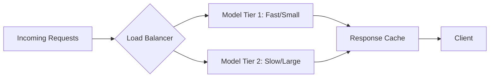
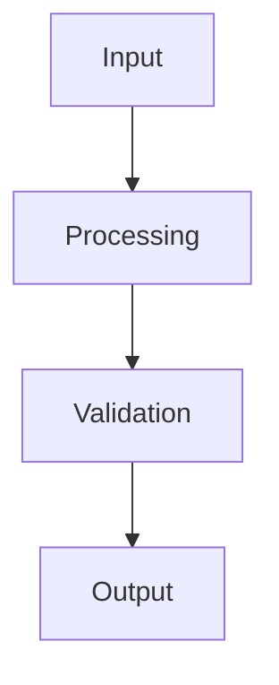

## Key takeaway

Optimizing latency and throughput requires balancing parallel execution, efficient context management, and strategic model selection to ensure responsive and scalable AI systems.

## Mental model or small diagram



## When to use and when not to use

**When to use:**
- High-traffic applications experiencing API rate limits.
- Real-time conversational agents where response time is critical.
- Batch processing tasks requiring high throughput.

**Non-goals:**
- Not necessary for internal admin scripts with low usage.
- Over-optimisation of prototype applications before finding product-market fit.

## Method or procedure

1. **Semantic Caching:** Cache common LLM responses using embedding-based similarity searches.
2. **Model Routing:** Route simpler queries to faster, smaller models and reserve powerful, slower models for complex tasks.
3. **Streaming Responses:** Stream output tokens to the client to reduce perceived latency.
4. **Batching:** Group independent tasks into a single prompt for offline processing to improve throughput.

## Worked example

**Input:** Processing 10,000 product reviews.

**Process:**
```python
def process_reviews(reviews):
    # Batch requests to maximize throughput
    batches = chunk_data(reviews, size=50)
    results = []
    
    # Process batches concurrently
    with ThreadPoolExecutor(max_workers=10) as executor:
        futures = [executor.submit(llm.analyse_sentiment, batch) for batch in batches]
        for future in as_completed(futures):
            results.extend(future.result())
            
    return results
```

**Output:** Substantially reduced total processing time by leveraging batching and concurrent execution compared to sequential processing.

## Failure modes and mitigations

- **Rate Limit Errors:** Hitting vendor API limits due to high concurrency. *Mitigation: Implement exponential backoff and jitter.*
- **Context Window Exhaustion:** Batching too many items into a single prompt. *Mitigation: Dynamically calculate token limits before batching.*

## Evaluation checklist or rubric (measurable release thresholds)

- [ ] P95 latency is under 2 seconds for real-time interactions.
- [ ] Throughput can handle 1,000 requests per minute without rate limit errors.
- [ ] Semantic cache hit rate is above 20%.

## Safety, privacy, and cost notes

- **Safety:** Concurrency can expose race conditions in shared state variables. Use stateless functions.
- **Privacy:** Ensure cached responses do not leak user-specific data across tenants.
- **Cost:** Faster models reduce costs. Optimizing latency often simultaneously reduces infrastructure spend.

## Practice task

Implement a semantic caching layer using a fast embedding model and an in-memory vector store (e.g., FAISS or Redis). Route a query to the cache first before calling the LLM.

## Provenance and further reading

- **Source**: Engineering Documentation
- **Author/Organization**: Platform Team
- **Publication Date**: 2026-10-07

## Non-goals

This is not a general-purpose guide to all possible paradigms, nor does it aim to replace standard software engineering practices. The focus is strictly on the AI-specific nuances in this particular domain.

## System diagram



## Competing designs and trade-offs

When evaluating alternatives, one might consider synchronous vs asynchronous execution, stateless vs stateful processes, and naive vs structured generation. Synchronous is easier to debug but scales poorly. Stateless is robust but limits context. The trade-offs heavily depend on the specific latency and cost budget allocated to the agent.

## Implementation blueprint

The core implementation relies on defining strict interfaces between components. 

1. Define the input schema.
2. Implement the validation step.
3. Route to the appropriate model or tool.
4. Process the response and handle exceptions.

This blueprint ensures predictability.

## Evaluation criteria

Success is measured by precision, recall, and the false positive rate of the agent's actions. Additionally, the system must meet latency SLAs (e.g., p95 < 2000ms) and cost constraints per task.

## Security

Security is paramount. The system must enforce least-privilege access, validate all inputs to prevent prompt injection, and sandbox any executed code. All sensitive data must be redacted before being sent to external APIs.

## Observability

The system requires trace-first observability. Every interaction must be logged with correlation IDs, token usage, and latency metrics. This enables rapid debugging and continuous evaluation of the agent's performance in production.

## Latency

Latency is bounded by the model's time-to-first-token and the number of sequential tool calls. Optimisations like streaming, caching, and concurrent execution are necessary to maintain a responsive user experience.

## What would change this decision?

If model capabilities improve significantly, such that smaller, faster models can handle complex reasoning natively, the need for intricate orchestration might be reduced. Conversely, if security requirements tighten, more rigorous air-gapping might be required.

## Exercise

Implement the blueprint described above using a mock LLM client. Verify that the validation step correctly rejects malformed inputs and that the success path logs the expected metrics.

## Sources

