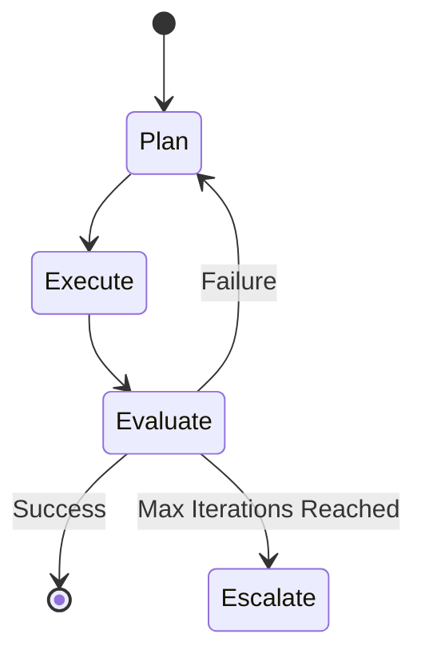

## Key takeaway
Autonomous loops must be designed with explicit termination conditions, robust state management, and clear escalation paths to prevent runaway execution and budget exhaustion.

## Mental model or small diagram


## When to use and when not to use
**When to use:**
- Self-Correcting Workflows (e.g., agents writing and debugging code).
- Open-Ended Research tasks requiring continuous information gathering.
- Multi-Agent Orchestration.

**When not to use:**
- Linear, Predictable Tasks like simple data extraction. Use a DAG or pipeline instead.
- Strict Budget Constraints where you cannot risk an agent looping unnecessarily.

## Method or procedure
1. **Define Convergence:** Establish how the agent measures progress toward its goal.
2. **Set Termination Rules:** Enforce max iterations, timeout limits, or budget caps.
3. **Build Recovery Logic:** Detect when the agent repeats the exact same action and force a new approach or pause.
4. **Context Pruning:** Implement summarization steps to compress previous iterations so the context window doesn't overflow.

## Worked example
**Process:**
```python
max_iterations = 5
iteration = 0
passed = False
previous_errors = []

while iteration < max_iterations and not passed:
    code = agent.generate_code(prompt, previous_errors)
    test_results = environment.run_tests(code)
    
    if test_results.is_success:
        passed = True
        break
        
    if agent.is_stuck_in_repetition(test_results, previous_errors):
        agent.escalate_to_human("Stuck in a loop. Need assistance.")
        break
        
    previous_errors.append(test_results.error_messages)
    iteration += 1
```

## Failure modes and mitigations
- **Infinite Loops (Hallucination Traps):** The agent tries the same incorrect solution endlessly. *Mitigation: Track action history and break if the similarity of consecutive actions is too high.*
- **Context Collapse:** The loop runs so long the prompt history exceeds the LLM limit. *Mitigation: Summarize past iterations every N steps.*

## Evaluation checklist or rubric
- [ ] **Graceful Termination:** Does the loop stop when max iterations are hit?
- [ ] **Repetition Awareness:** Does the agent recognize and recover from repeated failures?
- [ ] **Escalation Triggers:** Does the agent ask for human help when genuinely stuck?

## Safety, privacy, and cost notes
- **Cost:** Loops are extremely dangerous for budgets. Always set a hard limit on API calls or token spend per session.

## Practice task
Design a state machine for an agent whose goal is to scrape a website, extract pricing data, and format it. Define the states, the success condition, and at least two failure states that trigger an escalation to a human.
