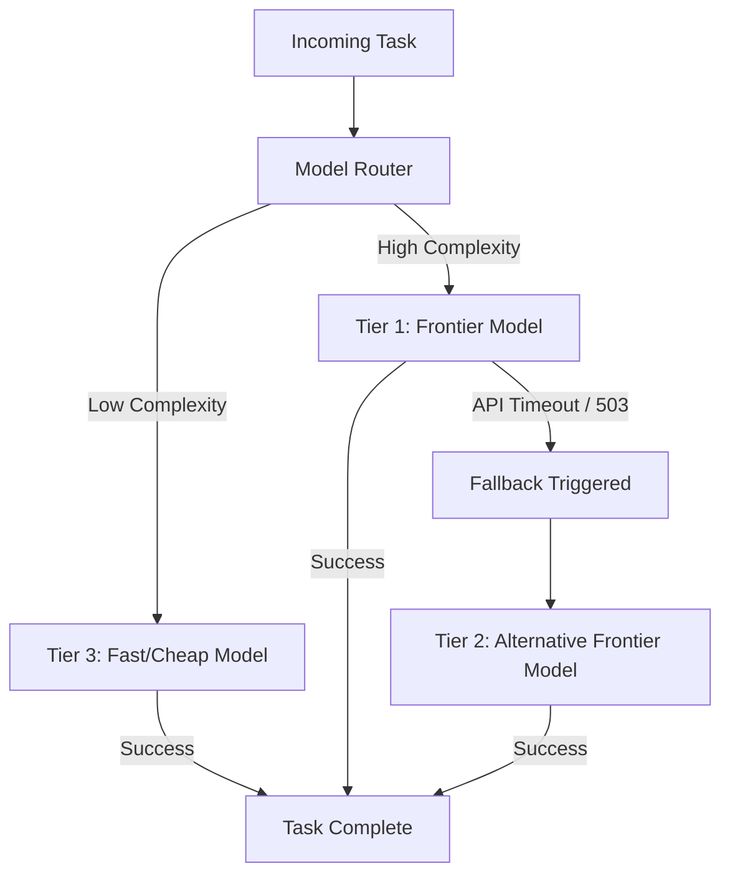

## Introduction

No single LLM provider offers 100% uptime, nor is a massive frontier model required for every trivial task. Advanced agentic systems utilize dynamic model routing to optimize for cost, latency, and capability, and they employ graceful degradation to remain operational during partial outages.

## System Diagram

The diagram below illustrates a dynamic model router that selects an LLM based on task complexity and falls back to alternative providers during an outage.



## Non-goals

* We will not cover training custom router models from scratch.
* We are not discussing multi-agent systems where different agents have fixed models; this is about dynamic infrastructure routing.

## Measurable Release Thresholds

1. **Fallback Latency:** The system must trigger a fallback to a secondary model within 3 seconds of a primary model timeout.
2. **Routing Accuracy:** Heuristic or classifier-based routing must correctly identify &gt; 90% of low-complexity tasks to save costs.
3. **Availability:** The multi-vendor fallback setup must achieve 99.99% aggregate availability for LLM requests.

## Prerequisites

* Familiarity with multiple LLM provider APIs (e.g., OpenAI, Anthropic, Google).
* Understanding of standard circuit breaker patterns.

## Core Concepts

### Model Routing
The process of inspecting an incoming prompt or task and directing it to the most appropriate model. This can be based on text length, required tools, or a quick classifier model that assesses "difficulty."

### Graceful Degradation
If the highest-tier frontier model is unavailable, the system should fall back to a less capable model. While the system's overall intelligence may temporarily decrease, it remains functional for most standard tasks rather than failing entirely.

### Fallback Tiers
Establishing primary, secondary, and tertiary model configurations (often across different cloud providers) to ensure redundancy.

## Architecture & Implementation Details

A robust router uses the circuit breaker pattern to prevent thundering herds against a failing API.

```python
class ModelRouter:
    def __init__(self, primary_client, fallback_client):
        self.primary = primary_client
        self.fallback = fallback_client
        self.circuit_breaker = CircuitBreaker(failure_threshold=5)

    def generate(self, prompt, complexity="high"):
        if complexity == "low":
            return self.fallback.generate(prompt)
            
        if self.circuit_breaker.is_open():
            return self.fallback.generate(prompt)
            
        try:
            return self.primary.generate(prompt)
        except ProviderOutageError:
            self.circuit_breaker.record_failure()
            return self.fallback.generate(prompt)
```

## Failure Modes & Mitigation

* **Failure Mode:** Schema mismatch during fallback. A fallback model might not support the exact tool-calling schema required by the primary model.
* **Mitigation:** Maintain an abstraction layer that normalizes schemas across providers, or maintain separate prompt/tool configurations for each model tier.

## Security & Privacy

When routing requests to multiple vendors, ensure all vendors comply with your organization's data privacy requirements (e.g., zero-retention policies). Do not fallback to a consumer-tier API that uses data for training.

## Testing Strategy

Perform chaos engineering. Use proxies (like Toxiproxy) to simulate 500-level errors, connection drops, and severe latency spikes on the primary provider. Assert that the system successfully reroutes to the fallback provider and maintains overall throughput.

## Deployment Strategy

Deploy model routing logic in passive observation mode first. Log which model the router *would* have chosen and compare the cost/latency implications against the current static routing before enabling it actively.

## Monitoring & Observability

Ensure you track:
* `router.model.selected` (dimension: model_name)
* `router.fallback.triggered` (dimension: reason)
* Latency distributions per model tier.

## Runbook & Incident Response

If the system degrades to the fallback tier heavily:
1. Check the status page of the primary provider.
2. If the primary provider is healthy, inspect the network path and rate limit headers.
3. If the fallback model is hallucinating heavily on complex tasks, consider engaging a "Stop Rule" (see previous lesson) to pause execution rather than proceeding with dangerous actions.

## Summary & Next Steps

Dynamic routing and fallbacks ensure that agentic systems balance cost and reliability. Next, we will formalize these reliability concepts by defining Service Level Objectives (SLOs) and incident response protocols for AI systems.

## Competing designs and trade-offs

When evaluating alternatives, one might consider synchronous vs asynchronous execution, stateless vs stateful processes, and naive vs structured generation. Synchronous is easier to debug but scales poorly. Stateless is robust but limits context. The trade-offs heavily depend on the specific latency and cost budget allocated to the agent.

## Implementation blueprint

The core implementation relies on defining strict interfaces between components. 

1. Define the input schema.
2. Implement the validation step.
3. Route to the appropriate model or tool.
4. Process the response and handle exceptions.

This blueprint ensures predictability.

## Worked example

Consider a scenario where the user requests a complex data transformation. 

Input: `Transform this CSV into a summary report.`

The agent parses the intent, validates the CSV structure, executes the transformation via a secure sandbox, and returns the result. If the CSV is malformed, it gracefully degrades by prompting for clarification rather than failing silently.

## Evaluation criteria

Success is measured by precision, recall, and the false positive rate of the agent's actions. Additionally, the system must meet latency SLAs (e.g., p95 < 2000ms) and cost constraints per task.

## Latency

Latency is bounded by the model's time-to-first-token and the number of sequential tool calls. Optimisations like streaming, caching, and concurrent execution are necessary to maintain a responsive user experience.

## Cost

Cost is primarily driven by token volume and model selection. Strategies such as prompt caching, semantic routing to smaller models for simple tasks, and strict token limits are essential to keep costs within budget.

## What would change this decision?

If model capabilities improve significantly, such that smaller, faster models can handle complex reasoning natively, the need for intricate orchestration might be reduced. Conversely, if security requirements tighten, more rigorous air-gapping might be required.

## Exercise

Implement the blueprint described above using a mock LLM client. Verify that the validation step correctly rejects malformed inputs and that the success path logs the expected metrics.

## Further reading

* [Anthropic Engineering Blog](https://www.anthropic.com/engineering)
* [Google Cloud Architecture Centre](https://cloud.google.com/architecture)

## Sources

