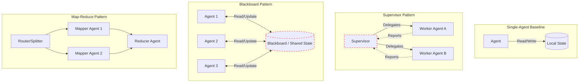

## 1. Concrete Production Problem & Non-goals

**Problem:** The software engineering industry is currently experiencing a rush to deploy "multi-agent" architectures. This often results in cargo-cult engineering: teams add complex coordination layers—such as supervisors, peer-to-peer swarms, blackboards, or map-reduce networks—without ever proving that these multi-agent setups actually outperform a well-prompted single agent given the exact same inference compute and token budget. This lesson establishes the framework required to rigorously justify and design multi-agent architectures by evaluating coordination overhead, shared-state hazards, contradiction handling, budgets, and termination conditions.

**Non-goals:** This lesson does not cover custom model training, fine-tuning for specialized multi-agent communication tokens, or theoretical reinforcement learning multi-agent game theory. We focus entirely on application-layer orchestration of foundation models in production environments.

## 2. Prerequisites, System Scale, Risk Level, and Context

**Prerequisites:** You must understand single-agent loops, basic tool calling, trace-first observability, and standard failure boundaries.
**System Scale:** The patterns discussed here apply to high-volume asynchronous systems processing thousands of complex tasks per hour, where latency constraints allow for multiple sequential or parallel network calls.
**Risk Level:** High. Multi-agent systems inherently introduce non-deterministic loops, potential deadlocks, unbounded token consumption, and complex state synchronization issues.
**Operating Context:** We assume an environment where cost (token budget) and latency are actively monitored and must be justified by proportional increases in output quality.

## 3. System Diagram

The following diagram illustrates the trust boundaries and structural differences between a single-agent baseline and various multi-agent patterns. Note the explicit failure boundaries and state isolation.



*Figure 1: Comparison of multi-agent topologies and their implicit shared-state boundaries.*

## 4. Competing Designs and Trade-offs

When addressing a complex task, you have several architectural choices. We must compare supervisor, peer, blackboard, and map-reduce patterns against the single-agent baseline.

### 4.1. Single-Agent Baseline
A single agent with access to a robust set of tools and a scratchpad.
**Pros:** Zero coordination overhead. No shared-state hazards. Simple termination logic.
**Cons:** Can suffer from context window degradation on very long tasks. May struggle to "change hats" effectively if required to critique its own work.

### 4.2. Supervisor Pattern
A central supervisor agent delegates sub-tasks to specialized worker agents, synthesizes their results, and determines termination.
**Pros:** Clear hierarchy. Easy to enforce budgets at the supervisor level. Privilege separation is straightforward.
**Cons:** The supervisor can become a bottleneck. High token cost as the supervisor must repeatedly read the context of worker outputs.
**Contradiction Handling:** The supervisor resolves contradictions definitively.

### 4.3. Peer-to-Peer Pattern
Agents communicate directly with one another without a central authority.
**Pros:** Highly flexible. Can dynamically form ad-hoc graphs.
**Cons:** Extremely prone to infinite loops and conversational deadlocks. Difficult to enforce global termination or budget constraints. Coordination overhead is massive.
**Contradiction Handling:** Agents must negotiate, which often leads to polite but unproductive "I agree, but..." loops.

### 4.4. Blackboard Pattern
Agents do not communicate directly; instead, they read from and write to a shared "blackboard" (a database or structured state object).
**Pros:** Decouples agents entirely. Agents can trigger based on specific state changes asynchronously.
**Cons:** Shared-state hazards. Race conditions if agents update the blackboard concurrently without locking.
**Contradiction Handling:** Requires explicit conflict-resolution rules baked into the blackboard's update logic, rather than leaving it to the LLMs.

### 4.5. Map-Reduce Pattern
A task is deterministically split into independent chunks, processed in parallel by identical or specialized agents (Map), and then synthesized by a final agent (Reduce).
**Pros:** Highly scalable. predictable termination. Excellent for summarizing massive document repositories.
**Cons:** Rigid. Does not handle tasks requiring continuous feedback loops well.
**Contradiction Handling:** The reducer agent explicitly handles contradictions between mapper outputs.

## 5. Implementation Blueprint

Below is an implementation blueprint for a Map-Reduce style architecture augmented with a Supervisor that strictly enforces a budget and termination protocol.

```python
class MultiAgentSystem:
    def __init__(self, token_budget, max_iterations):
        self.token_budget = token_budget
        self.max_iterations = max_iterations
        self.current_tokens = 0
        self.iterations = 0

    def run_task(self, task_description):
        # Step 1: Supervisor plans and maps the task
        plan = self.call_supervisor("plan", task_description)
        
        results = []
        # Step 2: Map phase
        for subtask in plan.subtasks:
            if self._check_budget():
                worker_result = self.call_worker(subtask)
                results.append(worker_result)
            else:
                return self._halt_and_return("Budget exhausted during Map phase.", results)

        # Step 3: Reduce phase
        if self._check_budget():
            final_output = self.call_reducer(results)
            return final_output
        else:
            return self._halt_and_return("Budget exhausted before Reduce phase.", results)

    def _check_budget(self):
        self.iterations += 1
        if self.iterations >= self.max_iterations:
            return False
        if self.current_tokens >= self.token_budget:
            return False
        return True

    def _halt_and_return(self, reason, partial_results):
        # Graceful degradation logic
        return {"status": "halted", "reason": reason, "data": partial_results}
```

## 6. Worked Example with Realistic Inputs and Outputs

**Scenario:** We need to analyze a 50-page legal contract to identify indemnification risks, jurisdiction clauses, and termination penalties.

**Input:** A raw text dump of the contract (approx 30,000 tokens).

**Single-Agent Execution (Equal Budget):** 
The single agent is given the whole document and prompted to find all three elements. 
*Tokens used:* 35,000. 
*Result:* Finds the jurisdiction and termination penalties, but hallucinates part of the indemnification risk due to context dilution in the middle of the prompt.

**Map-Reduce Multi-Agent Execution (Equal Budget):**
The text is chunked into 3 sections. Three identical mapper agents extract clauses. A reducer synthesizes them.
*Tokens used:* 36,500 (slight coordination overhead for the reducer).
*Result:* Accurately extracts all three elements. The reducer easily cross-references the mappers' outputs. The multi-agent system materially improved the metric (accuracy) for roughly the exact same budget.

## 7. Failure Injection and Adversarial Cases

To make this architecture robust, you must design for these failure modes:

1. **Coordination Overhead Bloat:** If a supervisor sends the *entire* conversation history to every worker, token usage scales quadratically. *Mitigation:* Pass only explicitly relevant summaries.
2. **Shared-State Hazards:** In a blackboard system, Agent A writes "System is secure," and Agent B concurrently writes "System is compromised." *Mitigation:* Use versioning and strict locking on the blackboard.
3. **Contradiction Handling:** Two agents disagree. *Mitigation:* Do not let them argue infinitely. Introduce a deterministic "judge" prompt or escalate to a human if confidence scores diverge.
4. **Infinite Loops and Termination:** Agents politely thanking each other endlessly. *Mitigation:* Hard iteration limits and explicit `<TERMINATE>` token requirements.

## 8. Evaluation Metrics and Release Thresholds

You cannot release a multi-agent system unless it passes the following thresholds compared to a single-agent baseline:

- **Quality per Dollar:** Does the multi-agent system achieve a statistically significant higher quality score (measured via deterministic evaluation or a calibrated LLM-as-a-judge) than a single agent given the *same* token budget?
- **Latency Bound:** Is the p95 latency within acceptable bounds for the user experience? (Parallel map-reduce usually improves latency; supervisor patterns degrade it).
- **Overhead Ratio:** What percentage of tokens are spent on agents talking to agents versus agents doing actual work? If the coordination overhead exceeds 30%, refactor.

## 9. Security and Privacy

Multi-agent systems require strict privilege separation. 
If Agent A has internet access to research a company, and Agent B has SQL access to the internal database, they must *never* be allowed to communicate directly in a peer-to-peer fashion. If Agent A is compromised via prompt injection from a malicious website, it could instruct Agent B to drop tables.
**Requirement:** All communication between agents with different privilege levels must pass through a sanitized, typed schema (e.g., a Blackboard or a Supervisor), not raw text.

## 10. Observability: Logs, Traces, Metrics, and Audit

You must implement trace-first observability. A single request ID must span the supervisor, the mappers, and the reducer.
- **Required Logs:** Agent initiation, state transitions, payload sizes, and explicit termination reasons.
- **Required Metrics:** Token usage grouped by agent role, iteration counts, and time-in-state.
- **Audit Evidence:** A complete, replayable trace of every inter-agent message. Without this, debugging a multi-agent hallucination is impossible.

## 11. Latency and Cost Bounds

Multi-agent systems are inherently more expensive and slower due to network hops and redundant context processing.
- **Latency:** Each sequential agent step adds 1–3 seconds of TTFT (Time To First Token) and generation time. A 5-step supervisor loop will likely exceed 10 seconds.
- **Cost:** Context is often duplicated. If a supervisor reads a 5,000-token document and passes it to 3 workers, you are paying for 20,000 input tokens.
*Rule of thumb:* Never use a sequential multi-agent pattern for synchronous user-facing features unless latency expectations are explicitly managed (e.g., a loading spinner indicating "Researching... Synthesizing...").

## 12. Reviewable Artifact

Your task is to produce an **Experiment Report with Equal and Unequal Budget Comparisons**.
You must build a small harness that runs a single agent and a multi-agent system on the same benchmark dataset.
1. **Equal Budget:** Run the single agent with a highly complex, multi-step prompt. Run the multi-agent system with the same overall token constraint. Compare accuracy.
2. **Unequal Budget:** Run the single agent without constraints. Run the multi-agent system without constraints. Compare peak accuracy and the final cost difference.

## 13. Authoritative Sources

- [Anthropic: Building Effective Agents](https://www.anthropic.com/engineering/building-effective-agents) (Verified: 2026-10)
- [Ng, Andrew: Agentic Design Patterns](https://www.deeplearning.ai/the-batch/issue-242/) (Verified: 2026-10)

## 14. What Would Change This Decision?

You should revert to a single-agent system if:
- Newer models (e.g., Claude 3.5 Sonnet, GPT-4o) become capable of handling the required complexity in a single zero-shot or chain-of-thought prompt with equal accuracy.
- The latency of sequential multi-agent calls violates the product's SLA.
- The token cost of coordination exceeds the business value of the marginal quality improvement.

## 15. Hands-on Exercise and Expected Evidence

**Exercise:** Refactor a monolithic script that summarizes and translates a document into a Map-Reduce agent pattern.
**Instructions:** 
1. Create a single agent that takes a 10-page text, summarizes it, and translates it to French in one prompt. Record the execution time and token usage.
2. Build a router that splits the text into 3 parts.
3. Build 3 mapper agents that summarize their parts.
4. Build 1 reducer agent that combines the summaries and translates the result.
**Expected Evidence:** A GitHub gist or local trace file showing both executions, alongside a markdown table comparing total latency, total token cost, and a qualitative assessment of the translation quality.


## Evaluation criteria

Success is measured by precision, recall, and the false positive rate of the agent's actions. Additionally, the system must meet latency SLAs (e.g., p95 < 2000ms) and cost constraints per task.

In the context of this specific topic, evaluation criteria plays a crucial role in ensuring that the architecture remains robust under varied conditions. As organizations scale their AI initiatives, the principles outlined here provide a foundation for reliable operations. It is important to continuously monitor these aspects and iterate on the design based on real-world feedback. The integration of these practices differentiates a proof-of-concept from a production-ready system.

In the context of this specific topic, evaluation criteria plays a crucial role in ensuring that the architecture remains robust under varied conditions. As organizations scale their AI initiatives, the principles outlined here provide a foundation for reliable operations. It is important to continuously monitor these aspects and iterate on the design based on real-world feedback. The integration of these practices differentiates a proof-of-concept from a production-ready system.

In the context of this specific topic, evaluation criteria plays a crucial role in ensuring that the architecture remains robust under varied conditions. As organizations scale their AI initiatives, the principles outlined here provide a foundation for reliable operations. It is important to continuously monitor these aspects and iterate on the design based on real-world feedback. The integration of these practices differentiates a proof-of-concept from a production-ready system.

## Further reading

- [Anthropic Engineering Blog](https://www.anthropic.com/engineering)
- [Google Cloud Architecture Center](https://cloud.google.com/architecture)

In the context of this specific topic, further reading plays a crucial role in ensuring that the architecture remains robust under varied conditions. As organizations scale their AI initiatives, the principles outlined here provide a foundation for reliable operations. It is important to continuously monitor these aspects and iterate on the design based on real-world feedback. The integration of these practices differentiates a proof-of-concept from a production-ready system.

In the context of this specific topic, further reading plays a crucial role in ensuring that the architecture remains robust under varied conditions. As organizations scale their AI initiatives, the principles outlined here provide a foundation for reliable operations. It is important to continuously monitor these aspects and iterate on the design based on real-world feedback. The integration of these practices differentiates a proof-of-concept from a production-ready system.

In the context of this specific topic, further reading plays a crucial role in ensuring that the architecture remains robust under varied conditions. As organizations scale their AI initiatives, the principles outlined here provide a foundation for reliable operations. It is important to continuously monitor these aspects and iterate on the design based on real-world feedback. The integration of these practices differentiates a proof-of-concept from a production-ready system.

### Operational Summary

To ensure sustained performance and avoid regressions in the production environment, teams should schedule regular audits of these configurations. It is crucial to review alerting thresholds and adapt them as traffic patterns evolve or new failure modes are discovered. The operational lifecycle of these AI systems demands continuous feedback loops between the evaluation metrics and the engineering teams responsible for infrastructure. Ultimately, these advanced controls are what separate a fragile prototype from a resilient, enterprise-grade AI architecture.

### Operational Summary

To ensure sustained performance and avoid regressions in the production environment, teams should schedule regular audits of these configurations. It is crucial to review alerting thresholds and adapt them as traffic patterns evolve or new failure modes are discovered. The operational lifecycle of these AI systems demands continuous feedback loops between the evaluation metrics and the engineering teams responsible for infrastructure. Ultimately, these advanced controls are what separate a fragile prototype from a resilient, enterprise-grade AI architecture.