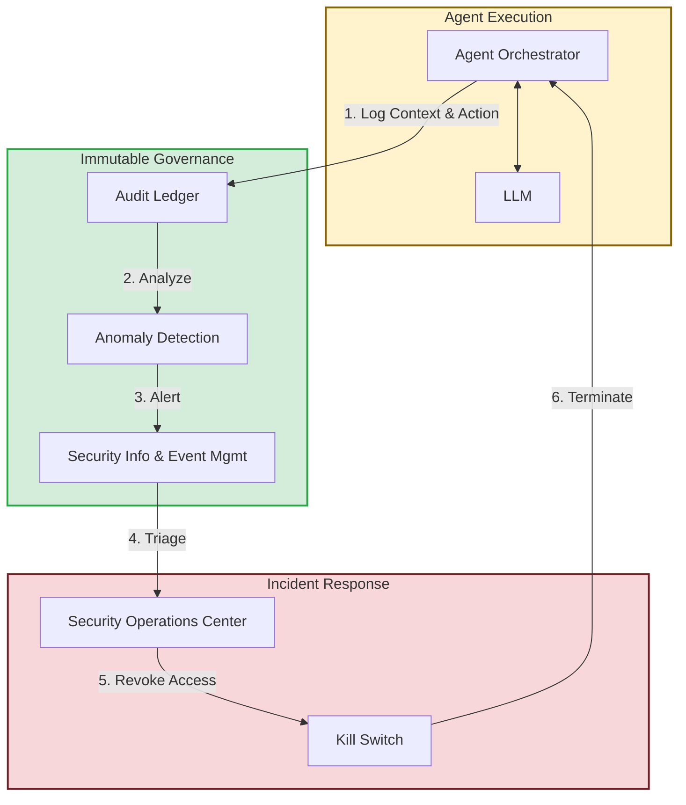

## 1. Concrete production problem and non-goals

**Problem:** When a deterministic system fails, the stack trace points to the bug. When an autonomous agentic system fails (e.g., deletes the wrong data, hallucinates a policy), standard logging is insufficient to reconstruct the *reasoning* that led to the action. This makes incident response and liability attribution nearly impossible without specialized governance.

**Non-goals:** This lesson does not cover general Kubernetes observability or standard APM metrics (like CPU usage). It focuses on the semantic observability and governance structures required for non-deterministic AI systems.

## 2. Prerequisites and assumed system scale

- **Prerequisites:** Understanding of SIEM systems, distributed tracing, and incident response lifecycles.
- **Scale:** Enterprise environments where agents perform automated actions with financial, legal, or reputational consequences.

## 3. System diagram with trust and failure boundaries



## 4. Viable designs and trade-offs

### Design 1: Standard Application Logging (Errors and Warnings)

- *Pros:* Cheap, integrates with existing infrastructure (e.g., ELK stack).
- *Cons:* Captures *what* happened, but not *why*. If an agent hallucinated, you cannot reconstruct the exact prompt context that caused it.

### Design 2: Semantic Audit Ledger with Full State Capture

- *Pros:* Complete traceability. Every tool execution is linked to the exact prompt, retrieved context, and model parameters at that specific millisecond.
- *Cons:* Massive data volume. Requires specialized data lakes and privacy scrubbing (PII redaction) before storage.

**Trade-off Summary:** For autonomous systems performing state-changing actions, a Semantic Audit Ledger is required. Storage costs are a necessary premium for accountability.

## 5. Implementation blueprint

```python
def log_agent_action(trace_id, user_id, prompt_context, tool_called, arguments, raw_response):
    # 1. Redact PII from the prompt context and raw response
    sanitized_context = pii_redactor.scrub(prompt_context)
    sanitized_response = pii_redactor.scrub(raw_response)
    
    # 2. Construct the semantic audit payload
    audit_event = {
        "timestamp": datetime.utcnow().isoformat(),
        "trace_id": trace_id,
        "user_id": user_id,
        "action": tool_called,
        "arguments": arguments,
        "context_hash": hash(sanitized_context), # Prove what context was seen
        "model_version": "gpt-4o-2024-08-06",
        "temperature": 0.0
    }
    
    # 3. Write to an immutable, append-only ledger (e.g., AWS QLDB or WORM storage)
    immutable_ledger.append(audit_event)
    
    # 4. Write full sanitized payload to cold storage for deep debugging
    cold_storage.save(trace_id, sanitized_context, sanitized_response)
```

## 6. Worked example using realistic data

**Scenario:** A customer service agent issues an unauthorized $500 refund.

- *Input:* A customer uses convoluted language to confuse the agent into applying a discount policy incorrectly.
- *Execution:* The agent calls `issue_refund(amount=500)`.
- *Investigation:* The SOC team pulls the `trace_id` from the ledger. They retrieve the exact context window and discover a prompt injection attack hidden within the customer's chat history.
- *Mitigation:* Because the context is preserved, the engineering team can write an evaluation test case against this exact attack to prevent regressions, and the SOC uses the Kill Switch to temporarily pause the agent type.

## 7. Failure injection or adversarial cases

- **Adversarial Input:** An attacker attempts to flood the agent with requests designed to overwhelm the audit logging system, causing it to drop events or fail open.
- *Expected System Response:* The agent orchestrator implements strict rate limiting per user. If the audit ledger becomes unavailable, the agent must *fail closed* and cease all state-changing operations until logging is restored.

## 8. Evaluation criteria and measurable release thresholds

- **Release Threshold:**
  - 100% of state-changing tool calls are logged to an immutable ledger.
  - A global "Kill Switch" can disable specific agent capabilities across the fleet within 60 seconds.
  - Mean Time To Investigate (MTTI) for an anomalous agent action is under 15 minutes.

## 9. Security and privacy considerations

- The audit ledger is a high-value target for attackers because it contains detailed operational data. It must be strictly access-controlled and immutable.
- PII redaction must occur *before* the data hits long-term storage to comply with GDPR/CCPA right-to-be-forgotten requests, as immutable ledgers cannot easily delete specific records.

## 10. Observability requirements

- Implement anomaly detection on tool usage frequency (e.g., if the `issue_refund` tool is called 100x more than the daily average, trigger a high-priority alert).

## 11. Latency and cost considerations

- Writing large context windows to storage is slow. Audit logging must be performed asynchronously via a message queue to avoid blocking the user response.

## 12. Operational or review artifact

An AI Incident Response Playbook detailing the step-by-step procedures for investigating an agent hallucination, including how to query the audit ledger and when to trigger the Kill Switch.

## 13. Authoritative sources

- [NIST AI Risk Management Framework](https://www.nist.gov/itl/ai-risk-management-framework) (Verified: 2026-10-07)

## 14. What would change this decision?

- Improvements in model interpretability (e.g., identifying exactly which neurons activated during a decision) might eventually supplement semantic logging, providing a deeper understanding of *why* an action was taken without relying solely on the textual context window.

## 15. Hands-on exercise

**Exercise:** Draft an Incident Response Playbook section for a "Confused Deputy / Unauthorized Action" scenario. Detail the immediate containment steps and the specific data fields you would query from the SIEM.
**Expected Evidence:** A 1-2 page playbook document.

## Provenance and further reading

- **Source**: Enterprise Governance Standards
- **Author/Organization**: AI Governance Board
- **Publication Date**: 2026-10-07
- **Access Date**: 2026-10-07
- **Next Steps**: Review the `capstone-d-mcp-gateway` case study.

## Competing designs and trade-offs

When evaluating alternatives, one might consider synchronous vs asynchronous execution, stateless vs stateful processes, and naive vs structured generation. Synchronous is easier to debug but scales poorly. Stateless is robust but limits context. The trade-offs heavily depend on the specific latency and cost budget allocated to the agent.

