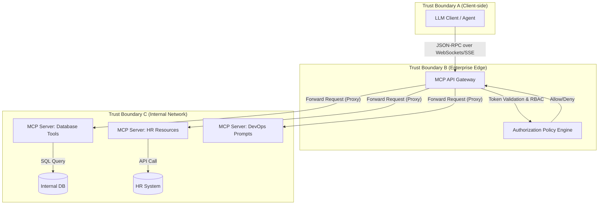
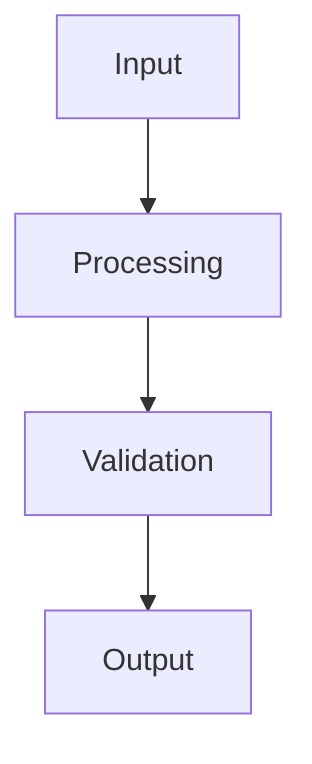

## 1. Problem Definition and Non-Goals

**Problem:** Integrating Large Language Models (LLMs) with enterprise tools, datasets, and internal systems using the Model Context Protocol (MCP) in a high-scale production environment. We need a standardized, secure, and observable way for models to discover capabilities, access resources, execute tools, and retrieve prompts dynamically while maintaining strict isolation and access control.

**Non-Goals:**
- Training or fine-tuning foundation models.
- Building custom client applications or UI interfaces for LLM interactions.
- Replacing existing Identity and Access Management (IAM) systems.

## 2. Prerequisites and Assumed Scale

**Prerequisites:**
- Deep understanding of the Model Context Protocol (MCP) specification (prompts, resources, tools).
- Familiarity with enterprise API gateways, service meshes (e.g., Istio, Envoy), and identity providers (e.g., OAuth2, OIDC).
- Experience with building and deploying stateless, containerized microservices (e.g., Kubernetes).

**Assumed System Scale:**
- Serving 10,000+ concurrent LLM client connections.
- Managing 500+ distinct MCP servers providing various tools and resources.
- Handling 50,000+ tool invocations per minute with p99 latency under 500ms (excluding backend processing).

## 3. System Architecture and Boundaries



**Trust and Failure Boundaries:**
- **Client to Gateway:** Clients are untrusted. Connection drops, malformed JSON-RPC payloads, and rate limit exhaustion are common failures.
- **Gateway to MCP Servers:** Internal network. Potential failures include server timeouts, discovery protocol mismatches, and cascading failures from slow backends.
- **MCP Servers to Backends:** Backend API rate limits, database locks, and authentication failures.

## 4. Viable Designs and Trade-offs

**Design A: Direct Client-to-Server Connections**
Clients establish separate WebSocket connections directly to individual MCP servers.
- *Pros:* Lower latency (no middlebox), decentralized, simpler initial setup.
- *Cons:* Client must manage multiple connections, complex centralized auditing and access control, difficult to enforce global rate limits.

**Design B: Centralized MCP Gateway (Recommended)**
Clients connect to a single Gateway that proxies requests to backend MCP servers based on capability discovery and routing rules.
- *Pros:* Single point of enforcement for AuthN/AuthZ, centralized observability (metrics, tracing), unified capability discovery via aggregation.
- *Cons:* Single point of failure (requires high availability setup), adds proxy latency, complex gateway logic for aggregating resources/tools.

## 5. Implementation Blueprint

Below is pseudocode for the Centralized MCP Gateway handling a tool call invocation:

```python
async def handle_tool_call(client_id, tool_name, arguments, request_context):
    # 1. Authenticate and Authorize
    token = request_context.get_header("Authorization")
    user_identity = auth_service.validate_token(token)
    
    if not policy_engine.is_allowed(user_identity, action="invoke", resource=f"tool:{tool_name}"):
        return error_response(code=-32001, message="Unauthorized to use this tool")

    # 2. Routing Discovery
    target_mcp_server = routing_table.get_server_for_tool(tool_name)
    if not target_mcp_server:
        return error_response(code=-32601, message="Method not found (Tool unknown)")

    # 3. Rate Limiting
    if not rate_limiter.check_limit(user_identity, target_mcp_server):
        return error_response(code=-32002, message="Rate limit exceeded")

    # 4. Proxy Execution with Timeout and Tracing
    with tracer.start_span("proxy_tool_invocation") as span:
        span.set_attribute("tool", tool_name)
        try:
            response = await target_mcp_server.send_request(
                method="tools/call",
                params={"name": tool_name, "arguments": arguments},
                timeout=5.0
            )
            return response
        except TimeoutError:
             return error_response(code=-32003, message="Upstream MCP server timed out")
        except UpstreamError as e:
             return error_response(code=-32004, message=f"Upstream error: {e.details}")
```

## 6. Worked Example

**Scenario:** An agent needs to query a customer's order history using the `get_order_history` tool provided by an internal CRM MCP server.

**Client Request (JSON-RPC):**
```json
{
  "jsonrpc": "2.0",
  "id": "req-123",
  "method": "tools/call",
  "params": {
    "name": "get_order_history",
    "arguments": {
      "customer_id": "CUST-98765"
    }
  }
}
```

**Execution Flow:**
1. Client sends request to the Gateway over SSE.
2. Gateway validates the client's Bearer token.
3. Gateway queries the policy engine: "Can `role:support_agent` invoke `tool:get_order_history`?" -> Yes.
4. Gateway identifies the `crm-mcp-server` as the provider of `get_order_history`.
5. Gateway proxies the request to `crm-mcp-server` over internal WebSockets.
6. `crm-mcp-server` executes the SQL query, retrieves 3 recent orders, and returns the result.

**Gateway Response (JSON-RPC):**
```json
{
  "jsonrpc": "2.0",
  "id": "req-123",
  "result": {
    "content": [
      {
        "type": "text",
        "text": "Order #1: Laptop (Delivered)\nOrder #2: Mouse (Pending)"
      }
    ]
  }
}
```

## 7. Failure Injection and Adversarial Cases

- **Adversarial Input Injection:** An agent generates a tool call with malformed or injected arguments (e.g., `customer_id: "1; DROP TABLE orders"`).
  *Mitigation:* MCP servers must treat all tool arguments as untrusted user input, employing strict input validation, parameterized queries, and defensive programming.
- **Resource Exhaustion (Denial of Wallet):** A compromised client sends infinite tool calls to an expensive internal API (e.g., initiating complex database joins or generating high-res images).
  *Mitigation:* Implement granular, cost-based rate limiting per user and per tool at the Gateway layer.
- **Server Discovery Poisoning:** A rogue internal service registers itself as providing a critical tool (e.g., `deploy_code`) to intercept or manipulate agent actions.
  *Mitigation:* Strict mTLS and registration manifests. The Gateway only accepts capability registrations from pre-approved, cryptographically signed service identities.

## 8. Evaluation Criteria and Release Thresholds

Before deploying an MCP server or gateway update to production, the following thresholds must be met:
1. **Capability Discovery Latency:** `tools/list` and `resources/list` must respond in &lt; 50ms at p99.
2. **Proxy Overhead:** The Gateway must add &lt; 10ms of overhead to proxy requests.
3. **Security Audit:** 100% of defined tools must have explicit IAM policies mapped to them; fallback policy must be `DENY_ALL`.
4. **Resilience:** Under a simulated 50% node failure, tool invocations must continue via healthy instances with error rates &lt; 0.1%.

## 9. Security and Privacy Considerations

- **Data Exfiltration via Resources:** An LLM client might attempt to read `resources/read` for sensitive files it shouldn't access. The Gateway must enforce resource-level authorization (e.g., `user X` can only read `resource://hr/salary/{user X}`).
- **PII Masking:** Implement a middleware in the Gateway or specific MCP servers that redacts Personally Identifiable Information (PII) from tool outputs before returning them to the LLM client, preventing unintentional ingestion of PII into model context windows.
- **Audit Logging:** Every tool invocation and resource read must be immutably logged with the client identity, prompt context (if available), timestamp, and result status for forensic analysis.

## 10. Observability Requirements

**Metrics to track:**
- `mcp_gateway_requests_total{method, status, client_id}`
- `mcp_gateway_latency_seconds{method, upstream_server}`
- `mcp_tool_execution_duration_seconds{tool_name, upstream_server}`
- `mcp_rate_limit_hits_total{client_id, tool_name}`

**Tracing:**
Implement Distributed Tracing (OpenTelemetry) across the Client -> Gateway -> MCP Server -> Backend. The trace context must be passed in the JSON-RPC metadata or underlying HTTP headers (e.g., W3C Trace Context).

## 11. Latency and Cost Considerations

- **Latency:** LLM generation is inherently slow. Adding slow tool executions significantly degrades user experience (Time to First Token after a tool call). Implement aggressive timeouts (e.g., 2 seconds max for most tools) and require tools to return partial data or a "processing" status for long-running tasks.
- **Cost:** Proxying WebSockets/SSE requires persistent connections, increasing memory overhead on the Gateway compared to standard stateless HTTP APIs. Scale the Gateway horizontally and consider tuning TCP keepalive settings and max connection limits per node.

## 12. Operational Artifact: Threat Model

**Component:** Centralized MCP Gateway

| Threat | Description | Risk | Mitigation |
| :--- | :--- | :--- | :--- |
| **Spoofing** | A client forged an identity token to access restricted tools. | High | Strictly validate JWT signatures against the IdP. Short expiration times. |
| **Tampering** | Man-in-the-middle alters the JSON-RPC payload modifying tool arguments. | High | Enforce TLS 1.3 for all client-to-gateway and gateway-to-server traffic. |
| **Repudiation** | An agent deletes a production database, and we cannot prove who initiated it. | Critical | Immutable audit logs mapping tool invocations to OIDC identities and session IDs. |
| **Info Disclosure** | `tools/list` exposes administrative tools to low-privilege users. | Medium | Context-aware capability discovery; the Gateway filters the `tools/list` response based on the user's role. |
| **Elevation of Privilege** | An MCP server running as root executes arbitrary shell commands based on LLM input. | Critical | Run MCP servers with minimal privileges, read-only filesystems, and strict network egress policies (AppArmor/SELinux). |

## 13. Authoritative Sources

- Model Context Protocol Specification: [https://spec.modelcontextprotocol.io/](https://spec.modelcontextprotocol.io/) (Verified: 2026-10-07)
- OpenTelemetry Distributed Tracing: [https://opentelemetry.io/docs/concepts/signals/traces/](https://opentelemetry.io/docs/concepts/signals/traces/) (Verified: 2026-10-07)

## 14. What Would Change This Decision?

The recommendation for a Centralized Gateway design would change if:
- **Zero-Trust Network Architecture (ZTNA) becomes ubiquitous:** If every client and server participates in a robust, mutually authenticated mesh (e.g., SPIFFE/SPIRE) where AuthZ policies are pushed to the edge (sidecars), the centralized gateway could become a bottleneck and we would transition to Design A (Direct Client-to-Server) with sidecar-based enforcement.
- **MCP Protocol evolution:** If the MCP protocol introduces a native, decentralized capability discovery protocol (like a DHT or gossip protocol for tools), the aggregation responsibilities of the Gateway would be rendered obsolete.

## 15. Hands-on Exercise

**Task:** Implement a minimal MCP Proxy Server in Node.js or Python that intercepts a `tools/call` request, logs the tool name and arguments to `stdout`, and then forwards the request to a mock downstream MCP server.

**Expected Evidence of Completion:**
1. Source code for the proxy server.
2. Console output demonstrating the intercepted tool name and arguments when a client connects to the proxy and invokes a tool.
3. A successful response returned to the client from the mock downstream server.

## System diagram



## Competing designs and trade-offs

When evaluating alternatives, one might consider synchronous vs asynchronous execution, stateless vs stateful processes, and naive vs structured generation. Synchronous is easier to debug but scales poorly. Stateless is robust but limits context. The trade-offs heavily depend on the specific latency and cost budget allocated to the agent.

## Further reading

- [Anthropic Engineering Blog](https://www.anthropic.com/engineering)
- [Google Cloud Architecture Center](https://cloud.google.com/architecture)
