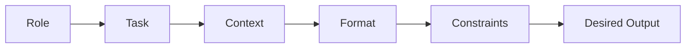

## Key takeaway
Clear, constrained, and well-structured instructions yield predictable, high-quality results from Large Language Models (LLMs). Prompt engineering is the base layer of LLM interaction.

## Mental model or small diagram

## When to use and when not to use
**When to use:**
- Single-turn tasks (e.g., translation, summarization, classification).
- Brainstorming and ideation.
- Basic text transformations (e.g., changing tone, formatting data).
- Extracting structured data from unstructured text.

**When not to use:**
- **When tasks require multiple autonomous steps:** If a task requires the model to plan, execute, evaluate, and retry, you need an Agentic system.
- **When external data is required:** If the model needs real-time information, you should use Retrieval-Augmented Generation (RAG) or tool-calling.

## Method or procedure
A well-constructed prompt usually contains several of the following elements:
1. **Role (Persona):** Who should the model act as? (e.g., "Act as a senior software engineer.")
2. **Task:** What is the specific action required? (e.g., "Review this code for security vulnerabilities.")
3. **Context:** What background information does the model need?
4. **Format:** How should the output be structured? 
5. **Constraints:** What limits should the model respect?

## Worked example
**Before (Poor Prompt - Too vague):**
> "Write a summary about climate change."

**After (Better Prompt - Specific, constrained, formatted):**
> "You are an expert environmental scientist. Summarize the main impacts of climate change on coastal cities.
> 
> Guidelines:
> - Keep it under 150 words.
> - Focus specifically on economic and infrastructural impacts.
> - Format the response as a bulleted list."

## Failure modes and mitigations
- **Vagueness:** Asking for "good code" instead of "code that passes these specific linting rules." *Mitigation: Be highly specific.*
- **Information Overload:** Providing too much irrelevant context. *Mitigation: Edit down to only what is necessary.*
- **Contradictory Instructions:** Telling the model to be extremely concise but also asking it to explain every detail. *Mitigation: Review constraints for logical consistency.*
- **Assuming Implicit Knowledge:** Expecting the model to know specific internal company jargon. *Mitigation: Define jargon in the prompt.*

## Evaluation checklist or rubric
- [ ] **Constraint Satisfaction:** Does the output match the specified constraints (e.g., length, format, tone)?
- [ ] **Robustness:** Does the prompt work consistently across different inputs of the same type?
- [ ] **Accuracy (Hallucination Rate):** Does the prompt generate factually incorrect information?

## Safety, privacy, and cost notes
- **Cost:** Longer prompts cost more tokens. Keep prompts concise.
- **Privacy:** Avoid including personally identifiable information (PII) or sensitive company secrets in prompts sent to public APIs.
- **Safety:** Models can be jailbroken if prompts do not include proper guardrails.

## Practice task
Write a prompt that instructs the LLM to act as a code reviewer. Provide a short snippet of buggy Python code and ask the model to output *only* a JSON array containing the line number and a brief description of the bug. Test it to ensure it does not include conversational filler like "Here is the JSON."
