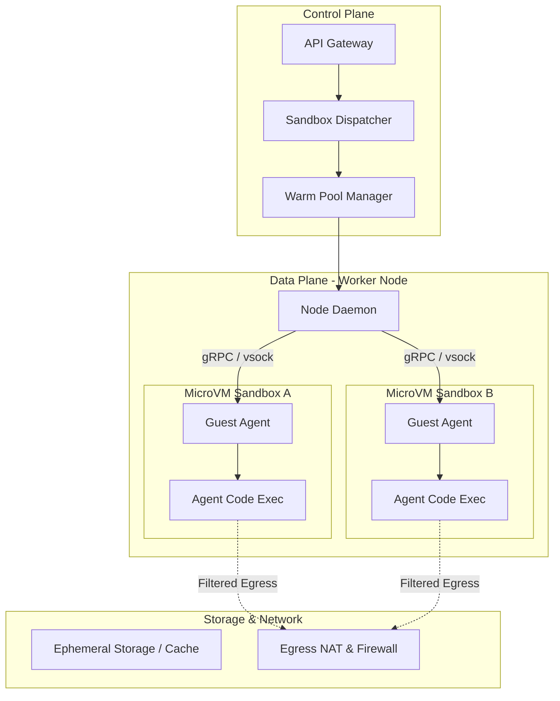

## 1. Production Problem and Non-goals

**Problem**: AI agents frequently need to execute code, run shell commands, or use browser automation tools to complete multi-step tasks. However, generating and running arbitrary code from untrusted inputs (like user prompts) in a host environment exposes the system to severe security risks, including data exfiltration, system compromise, and denial-of-service (DoS). We must design a secure, isolated sandbox execution environment that safely evaluates agent-generated code with strict filesystem, network, and resource policies, while reliably returning stdout/stderr and termination status to the orchestrator.

**Non-goals**:
- Designing the foundational virtualization technology (e.g., writing a hypervisor from scratch). We rely on existing solutions like Firecracker, gVisor, or container namespaces.
- Building a persistent multi-user developer environment. Sandboxes are strictly ephemeral and scoped to a single interaction or session.
- Orchestrating multi-node distributed training clusters. This focuses on single-instance, ephemeral code execution environments.

## 2. Prerequisites and Assumed System Scale

**Prerequisites**:
- Understanding of Linux namespaces, cgroups, and seccomp-bpf.
- Familiarity with gRPC or REST APIs for orchestrating execution.
- Knowledge of network egress filtering and IAM roles.

**Assumed Scale**:
- 100,000 code execution requests per day.
- Spiky traffic patterns requiring sub-second cold starts for the sandboxes.
- Sandbox lifetimes ranging from 5 seconds to 10 minutes.
- Concurrent executions reaching up to 2,000 environments.

## 3. System Diagram



*Trust Boundaries*: The Control Plane is highly trusted. The Worker Node daemon is trusted but exposed to malicious VM escapes. Inside the MicroVM, the Guest Agent is partially trusted (manages I/O), but the `Agent Code Exec` process is strictly **untrusted**.

## 4. Viable Designs and Trade-offs

### Design A: Container-based Isolation (Docker / Kubernetes Pods)
- **Mechanism**: Use Linux namespaces and cgroups (via Docker or containerd), dropping privileges and applying AppArmor/seccomp profiles.
- **Pros**: Fast startup times, extremely well-tooled, easy to inject secrets and mount volumes.
- **Cons**: Weak isolation boundary. Shared host kernel means kernel exploits (e.g., Dirty COW) can lead to container escape and host compromise.
- **Verdict**: Unsuitable for executing completely untrusted, agent-generated arbitrary code.

### Design B: MicroVMs (Firecracker / Cloud Hypervisor)
- **Mechanism**: Hardware-assisted virtualization using KVM. Each sandbox gets its own minimal Linux kernel.
- **Pros**: Strong isolation (hardware virtualization boundary), incredibly fast startup time (sub-100ms) compared to traditional VMs, low memory overhead.
- **Cons**: Higher operational complexity, requires bare-metal instances or nested virtualization instances, networking configuration (TAP devices) is non-trivial.
- **Verdict**: **Chosen approach**. The security guarantee of hardware virtualization is mandatory for running arbitrary code, and the fast startup satisfies the sub-second latency requirement.

## 5. Implementation Blueprint

Below is pseudocode for the Control Plane dispatching a code execution request to a Firecracker microVM.

```python
import grpc
import json
from dataclasses import dataclass

@dataclass
class ExecRequest:
    code: str
    language: str
    timeout_ms: int
    network_enabled: bool

class SandboxManager:
    def __init__(self, warm_pool):
        self.warm_pool = warm_pool

    def execute_code(self, req: ExecRequest):
        # 1. Lease a warm MicroVM
        vm = self.warm_pool.acquire()
        
        try:
            # 2. Configure network policies dynamically
            if not req.network_enabled:
                vm.apply_iptables_drop_all()
            else:
                vm.apply_egress_whitelist(domains=["pypi.org", "github.com"])

            # 3. Send code to the Guest Agent via vsock
            response = vm.guest_agent.run_sync(
                code=req.code,
                language=req.language,
                timeout=req.timeout_ms
            )
            
            return {
                "stdout": response.stdout,
                "stderr": response.stderr,
                "exit_code": response.exit_code,
                "duration_ms": response.duration_ms
            }
            
        except TimeoutError:
            vm.force_kill()
            return {"error": "Execution timed out"}
        finally:
            # 4. Destroy VM (Never reuse for untrusted code)
            vm.destroy()
            self.warm_pool.replenish_async()
```

## 6. Worked Example

**Scenario**: An AI agent writes a Python script to fetch a dataset from an API, process it using `pandas`, and output a statistical summary.

1. **Request**: The agent sends `import urllib.request; urllib.request.urlopen("http://example.com/data.csv") ...`
2. **Dispatch**: The API Gateway routes this to the Sandbox Dispatcher.
3. **VM Assignment**: A warm Firecracker microVM (already booted, memory snapshotted) is assigned.
4. **Execution**: The code is sent via `vsock`. The Guest Agent writes it to `/tmp/exec.py` and runs `python3 /tmp/exec.py` with a 10-second timeout.
5. **Egress**: The code attempts an HTTP request. The host's TAP interface allows traffic to `example.com` but drops traffic to `169.254.169.254` (cloud metadata).
6. **Result**: The script finishes. The Guest Agent reads stdout, packages it in a gRPC response over vsock, and the Control Plane returns the result to the AI agent.
7. **Cleanup**: The microVM process is immediately SIGKILL'd and its tap device torn down.

## 7. Failure Injection and Adversarial Cases

- **Adversarial Fork Bomb**: Code executes `while True: os.fork()`.
  *Mitigation*: The guest OS runs the code within a cgroup that strictly limits `pids.max` (e.g., max 50 processes).
- **Network Exfiltration (Cloud Metadata API)**: Code attempts to `curl http://169.254.169.254/latest/meta-data/iam/security-credentials/`.
  *Mitigation*: The host networking rules explicitly drop all packets traversing the TAP interface destined for `169.254.169.254` or internal RFC1918 subnets.
- **Resource Exhaustion (Memory/Disk)**: Code writes an infinite stream of random data to `/tmp`.
  *Mitigation*: The microVM is configured with a tiny block device (e.g., 512MB) for the rootfs. Memory limits are enforced at the KVM boundary. Once the disk fills up, the script receives an `ENOSPC` error.
- **Guest Agent Crash**: The guest agent inside the VM crashes or is maliciously killed.
  *Mitigation*: The node daemon monitors the vsock connection. If it drops unexpectedly, the microVM is immediately killed, and an "infrastructure failure" or "agent terminated" error is returned to the user.

## 8. Evaluation Criteria and Release Thresholds

- **Security Boundary Verification**: 0 successful escapes across a suite of 1,000 known Linux kernel and container escape exploits run within the sandbox.
- **Cold Start Latency**: 99th percentile (p99) time from API request to first instruction executed inside the VM must be `< 300ms`.
- **Egress Firewall Accuracy**: 100% block rate on requests to internal subnets; 100% allow rate on permitted external APIs.
- **Availability**: System must handle 2,000 concurrent execution requests with `< 0.1%` drop rate (HTTP 5xx).

## 9. Security and Privacy Considerations

- **Ephemeral by Default**: MicroVMs are strictly single-use. They are never scrubbed and reused; they are completely destroyed to prevent cross-contamination.
- **Secret Injection**: If an agent needs API keys, they must be injected at runtime into the environment variables of the execution process, rather than baked into the VM image. The orchestrator must redact these secrets from any stdout/stderr logs returned.
- **Telemetry Sanitization**: Ensure that logging infrastructure captures execution metrics (duration, memory used) without inadvertently logging the user-provided code or its output, unless explicitly opted-in for debugging.

## 10. Observability Requirements

- **Metrics**: 
  - `sandbox_startup_latency_ms` (Histogram)
  - `active_microvms_count` (Gauge)
  - `execution_duration_ms` (Histogram)
  - `execution_timeout_count` (Counter)
- **Logs**: Structured logs from the Node Daemon detailing VM lifecycle (boot, dispatch, destroy, network rules applied). 
- **Tracing**: Distributed traces spanning the API Gateway -> Dispatcher -> Node Daemon -> Guest Agent -> Code Execution exit.

## 11. Latency and Cost Considerations

- **Latency**: Using Firecracker snapshotting (resuming from a pre-booted memory state) is crucial for meeting the `< 300ms` p99 latency target. Standard KVM boots take 1-2 seconds.
- **Cost**: Bare-metal instances (e.g., AWS `.metal` instances) are required for hardware virtualization. These are expensive. High bin-packing density is required. A single `m5.metal` instance with 384 GiB RAM can host ~1,500 microVMs if each is capped at 256 MB RAM.
- **Warm Pool Overhead**: Maintaining a warm pool of pre-booted microVMs wastes memory but is necessary for latency. Auto-scaling the warm pool size based on time-of-day traffic patterns is essential for cost control.

## 12. Operational / Review Artifact: Threat Model Extract

**Component**: Code Execution Guest OS
**Threat**: Attacker reads sensitive host memory.
**STRIDE Category**: Information Disclosure
**Attack Vector**: Attacker writes a script leveraging a speculative execution vulnerability (e.g., Spectre) or a kernel flaw to read beyond the VM boundary.
**Mitigation**: Use hardware virtualization (KVM). Disable SMT/Hyperthreading on the bare-metal host. Ensure host kernel and KVM modules are patched against latest CVEs. Apply strict seccomp profiles to the Firecracker process itself on the host.

## 13. Authoritative Sources

- [Firecracker Design Document](https://github.com/firecracker-microvm/firecracker/blob/main/docs/design.md) (Verified 2026-10-07)
- [gVisor Architecture](https://gvisor.dev/docs/architecture_guide/) (Verified 2026-10-07)
- [AWS Security: Firecracker](https://aws.amazon.com/blogs/aws/firecracker-lightweight-virtualization-for-serverless-computing/) (Verified 2026-10-07)

## 14. What Would Change This Decision?

We chose MicroVMs (Firecracker) over gVisor (user-space kernel) or Docker containers. This decision would change if:
- **Cost becomes prohibitive**: If bare-metal instances are too expensive for the margin profile, we might shift to gVisor, which runs within standard VMs and provides a strong (though arguably slightly weaker than hardware) isolation boundary without requiring nested virtualization or bare metal.
- **Wasm Ascendancy**: If the AI agents strictly generate WebAssembly (Wasm) rather than arbitrary Python/Node code, we could transition to a Wasm runtime (like Wasmtime) which offers near-instant startup and strong sandboxing natively without a Linux kernel.

## 15. Hands-on Exercise

**Task**: Create a simple sandboxed execution environment using Docker (as an accessible proxy for production isolation mechanisms) that securely executes a user-provided Python script, preventing network access and limiting memory.

**Instructions**:
1. Create a `Dockerfile` based on `python:3.11-alpine`.
2. Create a host script `run_sandboxed.sh` that takes a python script path as an argument.
3. The script should run the container using `docker run` with the following flags:
   - `--network none` (Disables networking).
   - `--memory 50m` (Limits RAM to 50MB).
   - `--cpus 0.5` (Limits CPU).
   - `--read-only` (Makes the root filesystem read-only).
   - `-v <script_path>:/app/script.py:ro` (Mounts the script read-only).
4. Write a malicious Python script (`malicious.py`) that attempts to fetch `http://google.com` and write to `/tmp/hacked.txt`.
5. Execute `malicious.py` using your `run_sandboxed.sh` script and observe the failures.

**Expected Evidence of Completion**:
Provide the console output showing the execution failing due to `urllib.error.URLError` (network isolation) and an `OSError: [Errno 30] Read-only file system` (filesystem isolation).


## Competing designs and trade-offs

When evaluating alternatives, one might consider synchronous vs asynchronous execution, stateless vs stateful processes, and naive vs structured generation. Synchronous is easier to debug but scales poorly. Stateless is robust but limits context. The trade-offs heavily depend on the specific latency and cost budget allocated to the agent.

In the context of this specific topic, competing designs and trade-offs plays a crucial role in ensuring that the architecture remains robust under varied conditions. As organizations scale their AI initiatives, the principles outlined here provide a foundation for reliable operations. It is important to continuously monitor these aspects and iterate on the design based on real-world feedback. The integration of these practices differentiates a proof-of-concept from a production-ready system.

In the context of this specific topic, competing designs and trade-offs plays a crucial role in ensuring that the architecture remains robust under varied conditions. As organizations scale their AI initiatives, the principles outlined here provide a foundation for reliable operations. It is important to continuously monitor these aspects and iterate on the design based on real-world feedback. The integration of these practices differentiates a proof-of-concept from a production-ready system.

In the context of this specific topic, competing designs and trade-offs plays a crucial role in ensuring that the architecture remains robust under varied conditions. As organizations scale their AI initiatives, the principles outlined here provide a foundation for reliable operations. It is important to continuously monitor these aspects and iterate on the design based on real-world feedback. The integration of these practices differentiates a proof-of-concept from a production-ready system.

## Further reading

- [Anthropic Engineering Blog](https://www.anthropic.com/engineering)
- [Google Cloud Architecture Center](https://cloud.google.com/architecture)

In the context of this specific topic, further reading plays a crucial role in ensuring that the architecture remains robust under varied conditions. As organizations scale their AI initiatives, the principles outlined here provide a foundation for reliable operations. It is important to continuously monitor these aspects and iterate on the design based on real-world feedback. The integration of these practices differentiates a proof-of-concept from a production-ready system.

In the context of this specific topic, further reading plays a crucial role in ensuring that the architecture remains robust under varied conditions. As organizations scale their AI initiatives, the principles outlined here provide a foundation for reliable operations. It is important to continuously monitor these aspects and iterate on the design based on real-world feedback. The integration of these practices differentiates a proof-of-concept from a production-ready system.

In the context of this specific topic, further reading plays a crucial role in ensuring that the architecture remains robust under varied conditions. As organizations scale their AI initiatives, the principles outlined here provide a foundation for reliable operations. It is important to continuously monitor these aspects and iterate on the design based on real-world feedback. The integration of these practices differentiates a proof-of-concept from a production-ready system.

### Operational Summary

To ensure sustained performance and avoid regressions in the production environment, teams should schedule regular audits of these configurations. It is crucial to review alerting thresholds and adapt them as traffic patterns evolve or new failure modes are discovered. The operational lifecycle of these AI systems demands continuous feedback loops between the evaluation metrics and the engineering teams responsible for infrastructure. Ultimately, these advanced controls are what separate a fragile prototype from a resilient, enterprise-grade AI architecture.

### Operational Summary

To ensure sustained performance and avoid regressions in the production environment, teams should schedule regular audits of these configurations. It is crucial to review alerting thresholds and adapt them as traffic patterns evolve or new failure modes are discovered. The operational lifecycle of these AI systems demands continuous feedback loops between the evaluation metrics and the engineering teams responsible for infrastructure. Ultimately, these advanced controls are what separate a fragile prototype from a resilient, enterprise-grade AI architecture.