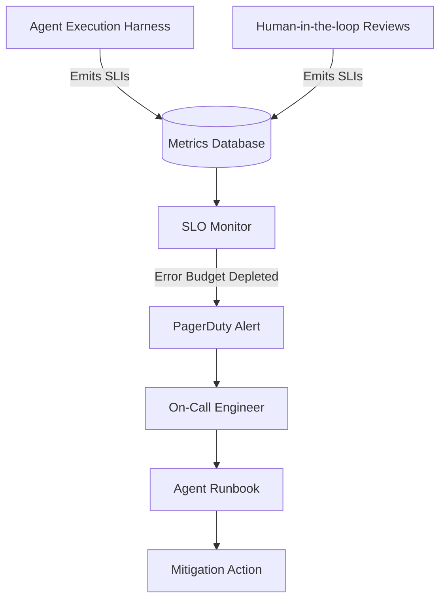

## Introduction

Traditional Site Reliability Engineering (SRE) focuses on uptime, latency, and error rates. While these apply to agentic systems, AI introduces new failure domains like hallucination rates, task completion rates, and policy violations. This lesson covers defining AI-specific Service Level Objectives (SLOs) and establishing effective incident response.

## System Diagram

This diagram shows how metrics flow from the agent infrastructure to the observability platform, triggering alerts when SLOs are breached.



## Non-goals

* We will not cover basic PagerDuty setup or general SRE culture.
* We will not discuss system-level monitoring (CPU, RAM) unless it relates directly to agent execution (e.g., local model hosting).

## Measurable Release Thresholds

1. **SLO Definition:** Every deployed agent must have at least one defined SLO for Task Success Rate and one for Latency.
2. **Alerting Latency:** Alerts must fire within 5 minutes of an error budget burn rate exceeding the critical threshold.
3. **Runbook Coverage:** 100% of defined critical alerts must link to an actionable runbook.

## Prerequisites

* Familiarity with SRE concepts: SLIs (Service Level Indicators), SLOs, and Error Budgets.
* Understanding of logging and metrics platforms (e.g., Datadog, Prometheus).

## Core Concepts

### Agent SLIs (Service Level Indicators)
Metrics that define the health of the agent. Examples:
* **Task Success Rate:** Percentage of agent loops that exit successfully vs. hitting a stop rule.
* **Time-to-Action:** Latency between the user prompt and the agent executing its first tool.
* **Self-Correction Rate:** How often the agent needs to fix its own errors.

### Error Budgets
The acceptable amount of unreliability allowed before halting new feature deployments. If your Task Success Rate SLO is 95%, you have a 5% error budget over the rolling window.

### AI Incident Response
Handling situations where an agent behaves unpredictably, violates safety policies, or degrades in quality (often silently, unlike hard software crashes).

## Architecture & Implementation Details

Implementing SLOs requires structured logging. Every agent execution must emit a standardized payload at completion.

```json
{
  "trace_id": "req-12345",
  "agent_id": "customer-support-v2",
  "status": "success",
  "total_duration_ms": 14500,
  "tokens_used": 4500,
  "self_correction_count": 1,
  "stop_rule_triggered": false
}
```

By querying this structured data, you can build dashboards tracking SLIs and set alerts based on rolling averages.

## Failure Modes & Mitigation

* **Failure Mode:** Silent quality degradation. The agent successfully completes tasks, but the quality of the work drops (e.g., poor writing, suboptimal code).
* **Mitigation:** Incorporate asynchronous LLM-as-a-judge evaluations on a sample of production traces. Treat the evaluation score as a primary SLI.

## Security & Privacy

During an incident, engineers will need to inspect raw agent traces (prompts and completions) to debug the issue. Ensure Role-Based Access Control (RBAC) and data masking are active in your observability platform to prevent unauthorized access to sensitive user data.

## Testing Strategy

Conduct "Game Days" or Tabletop Exercises. Intentionally deploy a degraded prompt to a staging environment and verify that the observability stack catches the drop in the Task Success Rate SLI and pages the on-call engineer.

## Deployment Strategy

Tie your CI/CD pipeline to your error budgets. If the agent's error budget is depleted, automatically block new deployments (except for hotfixes) until the budget recovers.

## Monitoring & Observability

Dashboards must display:
1. Current SLI performance vs. SLO targets.
2. Remaining Error Budget (30-day and 7-day rolling windows).
3. Burn rate (how fast the budget is being consumed).

## Runbook & Incident Response

Standard Runbook for "Task Success Rate Drop":
1. **Acknowledge Alert:** Claim the ticket in PagerDuty.
2. **Triage:** Check the provider status page (e.g., OpenAI, Anthropic). Is it a global outage?
3. **Investigate:** Query logs for `status="failed"`. Is the failure isolated to a specific tool or task type?
4. **Mitigate:** 
    * If a tool is failing, disable the tool via feature flag (the agent should degrade gracefully).
    * If the model is hallucinating, trigger a fallback to an older, pinned model version.
5. **Resolve & Postmortem:** Write an incident report detailing the root cause and required preventative actions.

## Summary & Next Steps

Defining SLOs transitions agent development from experimental scripts to production-grade software. The Capstone B project will synthesize these concepts into a complete, long-running coding agent harness.
