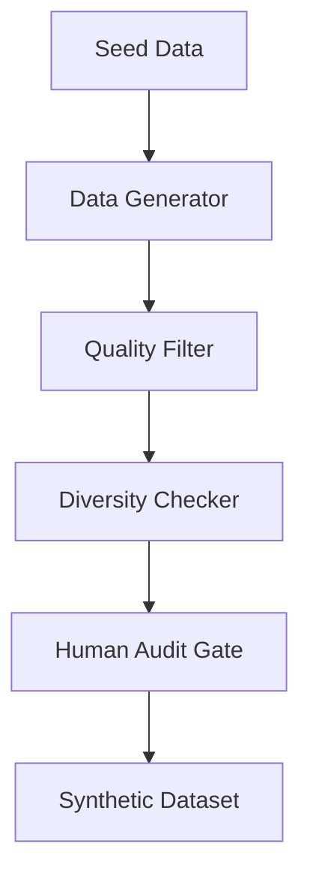

## 1. Concrete Production Problem and Explicit Non-Goals

**Problem**: You lack sufficient high-quality labeled data to evaluate your new AI feature or fine-tune a model. Generating synthetic data using LLMs is fast, but it often leads to mode collapse, hidden duplication, or self-confirming evaluators.

**Non-Goals**: We are not training foundation models on synthetic data. We are focused on generating task-specific data for evaluation and lightweight fine-tuning.

## 2. Prerequisites and Assumed System Scale

**Prerequisites**: Familiarity with prompt engineering and LLM evaluation.
**System Scale**: Needing 1,000 to 10,000 high-quality rows for evaluation and fine-tuning pipelines.

## 3. System Diagram: Trust and Failure Boundaries

## 4. Viable Designs and Trade-Offs

**Design A: Pure Synthetic Generation**
* **Pros**: Fast, highly scalable, zero human labor per row.
* **Cons**: Prone to mode collapse (generating the same 5 examples worded differently).

**Design B: Hybrid (Seed-Prompted) Generation**
* **Pros**: Uses real user queries as seeds to ensure structural diversity.
* **Cons**: Requires a starting corpus of real data, which might contain PII.

## 5. Implementation Blueprint

1. **Seed Data Collection**: Gather a small set of real data (e.g., 50 rows).
2. **Prompt Variation**: Use temperature=0.8 and multi-persona prompts to force diversity.
3. **Filtering**: Use a separate LLM (or rules) to filter out malformed or identical outputs.
4. **Embedding-Based Deduplication**: Compute embeddings for all generated rows. Discard rows with a cosine similarity > 0.95 to existing rows.
5. **Human Audit**: Randomly sample 5% of the data for human review.

## 6. Worked Example Using Realistic Data

**Goal**: Generate a test set of 1,000 adversarial customer support queries.
**Process**: We provide 10 real queries where customers were angry. We ask the Generator LLM to mutate these into 1,000 variants using different personas (e.g., "impatient teenager", "confused elderly"). We run cosine similarity and drop 150 near-duplicates, resulting in 850 diverse adversarial queries.

## 7. Failure Injection or Adversarial Cases

* **Self-Confirming Evaluators**: If the same model generates the data, writes the answers, and evaluates the answers, it will likely give itself a 100% score despite factual errors.
* **Mitigation**: Use different model families for generation (e.g., Llama 3) and evaluation (e.g., GPT-4).

## 8. Evaluation Criteria and Measurable Release Thresholds

* **Release Threshold**: The synthetic dataset must pass an N-gram diversity check (less than 20% vocabulary overlap across samples) and a human audit pass rate of > 95%.

## 9. Security and Privacy Considerations

* If seeding with real user data, ensure PII is scrubbed *before* it hits the generator LLM to prevent the model from hallucinating variations of real PII.

## 10. Observability Requirements

* Log the generation cost.
* Track the rejection rate of the Quality Filter and Diversity Checker.

## 11. Latency and Cost Considerations

* Generating 10,000 rows with a large model can cost $100+. Use smaller models for the bulk generation and larger models for the final filtering step.

## 12. Operational Artifact: Dataset Specification

**Specification**: Synthetic Adversarial Queries V1.
* **Size**: 850 rows.
* **Generation Strategy**: Hybrid Persona-based.
* **Deduplication**: Embedding cosine similarity threshold 0.95.

## 13. Authoritative Sources

* Anthropic: Demystifying evals for AI agents. Verified 2026-10-07.
* OpenAI API: Working with evals. Verified 2026-10-07.

## 14. What Would Change This Decision?

If the system gathers enough organic traffic (e.g., 10,000 real user queries per week), we should deprecate the synthetic dataset and transition to a sampled, human-annotated organic dataset.

## 15. Hands-On Exercise

**Exercise**: Write a prompt to generate 5 distinct variations of the query "Where is my refund?". Implement a Python script to compute their embeddings and flag any two variations with a similarity over 0.95.
**Evidence of Completion**: A log showing the 5 variations and their pairwise similarity scores.

## Competing designs and trade-offs

When evaluating alternatives, one might consider synchronous vs asynchronous execution, stateless vs stateful processes, and naive vs structured generation. Synchronous is easier to debug but scales poorly. Stateless is robust but limits context. The trade-offs heavily depend on the specific latency and cost budget allocated to the agent.

## Further reading

* [Anthropic Engineering Blog](https://www.anthropic.com/engineering)
* [Google Cloud Architecture Centre](https://cloud.google.com/architecture)

