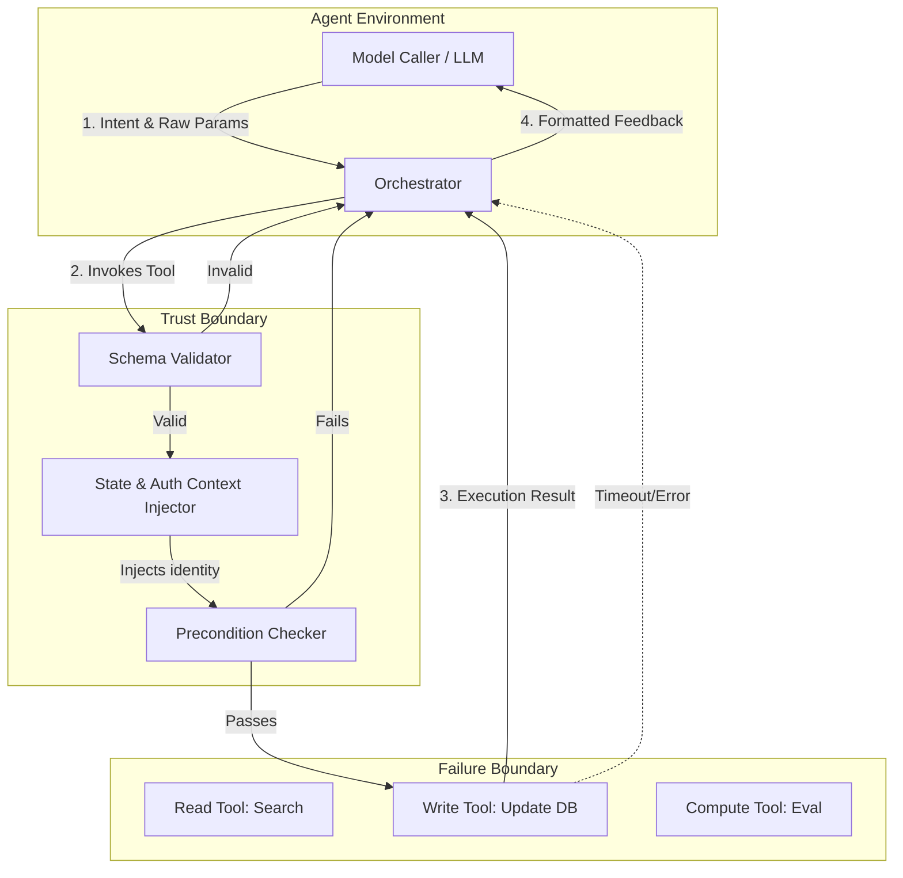

## 1. Concrete Production Problem and Explicit Non-Goals

### The Problem
When Large Language Models (LLMs) act as agents, they interact with external systems by calling "tools" (functions, APIs). The problem is that model-tool interaction is fundamentally brittle. A model caller might hallucinate parameters, pass arguments of the wrong type, omit required context, or fail to gracefully handle an API error (like rate limiting). If the tool interface lacks a rigorous "contract" (schema, preconditions, explicit error semantics, idempotency guarantees), the agent's behavior becomes unpredictable, leading to infinite retry loops, malformed data mutations, or stalled execution. We need a robust tool contract design that accommodates the probabilistic nature of LLM outputs while enforcing deterministic backend constraints.

### Explicit Non-Goals
* General fine-tuning or prompting strategies for tool use (we focus on the tool contract/interface itself).
* Implementation details of specific orchestrators (LangChain, LlamaIndex, etc.), though principles apply.
* Designing end-to-end multi-agent topologies.

## 2. Prerequisites and Assumed System Scale

### Prerequisites
* Deep understanding of JSON Schema and OpenAPI specifications.
* Familiarity with functional programming concepts (idempotency, side effects).
* Experience with building and consuming RESTful or gRPC APIs.
* Basic understanding of LLM function-calling mechanisms (e.g., OpenAI's function calling API).

### Assumed System Scale
* **Scale:** Tens to hundreds of tools available to the model.
* **Traffic:** Thousands of tool invocations per minute from distributed agents.
* **Latency:** The LLM generation step takes 1-5 seconds; tools are expected to resolve in `< 1` second unless explicitly asynchronous.

## 3. System Diagram with Trust and Failure Boundaries



* **Trust Boundary:** The line between the Orchestrator and the actual tool implementation. The LLM is inherently untrusted. All parameters must be validated before touching execution logic.
* **Failure Boundary:** The interface between the execution logic and external systems. Timeouts, 500s, and rate limits occur here and must be translated into actionable semantic errors for the LLM.

## 4. Viable Designs and Trade-offs

### Design A: Strict Typological Contracts with Fail-Fast
The tool enforces a rigid JSON schema. Any deviation (missing fields, wrong types) results in an immediate, hard exception sent back to the orchestrator, which then prompts the LLM to fix the error.
* **Pros:** Highly deterministic; protects backend systems from garbage data; easy to implement using standard schema validators.
* **Cons:** Increases LLM round-trips (higher cost/latency) as the model iteratively "guesses" the right format; high friction for complex schemas.

### Design B: Lenient Contracts with Semantic Repair (Coercion)
The tool accepts loosely structured input and attempts to coerce it into the valid state (e.g., converting string `"123"` to integer `123`, providing default values for missing fields based on conversation history).
* **Pros:** Reduces round-trips and latency; smoother agent experience; more resilient to minor model hallucinations.
* **Cons:** "Magic" behavior can lead to unintended consequences (e.g., assuming a default parameter that changes a destructive operation); harder to debug; blurs the trust boundary.

**Recommendation:** A hybrid approach. Use Strict Typological Contracts (Design A) for any state-mutating (write) operations, and Lenient Contracts (Design B) with bounded coercion for read-only operations.

## 5. Implementation Blueprint

Below is a conceptual implementation blueprint for a robust tool wrapper that enforces contracts.

```python
from typing import Any, Callable, Dict, Optional
from pydantic import BaseModel, ValidationError

class ToolContract:
    def __init__(self, 
                 name: str, 
                 description: str, 
                 schema: type[BaseModel], 
                 handler: Callable,
                 is_idempotent: bool = True):
        self.name = name
        self.description = description
        self.schema = schema
        self.handler = handler
        self.is_idempotent = is_idempotent

    def execute(self, raw_args: Dict[str, Any], context: Dict[str, Any]) -> str:
        # 1. Typological Validation
        try:
            validated_args = self.schema(**raw_args)
        except ValidationError as e:
            # Semantic Error Translation for LLM
            return self._format_validation_error(e)

        # 2. Precondition / State Checks (e.g., Auth)
        if not self._check_preconditions(context):
            return "System Error: Missing required permissions to execute this tool."

        # 3. Execution with Timeout/Retry semantics
        try:
            result = self.handler(validated_args, context)
            return f"Success: {result}"
        except TimeoutError:
            return "Execution Error: The tool timed out. Please try a narrower query."
        except Exception as e:
            return f"Execution Error: {str(e)}. Do not retry with the same arguments."

    def _format_validation_error(self, e: ValidationError) -> str:
        # Crucial: Format errors so the LLM understands how to fix them
        errors = []
        for err in e.errors():
            loc = ".".join(map(str, err['loc']))
            msg = err['msg']
            errors.append(f"Field '{loc}': {msg}")
        return "Validation Error. Please fix the following arguments:\n" + "\n".join(errors)
        
    def _check_preconditions(self, context: Dict) -> bool:
        return "user_id" in context
```

## 6. Worked Example using Realistic Data

**Scenario:** An agent uses a tool `UpdateTicketStatus`.

**Tool Schema:**
```json
{
  "ticket_id": {"type": "string", "pattern": "^[A-Z]+-\\d+$"},
  "status": {"type": "string", "enum": ["OPEN", "IN_PROGRESS", "RESOLVED"]},
  "resolution_notes": {"type": "string", "description": "Required if status is RESOLVED"}
}
```

**LLM Attempt 1 (Raw Output):**
`{"ticket_id": "12345", "status": "Done"}`

**Contract Execution & Response:**
1. **Validation Failure:** `ticket_id` fails regex (missing prefix). `status` fails enum ("Done" != "RESOLVED"). `resolution_notes` is missing.
2. **Feedback to LLM:** 
    `Validation Error. Please fix arguments: Field 'ticket_id': must match pattern ^[A-Z]+-\d+. Field 'status': value is not a valid enumeration member. Field 'resolution_notes': field required when status is RESOLVED.`

**LLM Attempt 2 (Corrected):**
`{"ticket_id": "ENG-12345", "status": "RESOLVED", "resolution_notes": "Rebooted the server."}`

**Contract Execution:**
Validates successfully, executes, returns `"Success: Ticket ENG-12345 updated to RESOLVED."`

## 7. Failure Injection and Adversarial Cases

* **Type Confusion Attack:** The LLM intentionally passes a huge nested array instead of a string to cause an Out-Of-Memory (OOM) error on the validator. *Mitigation:* Strict depth and payload size limits on incoming JSON before deserialization.
* **Semantic Bypass:** The LLM passes valid types, but semantically harmful data (e.g., `{"command": "rm -rf /"}` to a loosely typed "execute" tool). *Mitigation:* The contract must enforce an allowlist of valid commands, not just string typing.
* **Retry Storms:** The LLM receives an error and aggressively retries in a tight loop. *Mitigation:* The tool contract must emit "Terminal Errors" (do not retry) vs. "Transient Errors" (retry later), and the orchestrator must enforce max-retries per step.

## 8. Evaluation Criteria and Measurable Release Thresholds

To release a new tool to a production model caller:
* **Contract Coverage:** 100% of parameters must have a Pydantic/JSON schema definition with explicit type bounds (e.g., max string length, array size limits).
* **LLM Comprehension Rate:** When intentionally fed a broken schema, the target LLM must successfully correct the arguments and call the tool correctly on the next turn > 95% of the time based on the error message provided by the contract.
* **Idempotency Guarantee:** All non-read tools must safely handle duplicate requests (e.g., via an idempotency key injected by the orchestrator).

## 9. Security and Privacy Considerations

* **Confused Deputy Problem:** The LLM operates with the privileges of the system. The tool contract *must* extract authentication context from the session (not from the LLM's arguments) to authorize the action. Never let the LLM dictate `user_id`.
* **Data Exfiltration:** If a read tool retrieves sensitive PII, the contract should ideally redact or summarize the PII *before* returning it to the LLM, preventing the LLM from leaking it in subsequent chat outputs or external API calls.

## 10. Observability Requirements

Every tool contract execution must log:
1. `trace_id`: Tying the tool call to the specific LLM generation cycle.
2. `tool_name` and `tool_version`.
3. `validation_status`: (Pass / Fail).
4. `error_type`: (SchemaValidationError, PreconditionFailure, ExecutionTimeout, etc.).
5. **Important:** Do *not* log raw parameters or results blindly, as they may contain PII. Hash or scrub sensitive fields.

## 11. Latency and Cost Considerations

* **Validator Latency:** Schema validation (e.g., via Pydantic Rust core) is typically micro-seconds and negligible.
* **Round-trip Cost:** Poorly designed contracts (vague error messages) cause the LLM to fail and retry. Every retry incurs token costs. Spending time to write descriptive `description` fields and precise error messages directly reduces LLM API costs.
* **Streaming:** If a tool takes >3 seconds, the contract should support returning an immediate "Accepted, processing..." token so the orchestrator can stream status to the user, preventing timeout disconnects.

## 12. Operational Artifact: Tool Review Rubric

Use this rubric when reviewing a new Tool Contract Pull Request:
1. [ ] Does every parameter have a description tailored for an LLM (not a human developer)?
2. [ ] Are enums used instead of open strings wherever possible?
3. [ ] Does the tool return semantic error strings (e.g., "File not found. Valid files are X, Y") instead of raw stack traces?
4. [ ] Is the tool strictly idempotent? If not, is there a clear warning in the description?
5. [ ] Does the tool enforce authorization boundaries independent of the LLM inputs?

## 13. Authoritative Sources

* [OpenAI Function Calling Guide](https://platform.openai.com/docs/guides/function-calling) (Verified 2026-10-07)
* [JSON Schema Specification](https://json-schema.org/specification) (Verified 2026-10-07)
* [Anthropic Tool Use Documentation](https://docs.anthropic.com/en/docs/tool-use) (Verified 2026-10-07)

## 14. What Would Change This Decision?

If LLMs evolve to have built-in deterministic type systems and guaranteed state tracking (e.g., neural-symbolic architectures that mathematically guarantee schema adherence at the decoding layer), the need for thick client-side validation contracts (Design A) would diminish. We would shift from "validation and repair" to just "authorization and execution."

## 15. Hands-on Exercise

**Task:** Write a Python `ToolContract` definition for a `ScheduleMeeting` tool.
* It must accept `attendees` (list of emails) and `time` (ISO8601).
* Implement a custom validator that throws a specific semantic error if the time is in the past, or if the attendees list has more than 10 people.

**Expected Evidence of Completion:**
Submit a code snippet with the Pydantic schema, the tool definition, and a test case showing an LLM-friendly error message generated when trying to schedule a meeting for yesterday with 15 people.
