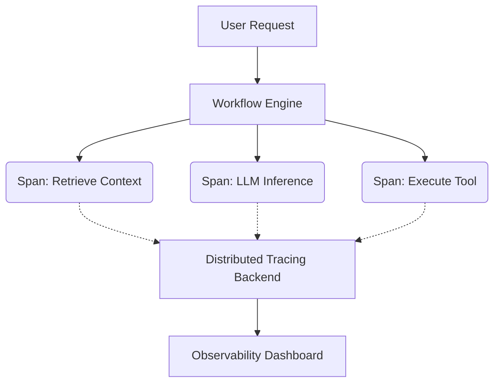
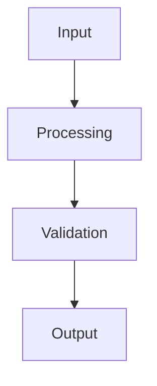

## Key takeaway

Trace-first observability is the practice of instrumenting agent workflows at the span level to capture granular execution paths, inputs, and outputs, enabling systematic debugging and performance optimisation in complex LLM systems.

## Mental model or small diagram



## When to use and when not to use

**When to use:**
- Complex multi-agent workflows with multiple asynchronous steps.
- Production systems where performance bottlenecks must be identified.
- Debugging intermittent tool execution failures.

**Non-goals:**
- This is not for replacing basic application logging.
- Not intended for simple, single-prompt scripts where execution is strictly linear and short-lived.

## Method or procedure

1. **Instrument the core loops:** Add trace spans around context retrieval, prompt generation, inference, and tool execution.
2. **Inject correlation IDs:** Pass trace IDs through asynchronous queues and external API calls.
3. **Capture rich metadata:** Include token usage, latency, and context window utilization in each span.
4. **Aggregate and alert:** Set up dashboards to alert on anomaly detection (e.g., spike in tool failure rates).

## Worked example

**Input:** A user query requiring database retrieval and synthesis.

**Process:**
```python
with tracer.start_span("process_query") as span:
    span.set_attribute("user_intent", "data_retrieval")
    
    with tracer.start_span("retrieve_context") as ctx_span:
        context = db.query(user_intent)
        ctx_span.set_attribute("context_length", len(context))
        
    with tracer.start_span("llm_inference") as llm_span:
        response = llm.generate(prompt=context)
        llm_span.set_attribute("tokens_used", response.usage.total_tokens)
```

**Output:** A structured trace tree in the observability backend detailing exact latency and token usage for each phase.

## Failure modes and mitigations

- **High Overhead:** Excessive tracing can slow down execution. *Mitigation: Use probabilistic sampling in production.*
- **Sensitive Data Leakage:** Traces might inadvertently log PII. *Mitigation: Implement PII scrubbers at the tracer level before sending to the backend.*

## Evaluation checklist or rubric (measurable release thresholds)

- [ ] Are correlation IDs maintained across all asynchronous boundaries?
- [ ] Is token usage tracked per span for accurate cost attribution?
- [ ] Can an engineer go from an alert to a specific trace within 60 seconds?

## Safety, privacy, and cost notes

- **Safety:** Ensure tracer endpoints are authenticated and encrypted.
- **Privacy:** Sanitize all PII and sensitive user data from span attributes.
- **Cost:** Tracing platforms charge by data volume; optimize sampling rates to balance visibility and cost.

## Practice task

Instrument an existing script with open-telemetry spans. Capture the latency of an LLM call and log the token usage as custom attributes.

## Provenance and further reading

- **Source**: Engineering Documentation
- **Author/Organization**: Platform Team
- **Publication Date**: 2026-10-07

## Non-goals

This is not a general-purpose guide to all possible paradigms, nor does it aim to replace standard software engineering practices. The focus is strictly on the AI-specific nuances in this particular domain.

## System diagram



## Competing designs and trade-offs

When evaluating alternatives, one might consider synchronous vs asynchronous execution, stateless vs stateful processes, and naive vs structured generation. Synchronous is easier to debug but scales poorly. Stateless is robust but limits context. The trade-offs heavily depend on the specific latency and cost budget allocated to the agent.

## Implementation blueprint

The core implementation relies on defining strict interfaces between components. 

1. Define the input schema.
2. Implement the validation step.
3. Route to the appropriate model or tool.
4. Process the response and handle exceptions.

This blueprint ensures predictability.

## Evaluation criteria

Success is measured by precision, recall, and the false positive rate of the agent's actions. Additionally, the system must meet latency SLAs (e.g., p95 < 2000ms) and cost constraints per task.

## Security

Security is paramount. The system must enforce least-privilege access, validate all inputs to prevent prompt injection, and sandbox any executed code. All sensitive data must be redacted before being sent to external APIs.

## Observability

The system requires trace-first observability. Every interaction must be logged with correlation IDs, token usage, and latency metrics. This enables rapid debugging and continuous evaluation of the agent's performance in production.

## Latency

Latency is bounded by the model's time-to-first-token and the number of sequential tool calls. Optimisations like streaming, caching, and concurrent execution are necessary to maintain a responsive user experience.

## What would change this decision?

If model capabilities improve significantly, such that smaller, faster models can handle complex reasoning natively, the need for intricate orchestration might be reduced. Conversely, if security requirements tighten, more rigorous air-gapping might be required.

## Exercise

Implement the blueprint described above using a mock LLM client. Verify that the validation step correctly rejects malformed inputs and that the success path logs the expected metrics.

## Sources

