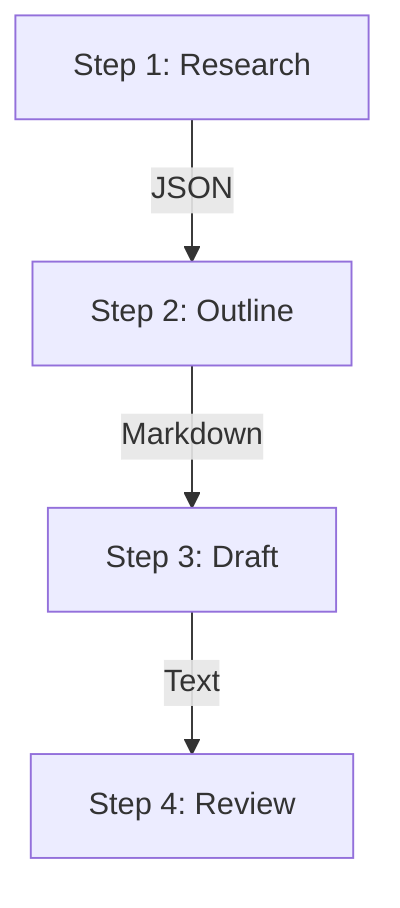
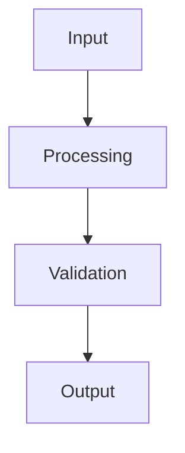

## Key takeaway

Instead of relying on a single "mega-prompt" to solve a complex problem, break the task down into a structured sequence (a workflow or pipeline) where the output of one step becomes the input to the next.

## Mental model or small diagram

## When to use and when not to use

**When to use:**

- Multi-step generation tasks (e.g., write a long-form article).
- When the LLM needs to plan a query, retrieve data, and then synthesize results.
- Tasks requiring high reliability where validation is needed at intermediate steps.

**When not to use:**

- Simple, single-shot requests where one prompt is sufficient.
- Low-latency requirements, as chaining LLM calls increases response time.

## Method or procedure

1. **Deconstruct the Task:** Identify the discrete logical steps required.
2. **Define Intermediate Formats:** Ensure each step outputs structured data (like JSON) so the next step can parse it deterministically.
3. **Build Prompts per Step:** Write focused, narrow prompts for each node in your workflow.
4. **Orchestrate:** Use application code to call the LLM, parse the output, and pass it to the next step.

## Worked example

**Input:** "Write a comprehensive report on quantum computing."
**Process:**

1. *Step 1 (Research):* "Search the web for breakthroughs and output a JSON array of facts."
2. *Step 2 (Outline):* "Given these facts, create a hierarchical markdown outline."
3. *Step 3 (Draft):* "Write section 1 of the outline using these facts."
4. *Step 4 (Review):* "Review this draft for factual accuracy against the original facts."
**Output:** A high-quality, fact-checked report.

## Failure modes and mitigations

- **Error Propagation:** Poor output in Step 1 amplifies in Step 2. *Mitigation: Add validation logic between steps to verify data integrity before continuing.*
- **Context Loss:** Passing only the output strips away necessary context. *Mitigation: Pass both the previous step's output and the original core instructions to downstream steps.*

## Evaluation checklist or rubric

- [ ] **Step-Level Accuracy:** What is the success rate of each individual node?
- [ ] **End-to-End Quality:** Is the final output significantly better than a single-prompt approach?
- [ ] **Data Flow:** Are intermediate payloads consistently formatted?

## Safety, privacy, and cost notes

- **Cost:** Multiple LLM calls mean significantly higher token usage. Evaluate if the quality gain justifies the cost.
- **Latency:** Workflows are inherently slower. Use parallelization where possible (e.g., drafting independent sections simultaneously).

## Practice task

Design a 3-step workflow to summarize an hour-long transcript. Write the pseudocode or prompts to: 1. Chunk and summarize parts, 2. Synthesize the summaries into key themes, 3. Format the themes into an executive brief.

## Provenance and further reading

> **Note:** The principles taught in this lesson are model-independent. Any vendor-specific implementation notes (e.g., specific API features or context limits from Anthropic or OpenAI) are used for illustration and should be adapted to your chosen provider.

- **Source**: [LLM Workflows](https://docs.anthropic.com/en/docs/build-with-claude/prompt-engineering/chain-prompts)
- **Author/Organization**: Anthropic
- **Publication Date**: 2024-05-22
- **Access Date**: 2026-10-07
- **Next Steps**: Review the related example `content-format-transformer` or proceed to the lesson `loop-engineering`.

## Non-goals

This is not a general-purpose guide to all possible paradigms, nor does it aim to replace standard software engineering practices. The focus is strictly on the AI-specific nuances in this particular domain.

## System diagram

## Competing designs and trade-offs

When evaluating alternatives, one might consider synchronous vs asynchronous execution, stateless vs stateful processes, and naive vs structured generation. Synchronous is easier to debug but scales poorly. Stateless is robust but limits context. The trade-offs heavily depend on the specific latency and cost budget allocated to the agent.

## Implementation blueprint

The core implementation relies on defining strict interfaces between components. 

1. Define the input schema.
2. Implement the validation step.
3. Route to the appropriate model or tool.
4. Process the response and handle exceptions.

This blueprint ensures predictability.

## Evaluation criteria

Success is measured by precision, recall, and the false positive rate of the agent's actions. Additionally, the system must meet latency SLAs (e.g., p95 < 2000ms) and cost constraints per task.

## Security

Security is paramount. The system must enforce least-privilege access, validate all inputs to prevent prompt injection, and sandbox any executed code. All sensitive data must be redacted before being sent to external APIs.

## Observability

The system requires trace-first observability. Every interaction must be logged with correlation IDs, token usage, and latency metrics. This enables rapid debugging and continuous evaluation of the agent's performance in production.

## Latency

Latency is bounded by the model's time-to-first-token and the number of sequential tool calls. Optimisations like streaming, caching, and concurrent execution are necessary to maintain a responsive user experience.

## What would change this decision?

If model capabilities improve significantly, such that smaller, faster models can handle complex reasoning natively, the need for intricate orchestration might be reduced. Conversely, if security requirements tighten, more rigorous air-gapping might be required.

## Exercise

Implement the blueprint described above using a mock LLM client. Verify that the validation step correctly rejects malformed inputs and that the success path logs the expected metrics.

## Sources

